# ADI MAX78000/MAX78002 Model Training and Synthesis

August 27, 2024

**Note: This branch requires PyTorch 2. Please see the archive-1.8 branch for PyTorch 1.8 support. [KNOWN_ISSUES](KNOWN_ISSUES.txt) contains a list of known issues.**

ADI’s MAX78000/MAX78002 project is comprised of five repositories:

1. **Start here**:
    **[Top Level Documentation](https://github.com/analogdevicesinc/MaximAI_Documentation)**
2. The software development kit (MSDK), which contains drivers and example programs ready to run on the evaluation kits (EVkit and Feather):
    [Analog Devices MSDK](https://github.com/analogdevicesinc/msdk)
3. The training repository, which is used for deep learning *model development and training*:
    [ai8x-training](https://github.com/analogdevicesinc/ai8x-training/tree/develop) **(described in this document)**
4. The synthesis repository, which is used to *convert a trained model into C code* using the “izer” tool:
    [ai8x-synthesis](https://github.com/analogdevicesinc/ai8x-synthesis/tree/develop) **(described in this document)**
5. The reference design repository, which contains host applications and sample applications for reference designs such as [MAXREFDES178 (Cube Camera)](https://www.analog.com/en/design-center/reference-designs/maxrefdes178.html):
    [refdes](https://github.com/analogdevicesinc/MAX78xxx-RefDes)
    *Note: Examples for EVkits and Feather boards are part of the MSDK*

_Open the `.md` version of this file in a markdown enabled viewer, for example Typora (<http://typora.io>).
See <https://github.com/adam-p/markdown-here/wiki/Markdown-Cheatsheet> for a description of Markdown. A [PDF copy of this file](README.pdf) is available in this repository. The GitHub rendering of this document does not show the mathematical formulas. Use the ≡ button to access the table of contents on GitHub._

---

[TOC]

## Part Numbers

This document covers several of ADI’s ultra-low power machine learning accelerator systems. They are sometimes referred to by their die types. The following shows the die types and their corresponding part numbers:

| Die Type | Part Number(s)                 |
| -------- | ------------------------------ |
| *AI84*   | *Unreleased test chip*         |
| AI85     | **MAX78000** (full production) |
| AI87     | **MAX78002** (full production) |

## Overview

The following graphic shows an overview of the development flow:

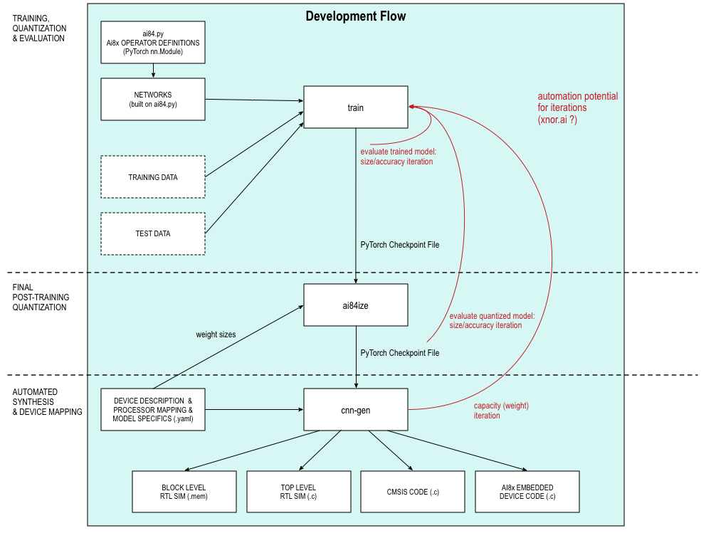

## Installation

### File System Layout

Including the MSDK, the expected/resulting file system layout will be:

    ..../ai8x-training/
    ..../ai8x-synthesis/
    ..../ai8x-synthesis/sdk/ [or a different path selected by the user]

where “....” is the project root, for example `~/Documents/Source/AI`.

### Prerequisites

This software requires PyTorch. *TensorFlow / Keras support is deprecated.*

PyTorch operating system and hardware support are constantly evolving. This document does not cover all possible combinations of operating system and hardware. Instead, this document describes how to install PyTorch on one officially supported platform.

#### Platform Recommendation and Full Support

Full support and documentation are provided for the following platform:

* CPU: 64-bit amd64/x86_64 “PC” with [Ubuntu Linux 20.04 LTS or 22.04 LTS](https://ubuntu.com/download/server)
* GPU for hardware acceleration (optional but highly recommended): Nvidia with [CUDA 12.1](https://developer.nvidia.com/cuda-toolkit-archive) or later
* [PyTorch 2.3](https://pytorch.org/get-started/locally/) on Python 3.11.x

Limited support and advice for using other hardware and software combinations is available as follows.

#### Operating System Support

##### Linux

**The only officially supported platforms for model training** are Ubuntu Linux 20.04 LTS and 22.04 LTS on amd64/x86_64, either the desktop or the [server version](https://ubuntu.com/download/server).

*Note that hardware acceleration using CUDA is <u>not available</u> in PyTorch for Raspberry Pi 4 and other <u>aarch64/arm64</u> devices, even those running Ubuntu Linux 20.04/22.04. See also [Development on Raspberry Pi 4 and 400](https://github.com/analogdevicesinc/ai8x-synthesis/blob/develop/docs/RaspberryPi.md) (unsupported).*

This document also provides instructions for installing on RedHat Enterprise Linux / CentOS 8 with limited support.

##### Windows

On Windows 10 version 21H2 or newer, and Windows 11, after installing the Windows Subsystem for Linux (WSL2), Ubuntu Linux 20.04 or 22.04 can be used inside Windows with full CUDA acceleration, please see *[Windows Subsystem for Linux](https://github.com/analogdevicesinc/ai8x-synthesis/blob/develop/docs/WSL2.md).* For the remainder of this document, follow the steps for Ubuntu Linux.

If WSL2 is not available, it is also possible (but not recommended due to inherent compatibility issues and slightly degraded performance) to run this software natively on Windows. Please see *[Native Windows Installation](https://github.com/analogdevicesinc/ai8x-synthesis/blob/develop/docs/Windows.md)*.

##### macOS

The software works on macOS and uses MPS acceleration on Apple Silicon. On Intel CPUs, model training suffers from the lack of hardware acceleration.

##### Virtual Machines (Unsupported)

This software works inside a virtual machine running Ubuntu Linux 20.04 or 22.04. However, GPU passthrough is potentially difficult to set up and <u>not always available</u> for Linux VMs, so there may be no CUDA hardware acceleration. Certain Nvidia cards support [vGPU software](https://www.nvidia.com/en-us/data-center/graphics-cards-for-virtualization/); see also [vGPUs and CUDA](https://docs.nvidia.com/cuda/vGPU/), but vGPU features may come at substantial additional cost and vGPU software is not covered by this document.

##### Docker Containers (Unsupported)

This software also works inside Docker containers. However, CUDA support inside containers requires Nvidia Docker ([see blog entry](https://developer.nvidia.com/blog/nvidia-docker-gpu-server-application-deployment-made-easy/)) and is not covered by this document.

#### PyTorch and Python

The officially supported version of [PyTorch is 2.3](https://pytorch.org/get-started/locally/) running on Python 3.11.x. Newer versions will typically work, but are not covered by support, documentation, and installation scripts.

#### Hardware Acceleration

When going beyond simple models, model training does not work well without hardware acceleration – Nvidia CUDA, AMD ROCm, or Apple Silicon MPS. The network loader (“izer”) does <u>not</u> require hardware acceleration, and very simple models can also be trained on systems without hardware acceleration.

* CUDA requires modern Nvidia GPUs. This is the most compatible, and best supported hardware accelerator.
* ROCm requires certain AMD GPUs, see [blog entry](https://pytorch.org/blog/pytorch-for-amd-rocm-platform-now-available-as-python-package/).
* MPS requires Apple Silicon (M1 or newer) and macOS 12.3 or newer.
* PyTorch does not include CUDA support for aarch64/arm64 systems. *Rebuilding PyTorch from source is not covered by this document.*


##### Using Multiple GPUs

When using multiple GPUs (graphics cards), the software will automatically use all available GPUs and distribute the workload. To prevent this (for example, when the GPUs are not balanced), set the `CUDA_VISIBLE_DEVICES` environment variable. Use the `--gpus` command line argument to set the default GPU.

#### Shared (Multi-User) and Remote Systems

On a shared (multi-user) system that has previously been set up, only local installation is needed. CUDA and any `apt-get` or `brew` tasks are not necessary, with the exception of the CUDA [Environment Setup](https://docs.nvidia.com/cuda/cuda-installation-guide-linux/index.html#environment-setup).

The `screen` command (or alternatively, the more powerful `tmux`) can be used inside a remote terminal to disconnect a session from the controlling terminal, so that a long running training session doesn’t abort due to network issues, or local power saving. In addition, screen can log all console output to a text file.

Example:

```shell
$ ssh targethost
targethost$ screen -L # or screen -r to resume, screen -list to list
targethost$
Ctrl+A,D to disconnect
```

`man screen` and `man tmux` describe the software in more detail.

#### Additional Software

The following software is optional, and can be replaced with other similar software of the user’s choosing.

1. Code Editor
   Visual Studio Code, <https://code.visualstudio.com> or the VSCodium version, <https://vscodium.com>, with the “Remote - SSH” plugin; *to use Visual Studio Code on Windows as a full development environment (including debug), see <https://github.com/analogdevicesinc/VSCode-Maxim>*
   Sublime Text, <https://www.sublimetext.com>
2. Markdown Editor
   Typora, <http://typora.io>
3. Serial Terminal
   CoolTerm, <http://freeware.the-meiers.org>
   Serial, <https://apps.apple.com/us/app/serial/id877615577?mt=12>
   Putty, <https://www.chiark.greenend.org.uk/~sgtatham/putty/latest.html>
   Tera Term, <https://osdn.net/projects/ttssh2/releases/>
4. Graphical Git Client
   GitHub Desktop, <https://desktop.github.com>
   Git Fork, <https://git-fork.com>
5. Diff and Merge Tool
   Beyond Compare, <https://scootersoftware.com>

### Project Installation

#### Free Disk Space

A minimum of 64 GB of free disk space is recommended, and datasets can be many times this size and should be stored separately. Check the available space on the target file system before continuing using

```shell
$ df -kh
Filesystem      Size  Used Avail Use% Mounted on
...
/dev/sda2       457G  176G  259G  41% /
```

#### System Packages

Some additional system packages are required, and installation of these additional packages requires administrator privileges. Note that this is the only time administrator privileges are required.

##### macOS

On macOS use:

```shell
$ brew install libomp libsndfile tcl-tk sox
```

##### Linux (Ubuntu), including WSL2)

```shell
$ sudo apt-get install -y make build-essential libssl-dev zlib1g-dev \
  libbz2-dev libreadline-dev libsqlite3-dev wget curl llvm \
  libncurses5-dev libncursesw5-dev xz-utils tk-dev libffi-dev liblzma-dev \
  libsndfile-dev portaudio19-dev libsox-dev
```

###### RedHat Enterprise Linux / CentOS 8

While Ubuntu 20.04 LTS and 22.04 LTS are the supported distributions, the MAX78000/MAX78002 software packages run fine on all modern Linux distributions that also support CUDA. The *apt-get install* commands above must be replaced with distribution specific commands and package names. Unfortunately, there is no obvious 1:1 mapping between package names from one distribution to the next. The following example shows the commands needed for RHEL/CentOS 8.

*Two of the required packages are not in the base repositories. Enable the EPEL and PowerTools repositories:*

```shell
$ sudo dnf install https://dl.fedoraproject.org/pub/epel/epel-release-latest-8.noarch.rpm
$ sudo dnf config-manager --set-enabled powertools
```

*Proceed to install the required packages:*

```shell
$ sudo dnf group install "Development Tools"
$ sudo dnf install openssl-devel zlib-devel \
  bzip2-devel readline-devel sqlite-devel wget llvm \
  xz-devel tk tk-devel libffi-devel \
  libsndfile libsndfile-devel portaudio-devel
```

#### Python 3.11

*The software in this project uses Python 3.11.8 or a later 3.11.x version.*

First, check whether there is a default Python interpreter and whether it is version 3.11.x:

```shell
$ python --version
Command 'python' not found, did you mean:
  command 'python3' from deb python3
  command 'python' from deb python-is-python3
# no default python, install pyenv

$ python --version
Python 2.7.18
# wrong version, pyenv required
```

Python 2 **will not function correctly** with the MAX78000/MAX78002 tools. If the result is Python **3.11**.x, skip ahead to [git Environment](#git-environment). For *any* other version (for example, 2.7, 3.7, 3.8, 3.9, 3.10), or no version, continue here.

*Note: For the purposes of the MAX78000/MAX78002 tools, “python3” is not a substitute for “python”. Please install pyenv when `python --version` does not return version 3.11.x, <u>even if</u> “python3” is available.*

*Note for advanced users: `sudo apt-get install python-is-python3` on Ubuntu 20.04 will install Python 3 as the default Python version; however, it may not be version 3.11.x.*

##### pyenv

It is not necessary to install Python 3.11 system-wide, or to rely on the system-provided Python. To manage Python versions, instead use `pyenv` (<https://github.com/pyenv/pyenv>). This allows multiple Python versions to co-exist on the same system without interfering with the system or with one another.

On macOS:

```shell
$ brew install pyenv pyenv-virtualenv
```

On Linux:

```shell
$ curl -L https://github.com/pyenv/pyenv-installer/raw/master/bin/pyenv-installer | bash  # NOTE: Verify contents of the script before running it!!
```

Then, follow the terminal output of the pyenv-installer and add pyenv to your shell by modifying one or more of `~/.bash_profile`, `~/.bashrc`, `~/.zshrc`, `~/.profile`, or `~/.zprofile`. The instructions differ depending on the shell (bash or zsh).

For example, on *Ubuntu 20.04 inside WSL2* add the following to `~/.bashrc`:

```shell
# WSL2
export PYENV_ROOT="$HOME/.pyenv"
export PATH="$PYENV_ROOT/bin:$PATH"
eval "$(pyenv init --path)"
eval "$(pyenv virtualenv-init -)"
```

To display the instructions again at any later time:

```shell
$ ~/.pyenv/bin/pyenv init

# (The below instructions are intended for common
# shell setups. See the README for more guidance
# if they don't apply and/or don't work for you.)

# Add pyenv executable to PATH and
# enable shims by adding the following
# to ~/.profile and ~/.zprofile:
...
...
```

*Note: Installing both conda and pyenv in parallel may cause issues. Ensure that the pyenv initialization tasks are executed <u>before</u> any conda related tasks.*

Next, close the Terminal, open a new Terminal and install Python 3.11.8.

On macOS:

```shell
$ env \
  PATH="$(brew --prefix tcl-tk)/bin:$PATH" \
  LDFLAGS="-L$(brew --prefix tcl-tk)/lib" \
  CPPFLAGS="-I$(brew --prefix tcl-tk)/include" \
  PKG_CONFIG_PATH="$(brew --prefix tcl-tk)/lib/pkgconfig" \
  CFLAGS="-I$(brew --prefix tcl-tk)/include" \
  PYTHON_CONFIGURE_OPTS="--with-tcltk-includes='-I$(brew --prefix tcl-tk)/include' --with-tcltk-libs='-L$(brew --prefix tcl-tk)/lib -ltcl8.6 -ltk8.6'" \
  pyenv install 3.11.8
```

On Linux, including WSL2:

```shell
$ pyenv install 3.11.8
```

#### git Environment

If the local git environment has not been previously configured, add the following commands to configure e-mail and name. The e-mail must match GitHub (including upper/lower case):

```shell
$ git config --global user.email "first.last@example.com"
$ git config --global user.name "First Last"
```

#### Nervana Distiller

[Nervana Distiller](https://github.com/analogdevicesinc/distiller) is automatically installed as a git sub-module with the other packages. Distiller is used for its scheduling and model export functionality.

### Upstream Code

Change to the project root and run the following commands. Use your GitHub credentials if prompted.

```shell
$ cd <your/project>
$ git clone --recursive https://github.com/analogdevicesinc/ai8x-training.git
$ git clone --recursive https://github.com/analogdevicesinc/ai8x-synthesis.git
```

#### Creating the Virtual Environment

To create the virtual environment and install basic wheels:

```shell
$ cd ai8x-training
```

Using the instructions above checks out the `develop` branch which supports PyTorch 2.3. The `main` branch is updated less frequently, but possibly more stable. To change branches, use the command `git checkout`, for example `git checkout main`.
For PyTorch 1.8 support, use the archive.

If using pyenv, set the local directory to use Python 3.11.8.

```shell
$ pyenv local 3.11.8
```

In all cases, verify that a 3.11.x version of Python is used:

```shell
$ python --version
Python 3.11.8
```

If this does <u>*not*</u> return version 3.11.x, please install and initialize [pyenv](#python-311).

Then continue with the following:

```shell
$ python -m venv .venv --prompt ai8x-training
$ echo "*" > .venv/.gitignore
```

If this command returns an error message similar to *“The virtual environment was not created successfully because ensurepip is not available,”* please install and initialize [pyenv](#python-311).

On macOS and Linux, including WSL2, activate the environment using

```shell
$ source .venv/bin/activate
```

On native Windows, instead use:

```shell
$ source .venv/Scripts/activate
```

Then continue with

```shell
(ai8x-training) $ pip3 install -U pip wheel setuptools
```

The next step differs depending on whether the system uses CUDA 12.1+, or not.

For CUDA 12:

```shell
(ai8x-training) $ pip3 install -r requirements.txt --extra-index-url https://download.pytorch.org/whl/cu121
```

For ROCm 5.7:

```shell
(ai8x-training) $ pip3 install -r requirements.txt --extra-index-url https://download.pytorch.org/whl/rocm5.7
```

For all other systems, including macOS:

```shell
(ai8x-training) $ pip3 install -r requirements.txt
```

##### Repository Branches

Using the instructions above checks out the `develop` branch which supports PyTorch 2.3. The `main` branch is updated less frequently, but possibly more stable. To change branches, use the command `git checkout`, for example `git checkout main`.
For PyTorch 1.8 support, use the archive.

###### TensorFlow / Keras

Support for TensorFlow / Keras is deprecated.

#### Updating to the Latest Version

After additional testing, `develop` is merged into the main branch at regular intervals.

After a small delay of typically a day, a “Release” tag is created on GitHub for all non-trivial merges into the main branch. GitHub offers email alerts for all activity in a project, or for new releases only. Subscribing to releases only substantially reduces email traffic.

*Note: Each “Release” automatically creates a code archive. It is recommended to use a git client to access (pull from) the main branch of the repository using a git client instead of downloading the archives.*

In addition to code updated in the repository itself, **submodules and Python libraries may have been updated as well**.

Major upgrades (such as updating from PyTorch 1.8 to PyTorch 2.3) are best done by removing all installed wheels. This can be achieved most easily by creating a new folder and starting from scratch at [Upstream Code](#upstream-code). Starting from scratch is also recommended when upgrading the Python version.

For minor updates, pull the latest code and install the updated wheels:

```shell
(ai8x-training) $ git pull
(ai8x-training) $ git submodule update --init
(ai8x-training) $ pip3 install -U pip setuptools
(ai8x-training) $ pip3 install -U -r requirements.txt  # add --extra-index-url if needed, as shown above
```

##### MSDK Updates

Please *also* update the MSDK or use the Maintenance Tool as documented in the [Analog Devices MSDK documentation](https://github.com/analogdevicesinc/msdk). The Maintenance Tool automatically updates the MSDK.

##### Python Version Updates

Updating Python may require updating `pyenv` first. Should `pyenv install 3.11.8` fail,

```shell
$ pyenv install 3.11.8
python-build: definition not found: 3.11.8
```

then `pyenv` must be updated. On macOS, use:

```shell
$ brew update && brew upgrade pyenv
...
$
```

On Linux (including WSL2), use:

```shell
$ cd $(pyenv root) && git pull && cd -
remote: Enumerating objects: 19021, done.
...
$
```

The update should now succeed:

```shell
$ pyenv install 3.11.8
Downloading Python-3.11.8.tar.xz...
-> https://www.python.org/ftp/python/3.11.8/Python-3.11.8.tar.xz
Installing Python-3.11.8...
...
$ pyenv local 3.11.8
```


#### Synthesis Project

The `ai8x-synthesis` project does not require hardware acceleration.

Start by deactivating the `ai8x-training` environment if it is active.

```shell
(ai8x-training) $ deactivate
```

Then, create a second virtual environment:

```shell
$ cd <your/project>
$ cd ai8x-synthesis
```

If you want to use the main branch, switch to “main” using the optional command `git checkout main`.

If using pyenv, run:

```shell
$ pyenv local 3.11.8
```

In all cases, make sure Python 3.11.x is the active version:

```shell
$ python --version
Python 3.11.8
```

If this does <u>*not*</u> return version 3.11.x, please install and initialize [pyenv](#python-311).

Then continue:

```shell
$ python -m venv .venv --prompt ai8x-synthesis
$ echo "*" > .venv/.gitignore
```

Activate the virtual environment. On macOS and Linux (including WSL2), use

```shell
$ source .venv/bin/activate
```

On native Windows, instead use

```shell
$ source .venv/Scripts/activate
```

For all systems, continue with:

```shell
(ai8x-synthesis) $ pip3 install -U pip setuptools
(ai8x-synthesis) $ pip3 install -r requirements.txt
```

##### Repository Branches and Updates

Branches and updates for `ai8x-synthesis` are handled similarly to the [`ai8x-training`](#repository-branches) project.

#### Installation is now Complete

With the installation of Training and Synthesis projects completed it is important to remember to activate the proper Python virtual environment when switching between projects. If scripts begin failing in a previously working environment, the cause might be that the incorrect virtual environment is active or that no virtual environment has been activated.


### Embedded Software Development Kit (MSDK)

The Software Development Kit (MSDK) for MAX78000 and MAX78002 is used to compile, flash, and debug the output of the *ai8x-synthesis* (“izer”) tool. It also enables general software development for the microcontroller cores of the MAX78000 and MAX78002. It consists of the following components:

* Peripheral Drivers
* Board Support Packages (BSPs)
* Libraries
* Examples
* Toolchain
  * Arm GCC
  * RISC-V GCC
  * Make
  * OpenOCD

There are two ways to install the MSDK.

#### Method 1: MSDK Installer

An automatic installer is available for the MSDK. Instructions for downloading, installing, and getting started with the MSDK’s supported development environments are found in the [**MSDK User Guide**](https://analogdevicesinc.github.io/msdk/USERGUIDE/).

After installation and setup, continue with the [Final Check](#final-check).

#### Method 2: Manual Installation

The MSDK is also available as a [git repository](https://github.com/analogdevicesinc/msdk), which can be used to obtain the latest development resources. The repository contains all of the MSDK’s components _except_ the Arm GCC, RISC-V GCC, and Make. These can be downloaded and installed manually.

1. Clone the MSDK repository (recommendation: change to the *ai8x-synthesis* folder first):

    ```shell
    $ git clone https://github.com/analogdevicesinc/msdk.git sdk
    ```

2. Download and install the Arm Embedded GNU Toolchain from [https://developer.arm.com/downloads/-/arm-gnu-toolchain-downloads](https://developer.arm.com/downloads/-/arm-gnu-toolchain-downloads).

    * Recommended version: 12.3.Rel1 *(newer versions may or may not work correctly)*
    * Recommended installation location: `/usr/local/arm-gnu-toolchain-12.3.rel1/`

3. Download and install the RISC-V Embedded GNU Toolchain from [https://github.com/xpack-dev-tools/riscv-none-elf-gcc-xpack/releases](https://github.com/xpack-dev-tools/riscv-none-elf-gcc-xpack/releases/)

    * Recommended version: 12.3.0-2 *(newer versions may or may not work correctly)*
    * Recommended installation location: `/usr/local/xpack-riscv-none-elf-gcc-12.3.0-2/`

4. Install GNU Make

    * (Linux/macOS) “make” is available on most systems by default. If not, it can be installed via the system package manager.

    * (Windows) Install [MSYS2](https://www.msys2.org/) first, then install “make” using the MSYS2 package manager:

      ```shell
      $ pacman -S --needed base filesystem msys2-runtime make
      ```

5. Install packages for OpenOCD. OpenOCD binaries are available in the “openocd” sub-folder of the ai8x-synthesis repository. However, some additional dependencies are required on most systems. See [openocd/README.md](https://github.com/analogdevicesinc/ai8x-synthesis/blob/develop/openocd/README.md) for a list of packages to install, then return here to continue.

6. Add the location of the toolchain binaries to the system path.

    On Linux and macOS, copy the following contents into `~/.profile`...
    On macOS, _also_ copy the following contents into `~/.zprofile`...
    ...adjusting for the actual `PATH` to the compilers and the system’s architecture (`TARGET_ARCH`):

    ```shell
    # Arm GCC
    ARMGCC_DIR=/usr/local/gcc-arm-none-eabi-10.3-2021.10  # Change me!
    echo $PATH | grep -q -s "$ARMGCC_DIR/bin"
    if [ $? -eq 1 ] ; then
        PATH=$PATH:"$ARMGCC_DIR/bin"
        export PATH
        export ARMGCC_DIR
    fi
    
    # RISC-V GCC
    RISCVGCC_DIR=/usr/local/xpack-riscv-none-elf-gcc-12.3.0-2  # Change me!
    echo $PATH | grep -q -s "$RISCVGCC_DIR/bin"
    if [ $? -eq 1 ] ; then
        PATH=$PATH:"$RISCVGCC_DIR/bin"
        export PATH
        export RISCVGCC_DIR
    fi
    
    # OpenOCD
    OPENOCD_DIR=$HOME/Documents/Source/ai8x-synthesis/openocd/bin/TARGET_ARCH  # Change me!
    echo $PATH | grep -q -s "$OPENOCD_DIR"
    if [ $? -eq 1 ] ; then
        PATH=$PATH:$OPENOCD_DIR
        export PATH
        export OPENOCD_DIR
    fi
    ```

    On Windows, add the toolchain paths to the system `PATH` variable (search for  “edit the system environment variables” in the Windows search bar).

Once the tools above have been installed, continue to the [Final Check](#final-check) step below.

#### Final Check

After a successful manual or MSDK installation, the following commands will run from on the terminal and display their version numbers:

* `arm-none-eabi-gcc -v`
* `arm-none-eabi-gdb -v`
* `make -v`
* `openocd -v`

`gen-demos-max78000.sh` and `gen-demos-max78002.sh` will create code that is compatible with the MSDK and copy it into the MSDK’s Example directories.

---


## MAX78000 and MAX78002 Hardware and Resources

MAX78000/MAX78002 are embedded accelerators. Unlike GPUs, MAX78000/MAX78002 do not have gigabytes of memory, and cannot support arbitrary data (image) sizes.

### Overview

A typical CNN operation consists of pooling followed by a convolution. While these are traditionally expressed as separate layers, pooling can be done “in-flight” on MAX78000/MAX78002 for greater efficiency.

To minimize data movement, the accelerator is optimized for convolutions with in-flight pooling on a sequence of layers. MAX78000 and MAX78002 also support in-flight element-wise operations, pass-through layers and 1D convolutions (without element-wise operations):

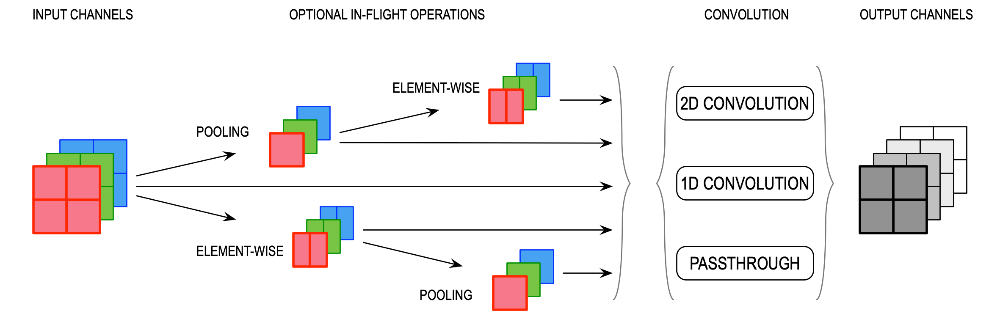

The MAX78000/MAX78002 accelerators contain 64 parallel processors. There are four quadrants that contain 16 processors each.

Each processor includes a pooling unit and a convolutional engine with dedicated weight memory:

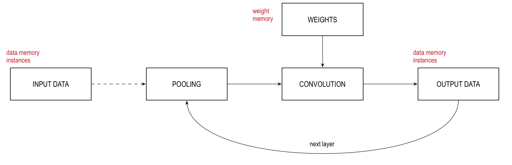

Data is read from [data memory](#data-memory) associated with the processor, and written out to any data memory located within the accelerator. To run a deep convolutional neural network, multiple layers are chained together, where each layer’s operation is individually configurable. The output data from one layer is used as the input data for the next layer, for up to 32 layers (where *in-flight* pooling and *in-flight* element-wise operations do not count as layers).

The following picture shows an example view of a 2D convolution with pooling:
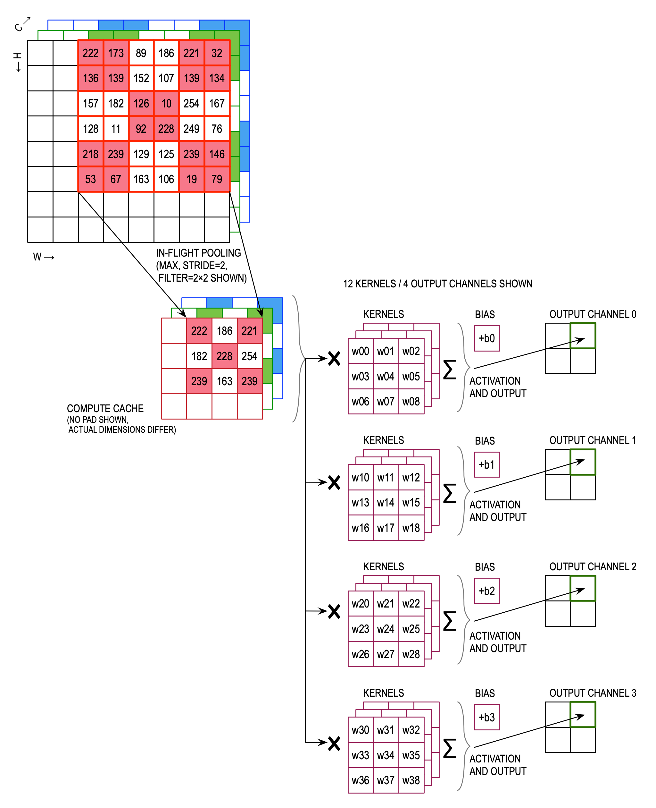

### Data, Weights, and Processors

Data memory, weight memory, and processors are interdependent.

In the MAX78000/MAX78002 accelerator, processors are organized as follows:

* Each processor is connected to its own dedicated weight memory instance.
* A group of four processors shares one data memory instance.
* A quadrant of sixteen processors shares certain common controls and can be operated tethered to another quadrant, or independently/separately.

Any given processor can:

* Read from its dedicated weight memory,
* Read from the data memory instance it shares with three other processors, and
* As part of output processing, write to *any* data memory instance.

#### Weight Memory

*Note: Depending on context, weights may also be referred to as “kernels” or “masks”. Additionally, weights are also part of a network’s “parameters”.*

For each of the four 16-processor quadrants, weight memory and processors can be visualized as follows. Assuming one input channel processed by processor 0, and 8 output channels, the 8 shaded kernels will be used:

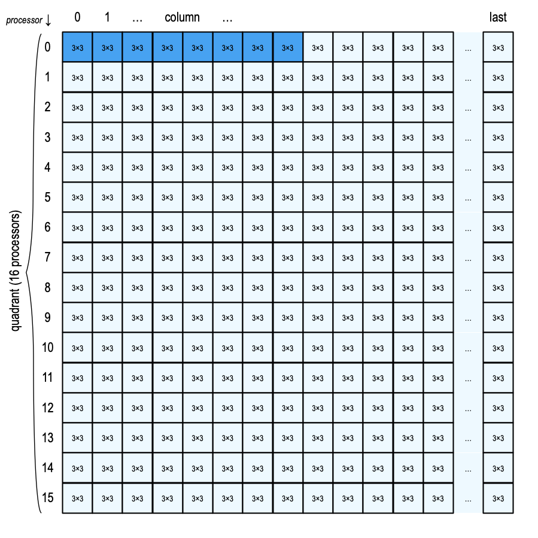

*Note: Weights that are not 3×3×8 (= 72-bits) per kernel are packed to save space. For example, when using 1×1 8-bit kernels, 9 kernels will be packed into a single 72-bit memory word.*

#### Data Memory

Data memory in MAX78000/MAX78002 is needed for:

* Input data (unless [FIFOs](#fifos) are used),
* All layer’s activation data, and
* Inference outputs.

Data memory connections can be visualized as follows:

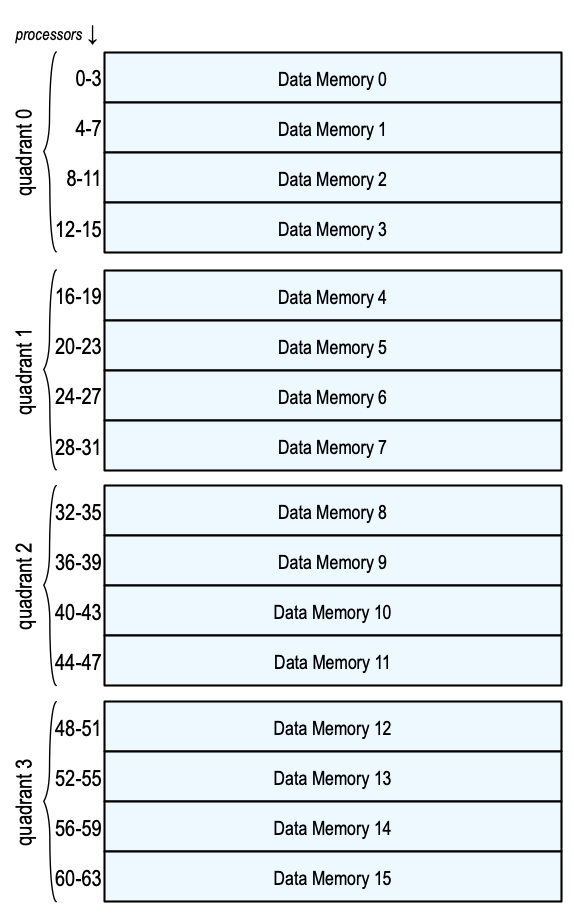

All input data must be located in the data memory instance the processor can access. Conversely, output data can be written to any data memory instance inside the accelerator (but not to general purpose SRAM on the Arm microcontroller bus).

The data memory instances inside the accelerator are single-port memories. This means that only one access operation can happen per clock cycle. When using the HWC data format (see [Channel Data Formats](#channel-data-formats)), this means that each of the four processors sharing the data memory instance will receive one byte of data per clock cycle (since each 32-bit data word consists of four packed channels).

##### Multi-Pass

When data has more channels than active processors, “multi-pass” is used. Each processor works on more than one channel, using multiple sequential passes, and each data memory holds more than four channels.

As data is read using multiple passes, and all available processor work in parallel, the first pass reads channels 0 through 63, the second pass reads channels 64 through 127, etc., assuming 64 processors are active.

For example, if 192-channel data is read using 64 active processors, Data Memory 0 stores three 32-bit words: channels 0, 1, 2, 3 in the first word, 64, 65, 66, 67 in the second word, and 128, 129, 130, 131 in the third word. Data Memory 1 stores channels 4, 5, 6, 7 in the first word, 68, 69, 70, 71 in the second word, and 132, 133, 134, 135 in the third word, and so on. The first processor processes channel 0 in the first pass, channel 64 in the second pass, and channel 128 in the third pass.

*Note: Multi-pass also works with channel counts that are not a multiple of 64, and can be used with fewer than 64 active processors.*

*Note: For all multi-pass cases, the processor count per pass is rounded up to the next multiple of 4.*

### Streaming Mode

The machine also implements a streaming mode. Streaming allows input data dimensions that exceed the available per-channel data memory in the accelerator. *Note: Depending on the model and application, [Data Folding](#data-folding) may have performance benefits over Streaming Mode.*

The following illustration shows the basic principle: In order to produce the first output pixel of the second layer, not all data needs to be present at the input. In the example, a 5×5 input needs to be available.

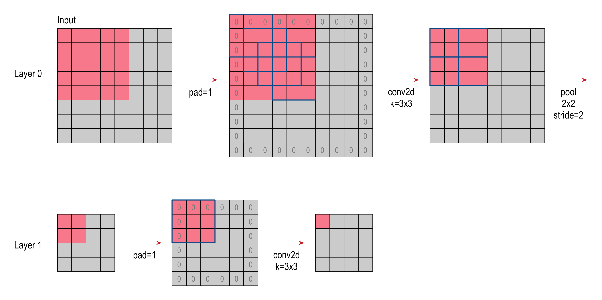

In the accelerator implementation, data is shifted into the Tornado memory in a sequential fashion, so prior rows will be available as well. In order to produce the _blue_ output pixel, input data up to the blue input pixel must be available.

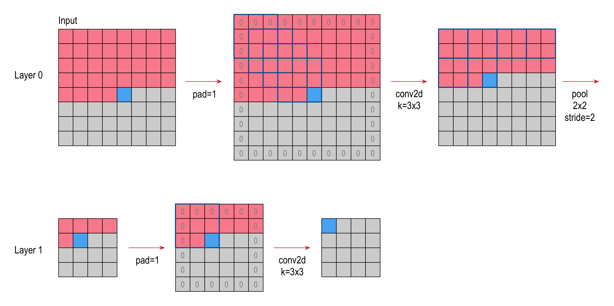

When the _yellow_ output pixel is produced, the first (_black_) pixel of the input data is no longer needed and its data can be discarded:

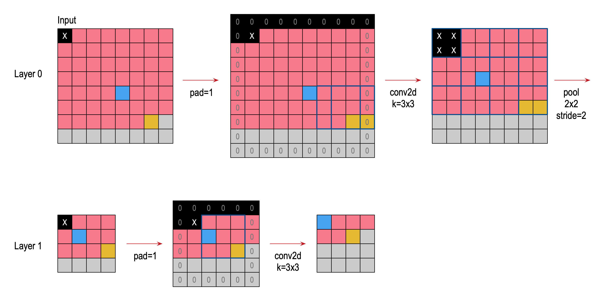

The number of discarded pixels is network specific and dependent on pooling strides and the types of convolution. In general, streaming mode is only useful for networks where the output data dimensions decrease from layer to layer (for example, by using a pooling stride).

*Note: Streaming mode requires the use of [FIFOs](#fifos).*

For concrete examples on how to implement streaming mode with a camera, please see the [Camera Streaming Guide](https://github.com/analogdevicesinc/MaximAI_Documentation/blob/main/Guides/Camera_Streaming_Guide.md).

#### FIFOs

Since the data memory instances are single-port memories, software would have to temporarily disable the accelerator in order to feed it new data. Using FIFOs, software can input available data while the accelerator is running. The accelerator will autonomously fetch data from the FIFOs when needed, and stall (pause) when no enough data is available.

The MAX78000/MAX78002 accelerator has two types of FIFO:

##### Standard FIFOs

There are four dedicated FIFOs connected to processors 0-3, 16-19, 32-35, and 48-51, supporting up to 16 input channels (in HWC format) or four channels (CHW format). These FIFOs work when used from the Arm Cortex-M4 core and from the RISC-V core.

The standard FIFOs are selected using the `--fifo` argument for `ai8xize.py`.

##### Fast FIFO

The fast FIFO is only available from the RISC-V core, and runs synchronously with the RISC-V for increased throughput. It supports up to four input channels (HWC format) or a single channel (CHW format). The fast FIFO is connected to processors 0, 1, 2, 3 or 0, 16, 32, 48.

The fast FIFO is selected using the `--fast-fifo` argument for `ai8xize.py`.

*The code generator inserts FIFO-full checks for either type of FIFO. When the data source rate is equal to or slower than the network speed, these checks are not needed. Use `--no-fifo-wait` to suppress them. The checks are necessary when the data source can deliver faster than the network can process the data.*

### Number Format

All weights, bias values and data are stored and computed in Q7 format (signed two’s complement 8-bit integers, [–128...+127]). See <https://en.wikipedia.org/wiki/Q_%28number_format%29>.

The 8-bit value $w$ is defined as:

$$ w = (-a_7 2^7+a_6 2^6+a_5 2^5+a_4 2^4+a_3 2^3+a_2 2^2+a_1 2^1+a_0)/128 $$

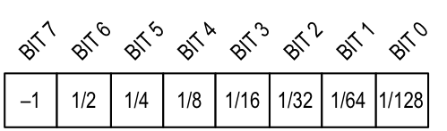

Examples:
| Binary    | Value        |
|:---------:|-------------:|
| 0000 0000 | 0            |
| 0000 0001 | 1/128        |
| 0000 0010 | 2/128        |
| 0111 1110 | 126/128      |
| 0111 1111 | 127/128      |
| 1000 0000 | −128/128 (–1)|
| 1000 0001 | −127/128     |
| 1000 0010 | −126/128     |
| 1111 1110 | −2/128       |
| 1111 1111 | −1/128       |

On MAX78000/MAX78002, _weights_ can be 1, 2, 4, or 8 bits wide (configurable per layer using the `quantization` key). Bias values are always 8 bits wide. Data is 8 bits wide, *except for the last layer that can optionally output 32 bits of unclipped data in Q17.14 format when not using activation.*

|          weight bits          |  min |  max |
| :---------------------------: | ---: | ---: |
|               8               | –128 | +127 |
|               4               |   –8 |    7 |
|               2               |   –2 |    1 |
|               1               |   –1 |    0 |
| *MAX78002 only*             1 |   –1 |   +1 |

Note that for –1/0 1-bit weights (and, to a lesser degree, –1/+1 1-bit weights and 2-bit weights) require the use of bias to produce useful results. Without bias, all sums of products of activated data from a prior layer would be negative, and activation of that data would always be zero.

In other cases, using bias in convolutional layers does not improve inference performance. In particular, [Quantization](#quantization)-Aware Training (QAT) optimizes the weight distribution, possibly deteriorating the distribution of the bias values.

#### Rounding

MAX78000/MAX78002 rounding (for the CNN sum of products) uses “round half towards positive infinity”, i.e. $y=⌊0.5+x⌋$. This rounding method is not the default method in either Excel or Python/NumPy. The rounding method can be achieved in NumPy using `y = np.floor(0.5 + x)` and in Excel as `=FLOOR.PRECISE(0.5 + X)`.

By way of example:

| Input                    | Rounded |
|:-------------------------|:-------:|
| +3.5                     | +4      |
| +3.25, +3.0, +2.75, +2.5 | +3      |
| +2.25, +2.0, +1.75, +1.5 | +2      |
| +1.25, +1.0, +0.75, +0.5 | +1      |
| +0.25, 0, –0.25, –0.5    | 0       |
| –0.75, –1.0, –1.25, –1.5 | –1      |
| –1.75, –2.0, –2.25, –2.5 | –2      |
| –2.75, –3.0, –3.25, –3.5 | –3      |

#### Addition

Addition works similarly to regular two’s-complement arithmetic.

Example:
$$ w_0 = 1/64 → 00000010 $$
$$ w_1 = 1/2 → 01000000 $$
$$ w_0 + w_1 = 33/64 → 01000010 $$

#### Saturation and Clipping

Values smaller than $–128⁄128$ are saturated to $–128⁄128$ (1000 0000). Values larger than $+127⁄128$ are saturated to $+127⁄128$ (0111 1111).

The MAX78000/MAX78002 CNN sum of products uses full resolution for both products and sums, so the saturation happens only at the very end of the computation.

Example 1:

$$ w_0 = 127/128 → 01111111 $$
$$ w_1 = 127/128 → 01111111 $$
$$ w_0 + w_1 = 254/128 → saturate → 01111111 (= 127/128) $$

Example 2:

$$ w_0 = -128/128 → 10000000 $$
$$ w_1 = -128/128 → 10000000 $$
$$ w_0 + w_1 = -256/128 → saturate → 10000000 (= -128/128) $$

#### Multiplication

Since operand values are implicitly divided by 128, the product of two values has to be shifted in order to maintain magnitude when using a standard multiplier (e.g., 8×8):

$$ w_0 * w_1 = \frac{w'_0}{128} * \frac{w'_1}{128} = \frac{w'_0 * w'_1}{128} ≫ 7 $$

In software,

* Determine the sign bit: $s = sign(w_0) * sign(w_1)$
* Convert operands to absolute values: $w'_0 = abs(w_0); w'_1 = abs(w_1)$
* Multiply using standard multiplier: $w'_0 * w'_1 = w''_0/128 * w''_1/128; r' = w''_0 * w''_1$
* Shift: $r'' = r' ≫ 7$
* Round up/down depending on $r'[6]$
* Apply sign: $r = s * r''$

Example 1:

$$ w_0 = 1/64 → 00000010 $$
$$ w_1 = 1/2 → 01000000 $$
$$ w_0 * w_1 = 1/128 → shift, truncate → 00000001 (= 1/128) $$

A “standard” two’s-complement multiplication would return 00000000 10000000. The MAX78000/MAX78002 data format discards the rightmost bits.

Example 2:

$$ w_0 = 1/64 → 00000010 $$
$$ w_1 = 1/4 → 00100000 $$
$$ w_0 * w_1 = 1/256 → shift, truncate → 00000000 (= 0) $$

“Standard” two’s-complement multiplication would return 00000000 01000000, the MAX78000/MAX78002 result is truncated to 0 after the shift operation.

#### Sign Bit

Operations preserve the sign bit.

Example 1:

$$ w_0 = -1/64 → 11111110 $$
$$ w_1 = 1/4 → 00100000 $$
$$ w_0 * w_1 = -1/256 → shift, truncate → 00000000 (= 0) $$

* Determine the sign bit: $s = sign(-1/64) * sign(1/4) = -1 * 1 = -1$
* Convert operands to absolute values: $w'_0 = abs(-1/64); w'_1 = abs(1/4)$
* Multiply using standard multiplier: $r' = 1/64 ≪ 7 * 1/4 ≪ 7 = 2 * 32 = 64$
* Shift: $r'' = r' ≫ 7 = 64 ≫ 7 = 0$
* Apply sign: $r = s * r'' = -1 * 0 = 0$

Example 2:

$$ w_0 = -1/64 → 11111110 $$
$$ w_1 = 1/2 → 01000000 $$
$$ w_0 * w_1 = -1/128 → shift, truncate → 11111111 (= -1/128) $$

* Determine the sign bit: $s = sign(-1/64) * sign(1/2) = -1 * 1 = -1$
* Convert operands to absolute values: $w'_0 = abs(-1/64); w'_1 = abs(1/2)$
* Multiply using standard multiplier: $r' = 1/64 ≪ 7 * 1/2 ≪ 7 = 2 * 64 = 128$
* Shift: $r'' = r' ≫ 7 = 128 ≫ 7 = 1$
* Apply sign: $r = s * r'' = -1 * 1 ≫ 7 = -1/128$

Example 3:

$$ w_0 = 127/128 → 01111111 $$
$$ w_1 = 1/128 → 00000001 $$
$$ w_0 * w_1 = 128/128 → saturation → 01111111 (= 127/128) $$

### Channel Data Formats

#### HWC (Height-Width-Channels)

All internal data are stored in HWC format, four channels per 32-bit word. Assuming 3-color (or 3-channel) input, one byte of the 32-bit word will be unused. The highest frequency in this data format is the channel, so the channels are interleaved.

Example:

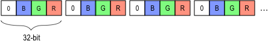

#### CHW (Channels-Height-Width)

The input layer (and *only* the input layer) can alternatively also use the CHW format (a sequence of channels). The highest frequency in this data format is the width W or X-axis, and the lowest frequency is the channel C. Assuming an RGB input, all red pixels are followed by all green pixels, followed by all blue pixels.

Example:

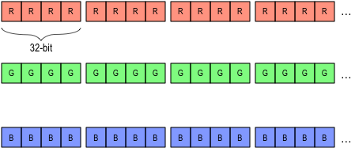


#### Considerations for Choosing an Input Format

The accelerator supports both HWC and CHW input formats to avoid unnecessary data manipulation. Choose the format that results in the least amount of data movement for a given input.

Internal layers and the output layer always use the HWC format.

In general, HWC is faster since each memory read can deliver data to up to four processors in parallel. On the other hand, four processors must share one data memory instance, which reduces the maximum allowable dimensions of the input layer.

#### CHW Input Data Format and Consequences for Weight Memory Layout

When using the CHW data format, only one of the four processors sharing the data memory instance can be used. The next channel needs to use a processor connected to a different data memory instance, so that the machine can deliver one byte per clock cycle to each enabled processor.

Because each processor has its own dedicated weight memory, this will introduce “gaps” in the weight memory map, as shown in the following illustration:


### Active Processors and Layers

For each layer, a set of active processors must be specified. The number of input channels for the layer must be equal to, or be a multiple of, the active processors, and the input data for that layer must be located in data memory instances accessible to the selected processors.

It is possible to specify a relative offset into the data memory instance that applies to all processors.
_Example:_ Assuming HWC data format, specifying the offset as 16,384 bytes (or 0x4000) will cause processors 0-3 to read their input from the second half of data memory 0, processors 4-7 will read from the second half of data memory instance 1, etc.

For most simple networks with limited data sizes, it is easiest to ping-pong between the first and second halves of the data memories – specify the data offset as 0 for the first layer, 0x4000 for the second layer, 0 for the third layer, etc. This strategy avoids overlapping inputs and outputs when a given processor is used in two consecutive layers.

Even though it is supported by the accelerator, the Network Generator will not be able to check for inadvertent overwriting of unprocessed input data by newly generated output data when overlapping data or streaming data. Use the `--overlap-data` command line switch to disable these checks, and to allow overlapped data.

### Layers and Weight Memory

For each layer, the weight memory start column is automatically configured by the Network Loader. The start column must be a multiple of 4, and the value applies to all processors.

The following example shows the weight memory layout for two layers. The first layer (L0) has 8 inputs and 10 outputs, and the second layer (L1) has 10 inputs and 2 outputs.

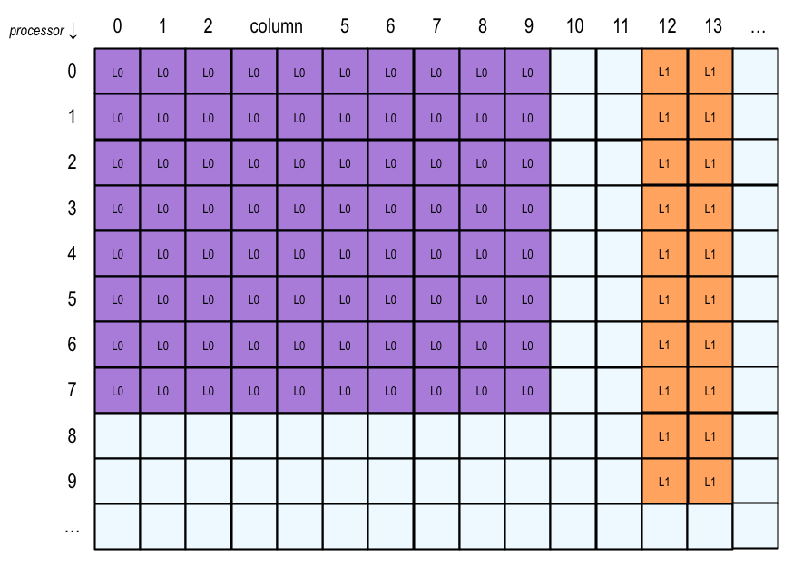

#### Bias Memories

Bias values are stored in separate bias memories. There are four bias memory instances available, and a layer can access any bias memory instance where at least one processor is enabled. By default, bias memories are automatically allocated using a modified Fit-First Descending (FFD) algorithm. Before considering the required resource sizes in descending order, and placing values in the bias memory with the most available resources, the algorithm places those bias values that require a single specified bias memory. The bias memory allocation can optionally be controlled using the [`bias_group`](#bias_group-optional) configuration option.

### Weight Storage Example

The file `ai84net.xlsx` contains an example for a single-channel CHW input using the `AI84Net5` network (this example also supports up to four channels in HWC).

*Note*: As described above, multiple CHW channels must be loaded into separate memory instances. When using a large number of channels, this can cause “holes” in the processor map, which in turn can cause subsequent layers’ kernels to require padding.

The Network Loader prints a kernel map that shows the kernel arrangement based on the provided network description. It will also flag cases where kernel or bias memories are exceeded.

### Example: `Conv2d`

The following picture shows an example of a `Conv2d` with 1×1 kernels, five input channels, two output channels, and a data size of 2×2. The inputs are shown on the left, and the outputs on the right, and the kernels are shown lined up with the associated inputs — the number of kernel rows matches the number of input channels, and the number of kernel columns matches the number of output channels. The lower half of the picture shows how the data is arranged in memory when HWC data is used for both input and output.

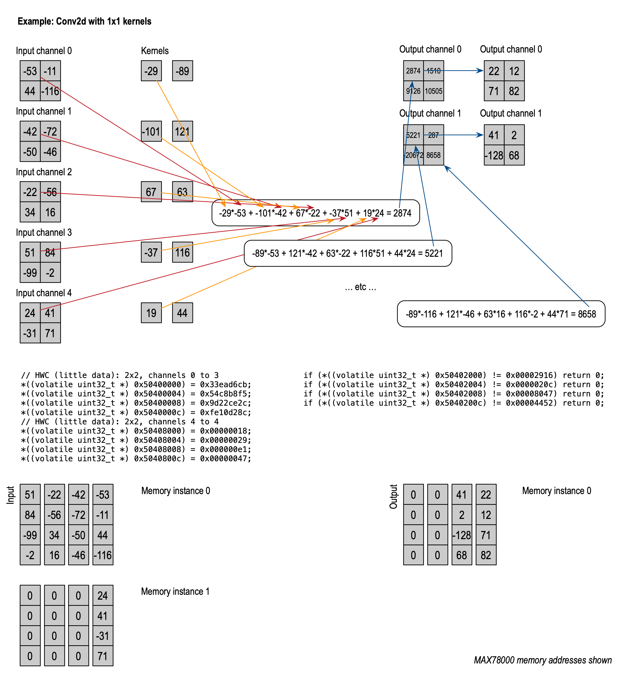

### Activation Functions

MAX78000/MAX78002 hardware provides several activation functions.

#### None

There is always an implicit non-linearity when outputting 8-bit data since outputs are [clamped](#saturation-and-clipping) to $[–128, +127]$ (or $[–128/128, +127/128]$ during training). Due to the clamping, “no activation” behaves similar to PyTorch’s `nn.Hardtanh(min_value=-128[/128], max_value=127[/128])`.

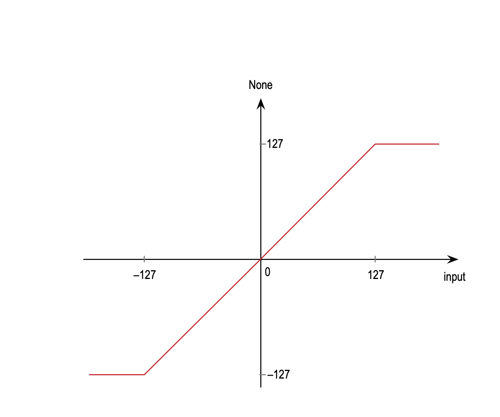

#### ReLU

All output values are [clipped (saturated)](#saturation-and-clipping) to $[0, +127]$. Because of this, `ReLU` behaves more similar to PyTorch’s `nn.Hardtanh(min_value=0, max_value=127[/128])` than to PyTorch’s `nn.ReLU()`.

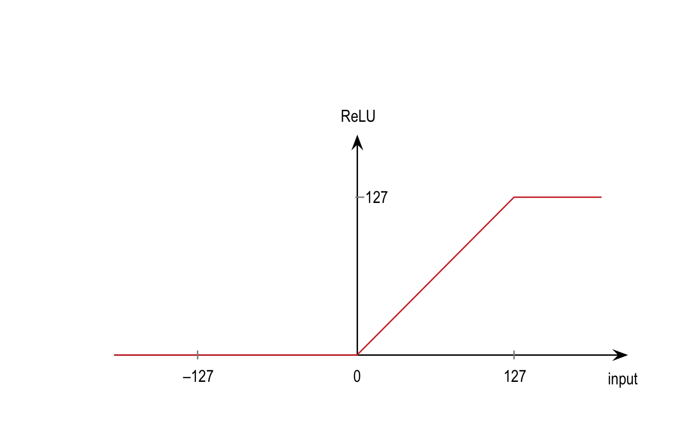

#### Abs

`Abs` returns the absolute value for all inputs, and then [clamps](#saturation-and-clipping) the outputs to $[0, +127]$, similar to PyTorch `abs()` followed by `nn.Hardtanh(min_value=0, max_value=127[/128])`.

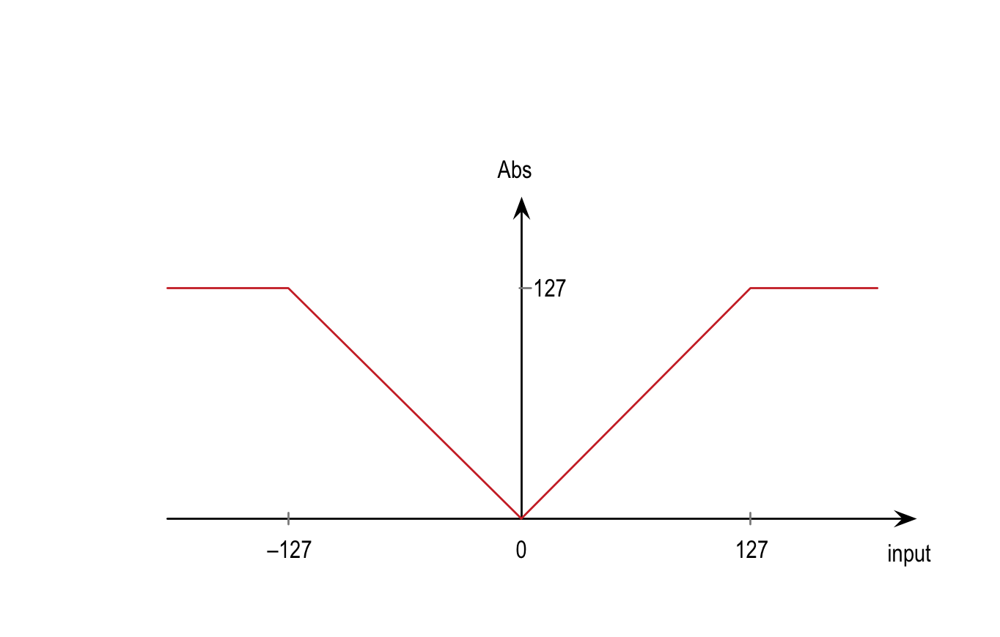

### Limitations of MAX78000 Networks

The MAX78000 hardware does not support arbitrary network parameters. Specifically,

* `Conv2d`:
  
  * Kernel sizes must be 1×1 or 3×3.
    *Note: Stacked 3×3 kernels can achieve the effect of larger kernels. For example, two consecutive layers with 3×3 kernels have the same receptive field as a 5×5 kernel. To achieve the same activation as a 5×5 kernel, additional layers are necessary.*
    *Note: 2×2 kernels can be emulated by setting one row and one column of 3×3 kernels to zero.*
  * Padding can be 0, 1, or 2. Padding always uses zeros.
  * Stride is fixed to [1, 1].
  * Dilation is fixed to 1.
  * Groups must be 1.
  
* `Conv1d`:
  
  * Kernel lengths must be 1 through 9.
  * Padding can be 0, 1, or 2.
  * Stride is fixed to 1.
  * Dilation can be 1 to 1023 for kernel lengths 1, 2, or 3 and is fixed to 1 for kernels with length greater than 3.
  
* `ConvTranspose2d`:

  * Kernel sizes must be 3×3.
  * Padding can be 0, 1, or 2.
  * Stride is fixed to [2, 2]. Output padding is fixed to 1.

* A programmable layer-specific shift operator is available at the output of a convolution, see [`output_shift` (Optional)](#output_shift-optional).

* The supported [activation functions](#activation-functions) are `ReLU` and `Abs`, and a limited subset of `Linear`. *Note that due to [clipping](#saturation-and-clipping), non-linearities are introduced even when not explicitly specifying an activation function.*

* Pooling:
  * Both max pooling and average pooling are available, with or without convolution.
  
  * Pooling does not support padding.
  
  * Pooling more than 64 channels requires the use of a “fused” convolution in the same layer, unless the pooled dimensions are 1×1.
  
  * Pooling strides can be 1 through 16. For 2D pooling, the stride is the same for both dimensions.
  
  * For 2D pooling, supported pooling kernel sizes are 1×1 through 16×16, including non-square kernels. 1D pooling supports kernel sizes from 1 through 16. *Note: Pooling kernel size values do not have to be the same as the pooling stride.*
  
  * Dilation must be 1.
  
  * Average pooling is implemented both using `floor()`and using rounding (half towards positive infinity). Use the `--avg-pool-rounding` switch to turn on rounding in the training software and the Network Generator.
  
    Example:
  
    * _floor:_ Since there is a quantization step at the output of the average pooling, a 2×2 `AvgPool2d` of `[[0, 0], [0, 3]]` will return $\lfloor \frac{3}{4} \rfloor = 0$.
    * _rounding:_ 2×2 `AvgPool2d` of `[[0, 0], [0, 3]]` will return $\lfloor \frac{3}{4} \rceil = 1$.
  
* The number of input channels must not exceed 1024 per layer.

* The number of output channels must not exceed 1024 per layer.

  * Bias is supported for up to 512 output channels per layer.

* The number of layers must not exceed 32 (where pooling and element-wise operations do not add to the count when preceding a convolution).

* The maximum dimension (number of rows or columns) for input or output data is 1023.
  
* Streaming mode:
  
  * When using data greater than 8192 pixels per channel (approximately 90×90 when width = height) in HWC mode, or 32,768 pixels per channel (181×181 when width = height) in CHW mode, and [Data Folding](#data-folding) techniques are not used, then `streaming` mode must be used.
  * When using `streaming` mode, the product of any layer’s input width, input height, and input channels divided by 64 rounded up must not exceed 2^21: $width * height * ⌈\frac{channels}{64}⌉ < 2^{21}$; _width_ and _height_ must not exceed 1023.
  * Streaming is limited to 8 consecutive layers or fewer, and is limited to four FIFOs (up to 4 input channels in CHW and up to 16 channels in HWC format), see [FIFOs](#fifos).
  * For streaming layers, bias values may not be added correctly in all cases.
  * The *final* streaming layer must use padding.
  * Layers that use 1×1 kernels without padding are automatically replaced with equivalent layers that use 3×3 kernels with padding.
  
* The weight memory supports up to 768 * 64 3×3 Q7 kernels (see [Number Format](#number-format)), for a total of [432 KiB of kernel memory](https://github.com/analogdevicesinc/ai8x-synthesis/blob/develop/docs/AHBAddresses.md).
  When using 1-, 2- or 4-bit weights, the capacity increases accordingly.
  When using more than 64 input or output channels, weight memory is shared, and effective capacity decreases proportionally (for example, 128 input channels require twice as much space as 64 input channels, and a layer with <u>both</u> 128 input and 128 output channels requires <u>four</u> times as much space as a layer with only 64 input channels and 64 output channels).
  Weights must be arranged according to specific rules detailed in [Layers and Weight Memory](#layers-and-weight-memory).

* There are 16 instances of 32 KiB data memory ([for a total of 512 KiB](https://github.com/analogdevicesinc/ai8x-synthesis/blob/develop/docs/AHBAddresses.md)). When not using streaming mode, any data channel (input, intermediate, or output) must completely fit into one memory instance. This limits the first-layer input to 32,768 pixels per channel in the CHW format (181×181 when width = height). However, when using more than one input channel, the HWC format may be preferred, and all layer outputs are in HWC format as well. In those cases, it is required that four channels fit into a single memory instance — or 8192 pixels per channel (approximately 90×90 when width = height).
  Note that the first layer commonly creates a wide expansion (i.e., a large number of output channels) that needs to fit into data memory, so the input size limit is mostly theoretical. In many cases, [Data Folding](#data-folding) (distributing the input data across multiple channels) can effectively increase both the input dimensions as well as improve model performance.

* The hardware supports 1D and 2D convolution layers, 2D transposed convolution layers (upsampling), element-wise addition, subtraction, binary OR, binary XOR as well as fully connected layers (`Linear`), which are implemented using 1×1 convolutions on 1×1 data:
  * The maximum number of input neurons is 1024, and the maximum number of output neurons is 1024 (16 each per processor used).
  
  * `Flatten` functionality is available to convert 2D input data for use by fully connected layers, see [Fully Connected Layers](#fully-connected-linear-layers).
  
  * When “flattening” two-dimensional data, the input dimensions (C×H×W) must satisfy C×H×W ≤ 16,384, and H×W ≤ 256. Pooling cannot be used at the same time as flattening.
  
  * Element-wise operators support from 2 up to 16 inputs.
  
  * Element-wise operators can be chained in-flight with pooling and 2D convolution (where the order of pooling and element-wise operations can be swapped).
  
  * For convenience, a `Softmax` operator is supported in software.
  
* Since the internal network format is HWC in groups of four channels, output concatenation only works properly when all components of the concatenation other than the last have multiples of four channels.

* Supported element-wise operations are `add`, `sub`, `bitwise xor`, and `bitwise or`. Element-wise operations can happen “in-flight” in the same layer as a convolution.

* Groups, and depthwise separable convolutions are not supported. *Note: Batch normalization should be folded into the weights, see [Batch Normalization](#batch-normalization).*


### Limitations of MAX78002 Networks

The MAX78002 hardware does not support arbitrary network parameters. Specifically,

* `Conv2d`:

  * Kernel sizes must be 1×1 or 3×3.
    *Note: Stacked 3×3 kernels can achieve the effect of larger kernels. For example, two consecutive layers with 3×3 kernels have the same receptive field as a 5×5 kernel. To achieve the same activation as a 5×5 kernel, additional layers are necessary.*
    *Note: 2×2 kernels can be emulated by setting one row and one column of 3×3 kernels to zero.*
  * Padding can be 0, 1, or 2. Padding always uses zeros.
  * Stride is fixed to [1, 1].
  * Dilation can be 1 to 16.
  * Groups can be 1, or the same as the number of input and output channels (depthwise separable convolution).

* `Conv1d`:

  * Kernel lengths must be 1 through 9.
  * Padding can be 0, 1, or 2, unless there are more than 64 input channels, when padding must be 0.
  * Stride is fixed to 1.
  * Dilation can be 1 to 2047 for kernel lengths 1, 2, or 3 and is fixed to 1 for kernels with length greater than 3.
  * Groups can be 1, or the same as the number of input and output channels (depthwise separable convolution).

* `ConvTranspose2d`:

  * Kernel sizes must be 3×3.
  * Padding can be 0, 1, or 2.
  * Stride is fixed to [2, 2]. Output padding is fixed to 1.

* A programmable layer-specific shift operator is available at the output of a convolution, see [`output_shift` (Optional)](#output_shift-optional).

* The supported [activation functions](#activation-functions) are `ReLU` and `Abs`, and a limited subset of `Linear`. *Note that due to [clipping](#saturation-and-clipping), non-linearities are introduced even when not explicitly specifying an activation function.*

* Pooling:

  * Both max pooling and average pooling are available, with or without convolution.

  * Pooling does not support padding.

  * Pooling strides can be 1 through 16. For 2D pooling, the stride is the same for both dimensions.

  * For 2D pooling, supported pooling kernel sizes are 1×1 through 16×16, including non-square kernels. 1D pooling supports kernel sizes from 1 through 16. *Note: Pooling kernel size values do not have to be the same as the pooling stride.*

  * Dilation is supported from 1 to 16, independently for both dimensions.

  * Average pooling is implemented both using `floor()`and using rounding (half towards positive infinity). Use the `--avg-pool-rounding` switch to turn on rounding in the training software and the Network Generator.

    Example:

    * _floor:_ Since there is a quantization step at the output of the average pooling, a 2×2 `AvgPool2d` of `[[0, 0], [0, 3]]` will return $\lfloor \frac{3}{4} \rfloor = 0$.
    * _rounding:_ 2×2 `AvgPool2d` of `[[0, 0], [0, 3]]` will return $\lfloor \frac{3}{4} \rceil = 1$.

* The number of input channels must not exceed 2048 per layer.

* The number of output channels must not exceed 2048 per layer.

* The number of layers must not exceed 128 (where pooling and element-wise operations do not add to the count when preceding a convolution).

* The maximum dimension (number of rows or columns) for input or output data is 2047.

* Streaming mode:

  * When using data greater than 20,480 pixels per channel in HWC mode (143×143 when height = width), or 81,920 pixels in CHW mode (286×286 when height = width), and [Data Folding](#data-folding) techniques are not used, then `streaming` mode must be used.
  * When using `streaming` mode, the product of any layer’s input width, input height, and input channels divided by 64 rounded up must not exceed 2^21: $width * height * ⌈\frac{channels}{64}⌉ < 2^{21}$; _width_ and _height_ must not exceed 2047.
  * Streaming is limited to 8 consecutive layers or fewer, and is limited to four FIFOs (up to 4 input channels in CHW and up to 16 channels in HWC format), see [FIFOs](#fifos).
  * Layers that use 1×1 kernels without padding are automatically replaced with equivalent layers that use 3×3 kernels with padding.
  * Streaming layers must use convolution (i.e., the `Conv1d`, `Conv2d`, or `ConvTranspose2d` [operators](#operation)).

* The weight memory of processors 0, 16, 32, and 48 supports up to 5,120 3×3 Q7 kernels (see [Number Format](#number-format)), all other processors support up to 4,096 3×3 Q7 kernels, for a total of [2,340 KiB of kernel memory](https://github.com/analogdevicesinc/ai8x-synthesis/blob/develop/docs/AHBAddresses.md).
  When using 1-, 2- or 4-bit weights, the capacity increases accordingly. The hardware supports two different flavors of 1-bit weights, either 0/–1 or +1/–1.
  When using more than 64 input or output channels, weight memory is shared, and effective capacity decreases.
  Weights must be arranged according to specific rules detailed in [Layers and Weight Memory](#layers-and-weight-memory).

* The total of [1,280 KiB of data memory](https://github.com/analogdevicesinc/ai8x-synthesis/blob/develop/docs/AHBAddresses.md) is split into 16 sections of 80 KiB each. When not using streaming mode, any data channel (input, intermediate, or output) must completely fit into one memory instance. This limits the first-layer input to 81,920 pixels per channel in CHW format (286×286 when height = width). However, when using more than one input channel, the HWC format may be preferred, and all layer outputs are in HWC format as well. In those cases, it is required that four channels fit into a single memory section — or 20,480 pixels per channel (143×143 when height = width).
  Note that the first layer commonly creates a wide expansion (i.e., a large number of output channels) that needs to fit into data memory, so the input size limit is mostly theoretical. In many cases, [Data Folding](#data-folding) (distributing the input data across multiple channels) can effectively increase both the input dimensions as well as improve model performance.

* The hardware supports 1D and 2D convolution layers, 2D transposed convolution layers (upsampling), element-wise addition, subtraction, binary OR, binary XOR as well as fully connected layers (`Linear`), which are implemented using 1×1 convolutions on 1×1 data:

  * The maximum number of input neurons is 1024, and the maximum number of output neurons is 1024 (16 each per processor used).
  * `Flatten` functionality is available to convert 2D input data for use by fully connected layers, see [Fully Connected Layers](#fully-connected-linear-layers).
  * When “flattening” two-dimensional data, the input dimensions (C×H×W) must satisfy C×H×W ≤ 16,384, and H×W ≤ 256. Pooling cannot be used at the same time as flattening.
  * Element-wise operators support from 2 up to 16 inputs.
  * Element-wise operators can be chained in-flight with pooling and 2D convolution (where the order of pooling and element-wise operations can be swapped).
  * For convenience, a `Softmax` operator is supported in software.

* The MAX78002 hardware supports executing layers sequentially or in programmed order, and it supports conditional branching based on data and address values and ranges and match counts.

* The MAX78002 hardware supports starting a network at any pre-programmed layer *(streaming is only supported in the first 8 layers)*. This can be used to run more than one network, and transitioning from one network to another.

* Since the internal network format is HWC in groups of four channels, output concatenation only works properly when all components of the concatenation other than the last have multiples of four channels.

* The MAX78002 hardware supports several processing speedups that accesses memory instances in parallel. The tools are capable of generating code that supports these speedups.

* Supported element-wise operations are `add`, `sub`, `xor`, and `or`. Element-wise operations can happen “in-flight” in the same layer as a convolution, *except* when the input is multi-pass (i.e., more than 64 channels), *and* a bias addition is also requested.

* *Note: Batch normalization should be folded into the weights, see [Batch Normalization](#batch-normalization).*


### Fully Connected (Linear) Layers

m×n fully connected layers can be realized in hardware by “flattening” 2D input data of dimensions C×H×W into m=C×H×W channels of 1×1 input data. The hardware will produce n channels of 1×1 output data. When chaining multiple fully connected layers, the flattening step is omitted. The following picture shows 2D data, the equivalent flattened 1D data, and the output.

For MAX78000/MAX78002, the product C×H×W must not exceed 16,384.

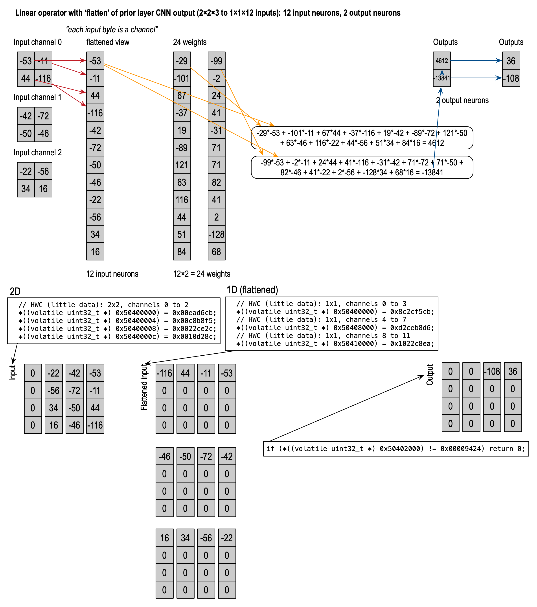

### Upsampling (Fractionally-Strided 2D Convolutions)

The hardware supports 2D upsampling (“fractionally-strided convolutions,” sometimes called “deconvolution” even though this is not strictly mathematically correct). The PyTorch equivalent is `ConvTranspose2d` with a stride of 2.

The example shows a fractionally-strided convolution with a stride of 2, a pad of 1, and a 3×3 kernel. This “upsamples” the input dimensions from 3×3 to output dimensions of 6×6.

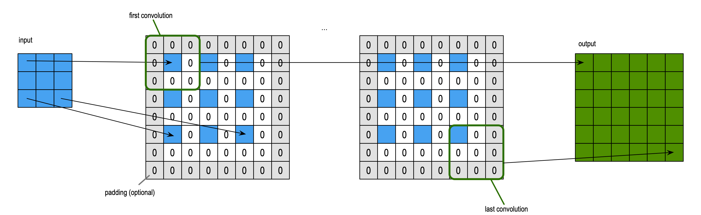

---

## Model Training and Quantization

### Hardware Acceleration

If hardware acceleration is not available, skip the following two steps and continue with [Training Script](#training-script).

Before the first training session, check that hardware acceleration is available and recognized by PyTorch:

 ```shell
   (ai8x-training) $ python check_cuda.py
   System:                 linux
   Python version:         3.11.8 (main, Mar  4 2024, 15:29:36) [GCC 11.4.0]
   PyTorch version:        2.3.1+cu121
   CUDA/ROCm acceleration: available in PyTorch
   MPS acceleration:       NOT available in PyTorch
 ```

CUDA can be diagnosed using `nvidia-smi -q`:

```shell
(ai8x-training) $ nvidia-smi -q
...
Driver Version                            : 545.23.06
CUDA Version                              : 12.3

Attached GPUs                             : 2
GPU 00000000:01:00.0
    Product Name                          : NVIDIA TITAN RTX
    Product Brand                         : Titan
...
```

### Training Script

The main training software is `train.py`. It drives the training aspects, including model creation, checkpointing, model save, and status display (see `--help` for the many supported options, and the `scripts/train_*.sh` scripts for example usage).

The `models/` folder contains models that fit into the MAX78000 or MAX78002’s weight memory. These models rely on the MAX78000/MAX78002 hardware operators that are defined in `ai8x.py`.

To train the FP32 model for MNIST on MAX78000 or MAX78002, run `scripts/train_mnist.sh` from the `ai8x-training` project. This script will place checkpoint files into the log directory. Training makes use of the Distiller framework, but the `train.py` software has been modified slightly to improve it and add some MAX78000/MAX78002 specifics.

#### Distributed Training

On systems with multiple GPUs, the training script supports `DistributedDataParallel`. To use distributed training, prefix the training script with `scripts/distributed.sh`. For example, run `scripts/distributed.sh scripts/train_mnist.sh`. Note that (at this time) distributed training is only supported locally.

Since training can take a significant amount of time, the training script does not overwrite any weights previously produced. Results are placed in sub-directories under `logs/` named with the date and time when training began. The latest results are always soft-linked to by `latest-log_dir` and `latest_log_file`.

#### Troubleshooting

1. If the training script returns `ModuleNotFoundError: No module named 'numpy'`, please activate the virtual environment using `source .venv/bin/activate`, or on native Windows without WSL2, `source .venv/scripts/activate`.

2. If the training script crashes, or if it returns an internal error (such as `CUDNN_STATUS_INTERNAL_ERROR`), it may be necessary to limit the number of PyTorch workers to 1 (this has been observed running on native Windows). Add `--workers=1` when running any training script, for example;

   ```shell
   $ scripts/train_mnist.sh --workers=1
   ```

3. On resource constrained systems, training may abort with an error message such as `RuntimeError: unable to open shared memory object </torch_..._...> in read-write mode`. Add `--workers=0` when running the training script.

4. By default, many systems limit the number of open file descriptors.  `train.py` checks this limit and prints `WARNING: The open file limit is 2048. Please raise the limit (see documentation)` when the limit is low. When the limit is too low, certain actions might abort:

   ```shell
   (ai8x-training) $ scripts/evaluate_facedet_tinierssd.sh 
   WARNING: The open file limit is 1024. Please raise the limit (see documentation).
   ...
   --- test ---------------------
   165656 samples (256 per mini-batch)
   {'multi_box_loss': {'alpha': 2, 'neg_pos_ratio': 3}, 'nms': {'min_score': 0.75, 'max_overlap': 0.3, 'top_k': 20}}
   Traceback (most recent call last):
   ...
   RuntimeError: unable to open shared memory object </torch_202118_3977843486> in read-write mode
   OSError: [Errno 24] Too many open files
   ...
   ```

   To fix this issue, check `ulimit -n` (the soft limit) as well as `ulimit -n -H` (the hard limit) and raise the file descriptor limit using `ulimit -n NUMBER` where NUMBER cannot exceed the hard limit. Note that on many Linux systems, the defaults can be configured in `/etc/security/limits.conf`.

5. Datasets with larger-dimension images may require substantial amounts of system RAM. For example, `scripts/train_kinetics.sh` is configured for systems with 64 GB of RAM. When the system runs out of memory, training is abruptly killed and the error is logged to system journal. The following examples are from a system with 48 GB of RAM:

   ```shell
   ...
   Epoch: [13][  142/  142]    Overall Loss 1.078153    Objective Loss 1.078153    Top1 64.062500    LR 0.000500    Time 1.247024    
   --- validate (epoch=13)-----------
   1422 samples (32 per mini-batch)
   Epoch: [13][   10/   45]    Loss 1.082790    Top1 60.937500    
   Epoch: [13][   20/   45]    Loss 1.099474    Top1 60.312500    
   Epoch: [13][   30/   45]    Loss 1.113100    Top1 59.791667    
   Killed
   ```

   and from the system journal:

   ```shell
   kernel: oom-kill:constraint=CONSTRAINT_NONE,nodemask=(null),cpuset=/,mems_allowed=0,global_oom,task_memcg=/user.slice/user-1000.slice/session-11289.scope,task=python,pid=226828,uid=1000
   kernel: Out of memory: Killed process 226828 (python) total-vm:81269752kB, anon-rss:5711328kB, file-rss:146056kB, shmem-rss:648024kB, UID:1000 pgtables:97700kB oom_score_adj:0
   kernel: oom_reaper: reaped process 226828 (python), now anon-rss:0kB, file-rss:145268kB, shmem-rss:648024kB
   ```

   Training might succeed after reducing the batch size, reducing image dimensions, or pruning the dataset. Unfortunately, the only real fix for this issue is more system RAM. In the example, `kinetics_get_datasets()` from `datasets/kinetics.py` states “The current implementation of using 2000 training and 150 test examples per class at 240×240 resolution and 5 frames per second requires around 50 GB of RAM.”

6. On CUDA-capable machines, the training script by default uses PyTorch 2’s [`torch.compile()` feature](https://pytorch.org/docs/stable/generated/torch.compile.html) which improves execution speed. However, some models may not support this feature. It can be disabled using the command line option
   `--compiler-mode none`
   Disabling `torch.compile()` may also be necessary when using AMD ROCm acceleration.


### Example Training Session

Using the MNIST dataset and a simple model as an example, run `scripts/train_mnist.sh`. The following is the shortened output of an MNIST training session:

```shell
(ai8x-training) $ scripts/train_mnist.sh 
Configuring device: MAX78000, simulate=False.
Log file for this run: logs/2021.07.13-111453/2021.07.13-111453.log
{'start_epoch': 10, 'weight_bits': 8}
Optimizer Type: <class 'torch.optim.sgd.SGD'>
Optimizer Args: {'lr': 0.1, 'momentum': 0.9, 'dampening': 0, 'weight_decay': 0.0001, 'nesterov': False}
Downloading https://ossci-datasets.s3.amazonaws.com/mnist/train-images-idx3-ubyte.gz
Downloading https://ossci-datasets.s3.amazonaws.com/mnist/train-images-idx3-ubyte.gz to data/MNIST/raw/train-images-idx3-ubyte.gz
9913344it [00:01, 5712259.71it/s]                                                                                                                                                                                                                           
Extracting data/MNIST/raw/train-images-idx3-ubyte.gz to data/MNIST/raw

...

Dataset sizes:
        training=54000
        validation=6000
        test=10000
Reading compression schedule from: policies/schedule.yaml


Training epoch: 54000 samples (256 per mini-batch)
Named tensors and all their associated APIs are an experimental feature and subject to change. Please do not use them for anything important until they are released as stable. (Triggered internally at  /pytorch/c10/core/TensorImpl.h:1156.)

Epoch: [0][   10/  211]    Overall Loss 2.298435    Objective Loss 2.298435    Top1 13.710937    Top5 52.070313    LR 0.100000    Time 0.054167    
Epoch: [0][   20/  211]    Overall Loss 2.267082    Objective Loss 2.267082    Top1 16.464844    Top5 58.535156    LR 0.100000    Time 0.039278    
...
Epoch: [0][  211/  211]    Overall Loss 0.867936    Objective Loss 0.867936    Top1 71.101852    Top5 92.837037    LR 0.100000    Time 0.025054    

--- validate (epoch=0)-----------
6000 samples (256 per mini-batch)
Epoch: [0][   10/   24]    Loss 0.295286    Top1 91.367188    Top5 99.492188    
Epoch: [0][   20/   24]    Loss 0.293729    Top1 91.054688    Top5 99.550781    
Epoch: [0][   24/   24]    Loss 0.296180    Top1 91.000000    Top5 99.550000    
==> Top1: 91.000    Top5: 99.550    Loss: 0.296

==> Confusion:
[[581   2   3   1   2   3   4   3   2   4]
 [  0 675   4   1   3   0   1   4   0   0]
 [  5   6 501  21  11   2   4  25   7   4]
 [  1   4   7 549   3   5   0  11   2   1]
 [  2   6   7   0 525   1   3   9   0  12]
 [  0   8   2  10   5 464   3   8   6  12]
 [ 13  18   1   0  10   8 574   0   6   1]
 [  1  11   8   7   3   4   0 588   0   3]
 [ 26   4   7   5   9   9  16   5 482  21]
 [  4   9   5   7  36   8   0  19   6 521]]

==> Best [Top1: 91.000   Top5: 99.550   Sparsity:0.00   Params: 71148 on epoch: 0]
Saving checkpoint to: logs/2021.07.13-111453/checkpoint.pth.tar

...

Training epoch: 54000 samples (256 per mini-batch)
Epoch: [199][   10/  211]    Overall Loss 0.033614    Objective Loss 0.033614    Top1 98.984375    Top5 100.000000    LR 0.000100    Time 0.052778    
...
Epoch: [199][  211/  211]    Overall Loss 0.027310    Objective Loss 0.027310    Top1 99.181481    Top5 99.992593    LR 0.000100    Time 0.024874    

--- validate (epoch=199)-----------
6000 samples (256 per mini-batch)
Epoch: [199][   10/   24]    Loss 0.027533    Top1 98.984375    Top5 100.000000    
Epoch: [199][   20/   24]    Loss 0.028965    Top1 98.984375    Top5 100.000000    
Epoch: [199][   24/   24]    Loss 0.028365    Top1 98.983333    Top5 100.000000    
==> Top1: 98.983    Top5: 100.000    Loss: 0.028

==> Confusion:
[[599   0   1   1   0   0   3   0   0   1]
 [  0 685   0   1   0   0   0   2   0   0]
 [  0   1 581   0   0   0   0   2   2   0]
 [  0   0   1 578   0   2   0   1   1   0]
 [  0   1   1   0 558   0   0   0   1   4]
 [  1   0   0   2   0 513   1   0   1   0]
 [  2   1   0   0   1   0 625   0   2   0]
 [  0   1   3   1   0   0   0 619   0   1]
 [  1   0   1   1   1   1   2   0 577   0]
 [  0   0   0   0   2   1   0   6   2 604]]

==> Best [Top1: 99.283   Top5: 100.000   Sparsity:0.00   Params: 71148 on epoch: 180]
Saving checkpoint to: logs/2021.07.13-111453/qat_checkpoint.pth.tar
--- test ---------------------
10000 samples (256 per mini-batch)
Test: [   10/   40]    Loss 0.017528    Top1 99.453125    Top5 100.000000    
Test: [   20/   40]    Loss 0.015671    Top1 99.492188    Top5 100.000000    
Test: [   30/   40]    Loss 0.013522    Top1 99.583333    Top5 100.000000    
Test: [   40/   40]    Loss 0.013415    Top1 99.590000    Top5 100.000000    
==> Top1: 99.590    Top5: 100.000    Loss: 0.013

==> Confusion:
[[ 980    0    0    0    0    0    0    0    0    0]
 [   0 1133    1    0    0    0    0    1    0    0]
 [   1    0 1025    1    0    0    0    5    0    0]
 [   0    0    0 1010    0    0    0    0    0    0]
 [   0    0    0    0  978    0    2    0    0    2]
 [   0    0    0    3    0  888    1    0    0    0]
 [   0    1    0    0    1    2  953    0    1    0]
 [   0    1    0    0    0    0    0 1026    0    1]
 [   0    0    2    1    1    1    0    1  967    1]
 [   0    0    0    0    5    2    0    3    0  999]]


Log file for this run: logs/2021.07.13-111453/2021.07.13-111453.log

```

For classification, the “Top-1” score refers to the percentage of samples that returned the correct class (the correct target label), while “Top-5” is the percentage of samples the correct answer was one of the five highest ranked predictions. The “Loss” shows the output of the loss function that the training session aims to minimize (the “loss” numbers may be larger than 1, depending on the dataset and model). “LR” is the learning rate, and depending on the learning rate schedule used, LR may decrease as training progresses.

The “Confusion Matrix” shows both the target (expected) label on the vertical (Y) axis, as well as the highest ranked prediction on the horizontal (X) axis. If the network returns 100% expected labels, then only the diagonal (top left to bottom right) will contain values greater than 0.

When enabling TensorBoard (see [TensorBoard](#tensorboard)), these and other statistics are also available in graphical form:

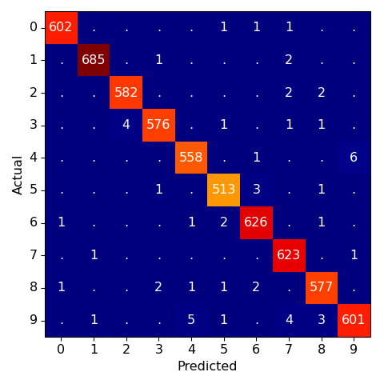

### Command Line Arguments

The following table describes the most important command line arguments for `train.py`. Use `--help` for a complete list.

| Argument                   | Description                                                  | Example                         |
| -------------------------- | ------------------------------------------------------------ | ------------------------------- |
| `--help`                   | Complete list of arguments                                   |                                 |
| *Device selection*         |                                                              |                                 |
| `--device`                 | Set device (default: AI84)                                   | `--device MAX78000`             |
| *Model and dataset*        |                                                              |                                 |
| `-a`, `--arch`, `--model`  | Set model (collected from models folder)                     | `--model ai85net5`              |
| `-f`, `--out-fold-ratio`   | Fold ratio for the model output (default: 1). Fold ratio 1 means no folding. | `--out-fold-ratio 4` |
| `--dataset`                | Set dataset (collected from datasets folder)                 | `--dataset MNIST`               |
| `--data`                   | Path to dataset (default: data)                              | `--data /data/ml`               |
| *Training*                 |                                                              |                                 |
| `--epochs`                 | Number of epochs to train (default: 90)                      | `--epochs 100`                  |
| `-b`, `--batch-size`       | Mini-batch size (default: 256)                               | `--batch-size 512`              |
| `--compress`               | Set compression and learning rate schedule                   | `--compress schedule.yaml`      |
| `--lr`, `--learning-rate`  | Set initial learning rate                                    | `--lr 0.001`                    |
| `--deterministic`          | Seed random number generators with fixed values              |                                 |
| `--resume-from`            | Resume from previous checkpoint                              | `--resume-from chk.pth.tar`     |
| `--qat-policy`             | Define QAT policy in YAML file (default: policies/qat_policy.yaml). Use “None” to disable QAT. | `--qat-policy qat_policy.yaml` |
| `--nas`                    | Enable network architecture search                           |                                 |
| `--nas-policy`             | Define NAS policy in YAML file                               | `--nas-policy nas/nas_policy.yaml` |
| `--regression` | Select regression instead of classification (changes Loss function, and log output) |  |
| `--compiler-mode` | Select [TorchDynamo optimization mode](https://pytorch.org/docs/stable/generated/torch.compile.html) (default: enabled on CUDA capable machines) | `--compiler-mode none` |
| `--dr` | Set target embedding dimensionality for dimensionality reduction                |`--dr 64`                        |
| `--scaf-lr` | Initial learning rate for sub-center ArcFace loss optimizer |  |
| `--scaf-scale` |Scale hyperparameter for sub-center ArcFace loss |  |
| `--scaf-margin` |Margin hyperparameter for sub-center ArcFace loss |  |
| `--backbone-checkpoint` |Path to checkpoint from which to load backbone weights |  |
| *Display and statistics*   |                                                              |                                 |
| `--enable-tensorboard`     | Enable logging to TensorBoard (default: disabled)            |                                 |
| `--confusion`              | Display the confusion matrix                                 |                                 |
| `--param-hist`             | Collect parameter statistics                                 |                                 |
| `--pr-curves`              | Generate precision-recall curves                             |                                 |
| `--embedding`              | Display embedding (using projector)                          |                                 |
| *Hardware*                 |                                                              |                                 |
| `--use-bias`               | The `bias=True` parameter is passed to the model. The effect of this parameter is model-dependent (the parameter does nothing, affects some operations, or all operations). |                                 |
| `--avg-pool-rounding`      | Use rounding for AvgPool                                     |                                 |
| *Evaluation*               |                                                              |                                 |
| `-e`, `--evaluate`         | Evaluate previously trained model                            |                                 |
| `--8-bit-mode`, `-8`       | Simulate quantized operation for hardware device (8-bit data). Used for evaluation only. |     |
| `--exp-load-weights-from`  | Load weights from file                                       |                                 |
| *Export*                   |                                                              |                                 |
| `--summary onnx`           | Export trained model to ONNX (default name: to model.onnx) — *see description below* |         |
| `--summary onnx_simplified` | Export trained model to simplified [ONNX](https://onnx.ai/) file (default name: model.onnx) |                     |
| `--summary-filename`       | Change the file name for the exported model                  | `--summary-filename mnist.onnx` |
| `--save-sample`            | Save data[index] from the test set to a NumPy pickle for use as sample data | `--save-sample 10` |
| `--slice-sample`  | For models that require RGB input, when the sample from the dataset has additional channels, slice the sample into 3 channels                                      |                                 |

#### ONNX Model Export

The ONNX model export (via `--summary onnx` or `--summary onnx_simplified`) is primarily intended for visualization of the model. ONNX does not support all of the operators that `ai8x.py` uses, and these operators are therefore removed from the export (see function `onnx_export_prep()` in `ai8x.py`). The ONNX file does contain the trained weights and *may* therefore be usable for inference under certain circumstances. However, it is important to note that the ONNX file **will not** be usable for training (for example, the ONNX `floor` operator has a gradient of zero, which is incompatible with quantization-aware training as implemented in `ai8x.py`).

### Observing GPU Resources

`nvidia-smi` can be used in a different terminal during training to examine the GPU resource usage of the training process. In the following example, the GPU is using 100% of its compute capabilities, but not all of the available memory. In this particular case, the batch size could be increased to use more memory.

```shell
$ nvidia-smi
+-----------------------------------------------------------------------------+
|  NVIDIA-SMI 470.42.01    Driver Version: 470.42.01    CUDA Version: 11.4    |
|-------------------------------+----------------------+----------------------+
| GPU  Name        Persistence-M| Bus-Id        Disp.A | Volatile Uncorr. ECC |
| Fan  Temp  Perf  Pwr:Usage/Cap|         Memory-Usage | GPU-Util  Compute M. |
|===============================+======================+======================|
|   0  GeForce RTX 208...  Off  | 00000000:01:00.0  On |                  N/A |
| 39%   65C    P2   152W / 250W |   3555MiB / 11016MiB |    100%      Default |
+-------------------------------+----------------------+----------------------+
...
```

### Custom nn.Modules

The `ai8x.py` file contains customized PyTorch classes (subclasses of `torch.nn.Module`). Any model that is designed to run on MAX78000/MAX78002 should use these classes. There are three main changes over the default classes in `torch.nn.Module`:

1. Additional “Fused” operators that model in-flight pooling and activation.
2. Rounding, clipping and activation that matches the hardware.
3. Support for quantized operation (when using the `-8` command line argument).

#### set_device()

`ai8x.py` defines the `set_device()` function which configures the training system:

```python
def set_device(
        device,
        simulate,
        round_avg,
        verbose=True,
):
```

where *device* is `85` (the MAX78000 device code) or `87` (the MAX78002 device code), *simulate* is `True` when clipping and rounding are set to simulate hardware behavior, and *round_avg* picks one of the two hardware rounding modes for AvgPool.

#### update_model()

`ai8x.py` defines `update_model()`. This function is called after loading a checkpoint file, and recursively applies output shift, weight scaling, and quantization clamping to the model.


#### List of Predefined Modules

The following modules are predefined:

| Name                   | Description / PyTorch equivalent        |
| ---------------------- | --------------------------------------- |
| Conv2d                 | Conv2d                                  |
| FusedConv2dReLU        | Conv2d, followed by ReLU                |
| FusedConv2dAbs         | Conv2d, followed by Abs                 |
| MaxPool2d              | MaxPool2d                               |
| FusedMaxPoolConv2d     | MaxPool2d, followed by Conv2d           |
| FusedMaxPoolConv2dReLU | MaxPool2d, followed by Conv2d, and ReLU |
| FusedMaxPoolConv2dAbs  | MaxPool2d, followed by Conv2d, and Abs  |
| AvgPool2d              | AvgPool2d                               |
| FusedAvgPoolConv2d     | AvgPool2d, followed by Conv2d           |
| FusedAvgPoolConv2dReLU | AvgPool2d, followed by Conv2d, and ReLU |
| FusedAvgPoolConv2dAbs  | AvgPool2d, followed by Conv2d, and Abs  |
| ConvTranspose2d        | ConvTranspose2d                         |
| FusedConvTranspose2dReLU      | ConvTranspose2d, followed by ReLU |
| FusedConvTranspose2dAbs       | ConvTranspose2d, followed by Abs |
| FusedMaxPoolConvTranspose2d   | MaxPool2d, followed by ConvTranspose2d |
| FusedMaxPoolConvTranspose2dReLU       | MaxPool2d, followed by ConvTranspose2d, and ReLU |
| FusedMaxPoolConvTranspose2dAbs        | MaxPool2d, followed by ConvTranspose2d, and Abs |
| FusedAvgPoolConvTranspose2d           | AvgPool2d, followed by ConvTranspose2d |
| FusedAvgPoolConvTranspose2dReLU       | AvgPool2d, followed by ConvTranspose2d, and ReLU |
| FusedAvgPoolConvTranspose2dAbs        | AvgPool2d, followed by ConvTranspose2d, and Abs |
| Linear                 | Linear                                  |
| FusedLinearReLU        | Linear, followed by ReLU                |
| FusedLinearAbs         | Linear, followed by Abs                 |
| Conv1d                 | Conv1d                                  |
| FusedConv1dReLU        | Conv1d, followed by ReLU                |
| FusedConv1dAbs         | Conv1d, followed by Abs                 |
| MaxPool1d | MaxPool1d |
| FusedMaxPoolConv1d | MaxPool1d, followed by Conv1d |
| FusedMaxPoolConv1dReLU | MaxPool1d, followed by Conv1d, and ReLU |
| FusedMaxPoolConv1dAbs | MaxPool1d, followed by Conv1d, and Abs |
| AvgPool1d | AvgPool1d |
| FusedAvgPoolConv1d | AvgPool1d, followed by Conv1d |
| FusedAvgPoolConv1dReLU | AvgPool1d, followed by Conv1d, and ReLU |
| FusedAvgPoolConv1dAbs | AvgPool1d, followed by Conv1d, and Abs |
| Add | Element-wise Add |
| Sub | Element-wise Sub |
| BitwiseOr | Element-wise bitwise Or |
| BitwiseXor | Element-wise bitwise Xor |

#### Dropout

Dropout modules such as `torch.nn.Dropout()` and `torch.nn.Dropout2d()` are automatically disabled during inference, and can therefore be used for training without affecting inference. [Dropout](https://en.wikipedia.org/wiki/Dilution_(neural_networks)) can improve generalization by reducing overfitting, but should not be used for “analytical” functions.

*Note: Using [batch normalization](#batch-normalization) in conjunction with dropout can sometimes degrade training results.*

#### view(), reshape() and Flatten

There are two supported cases for `view()` or `reshape()`.

1. Conversion between 1D data and 2D data: Both the batch dimension (first dimension) and the channel dimension (second dimension) must stay the same. The height/width of the 2D data must match the length of the 1D data (i.e., H×W = L).
   Examples:
       `x = x.view(x.size(0), x.size(1), -1)  # 2D to 1D`
       `x = x.view(x.shape[0], x.shape[1], 16, -1)  # 1D to 2D`
   *Note: `x.size()` and `x.shape[]` are equivalent.*
   When reshaping data, `in_dim:` must be specified in the model description file.
2. Conversion from 1D and 2D to Fully Connected (“flattening”): The batch dimension (first dimension) must stay the same, and the other dimensions are combined (i.e., M = C×H×W or M = C×L).
   Example:
       `x = x.view(x.size(0), -1)  # Flatten`
   An alternate way to express the flatten operation is `torch.nn.Flatten()`.

#### Support for Quantization

The hardware always uses signed integers for data and weights. While data is always 8-bit, weights can be configured on a per-layer basis. However, training makes use of floating point values for both data and weights, while also clipping (clamping) values.

##### Data

When using the `-8` command line switch, all module outputs are quantized to 8-bit in the range [-128...+127] to simulate hardware behavior. The `-8` command line switch is designed for *evaluating quantized weights* against a test set, in order to understand the impact of quantization. *Note that model training always uses floating point values, and therefore `-8` is not compatible with training.*

The last layer can optionally use 32-bit output for increased precision. This is simulated by adding the parameter `wide=True` to the module function call.

##### Weights and Activations: Quantization-Aware Training (QAT)

Quantization-aware training (QAT) is enabled by default. QAT is controlled by a policy file, specified by `--qat-policy`.

* After `start_epoch` epochs, an intermediate epoch with no backpropagation will be realized to collect activation statistics. Each layer's activation ranges will be determined based on the range & resolution trade-off from the collected activations. Then, QAT will start and an additional parameter (`output_shift`) will be learned to shift activations for compensating weights  & biases scaling down.
* `weight_bits` describes the number of bits available for weights.
* `overrides` allows specifying the `weight_bits` on a per-layer basis.
* `outlier_removal_z_score` defines the z-score threshold for outlier removal during activation range calculation. (default: 8.0)
* `shift_quantile` defines the quantile of the parameters distribution to be used for the `output_shift` parameter. (default: 1.0)

By default, weights are quantized to 8-bits after 30 epochs as specified in `policies/qat_policy.yaml`. A more refined example that specifies weight sizes for individual layers can be seen in `policies/qat_policy_cifar100.yaml`.

Quantization-aware training can be <u>disabled</u> by specifying `--qat-policy None`.

The proper choice of `start_epoch` is important for achieving good results, and the default policy’s `start_epoch` may be much too small. As a rule of thumb, set `start_epoch` to a very high value (e.g., 1000) to begin, and then observe where in the training process the model stops learning. This epoch can be used as `start_epoch`, and the final network metrics (after an additional number of epochs) should be close to the non-QAT metrics. *Additionally, ensure that the learning rate after the `start_epoch` epoch is relatively small.*

For more information, please also see [Quantization](#quantization).

#### Batch Normalization

Batch normalization after `Conv1d` and `Conv2d` layers is supported using “fusing.” The fusing operation merges the effect of batch normalization layers into the parameters of the preceding convolutional layer, by modifying weights and bias values of that preceding layer. For detailed information about batch normalization fusing/fusion/folding, see Section 3.2 of the following paper: <https://arxiv.org/pdf/1712.05877.pdf>.

After fusing/folding, the network will no longer contain any batchnorm layers. The effects of batch normalization will instead be expressed by modified weights and biases of the preceding convolutional layer.

* When using [Quantization-Aware Training (QAT)](#quantization-aware-training-qat), batchnorm layers <u>are automatically folded</u> during training and no further action is needed.
* When using [Post-Training Quantization](#post-training-quantization), the `batchnormfuser.py` script (see [BatchNorm Fusing](#batchnorm-fusing)) must be called before `quantize.py` to explicitly fuse the batchnorm layers.

*Note: Using batch normalization in conjunction with [dropout](#dropout) can sometimes degrade training results.*

### Adapting Pre-existing Models

In some cases, it may be possible to use generic models that were designed for non-MAX78000/MAX78002 platforms. To adapt pre-existing models to MAX78000/MAX78002, several steps are needed:

1. Check that all operators are supported in hardware (see [List of Predefined Modules](#list-of-predefined-modules), [Dropout](#dropout), and [Batch Normalization](#batch-normalization)).
2. Check that the model size, parameter count, and parameters to the operators are supported (see [Limitations of MAX78000 Networks](#limitations-of-max78000-networks) and [Limitations of MAX78002 Networks](#limitations-of-max78002-networks)). For example, padding must always be zero-padding, and `Conv2d()` supports 1×1 and 3×3 kernels.
3. Change from PyTorch *nn.modules* to the *ai8x* versions of the modules. For example, `nn.Conv2d(…)` ⟶ `ai8x.Conv2d(…)`.
4. Merge modules where possible (for example, `MaxPool2d()` + `Conv2d()` + `ReLU()` = `FusedMaxPoolConv2dReLU()`).
5. [Re-train](#model-training-and-quantization) the model. *This is necessary to correctly model clipping and quantization effects of the hardware.*

### Model Comparison and Feature Attribution

TensorBoard can be used for model comparison and feature attribution.

#### TensorBoard

[TensorBoard](https://www.tensorflow.org/tensorboard/) support is built into `train.py`. When enabled using `--enable-tensorboard`, it provides a local web server that can be started before, during, or after training, and it picks up all data that is written to the `logs/` directory.

For classification models, TensorBoard supports the optional `--param-hist` and `--embedding` command line arguments. `--embedding` randomly selects up to 100 data points from the last batch of each verification epoch. These can be viewed in the “projector” tab in TensorBoard.

`--pr-curves` adds support for displaying precision-recall curves.

To start the TensorBoard server, use a second terminal window:

```shell
(ai8x-training) $ tensorboard --logdir='./logs'
TensorBoard 2.4.1 at http://127.0.0.1:6006/ (Press CTRL+C to quit)
```

On a shared system, add the `--port 0` command line option.

The training progress can be observed by starting TensorBoard and pointing a web browser to the port indicated.

##### Examples

TensorBoard produces graphs and displays metrics that may help optimize the training process, and can compare the performance of multiple training sessions and their settings. Additionally, TensorBoard can show a graphical representation of the model and its parameters, and help discover labeling errors. For more information, please see the [TensorBoard web site](https://www.tensorflow.org/tensorboard/).

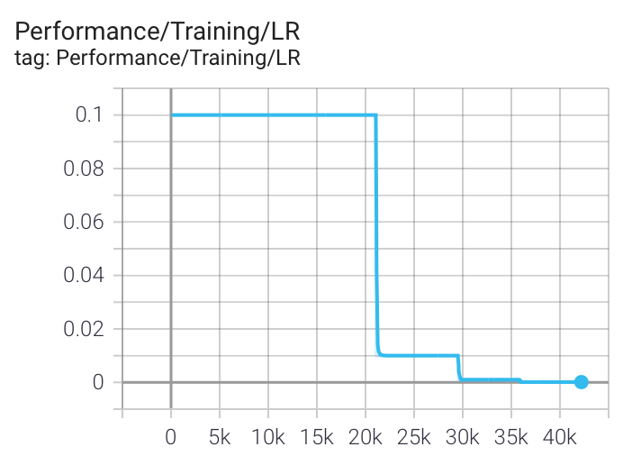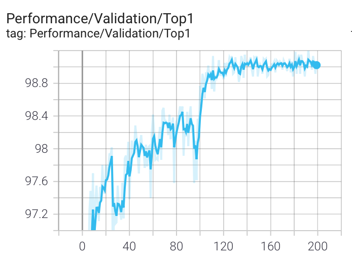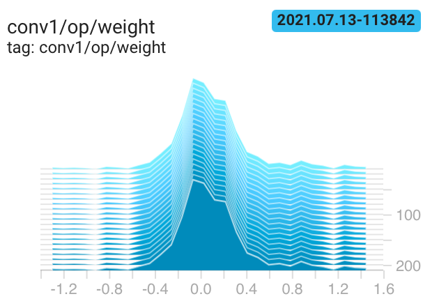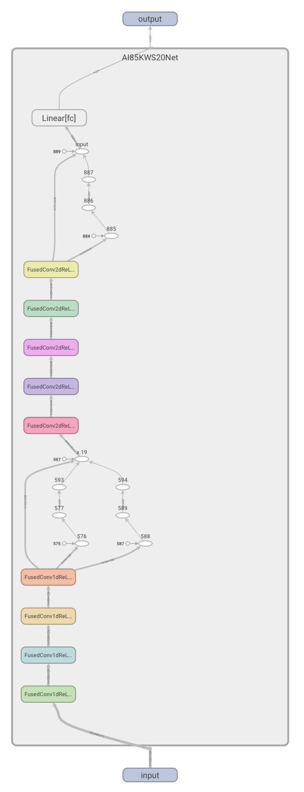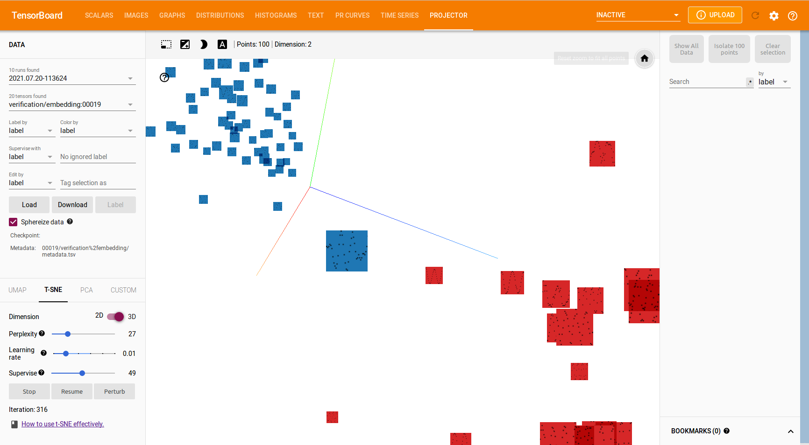

##### Remote Access to TensorBoard

When using a remote system, use `ssh` in another terminal window to forward the remote port to the local machine:

```shell
$ ssh -L 6006:127.0.0.1:6006 targethost
```

When using PuTTY, port forwarding is achieved as follows:


### BatchNorm Fusing

Batchnorm fusing (see [Batch Normalization](#batch-normalization)) is needed as a separate step <u>only when both</u> the following are true:

1. Batch Normalization is used in the network and
2. [Quantization-Aware Training (QAT)](#quantization-aware-training-qat) is <u>not</u> used (i.e., when [post-training quantization](#post-training-quantization) is active).

In order to perform batchnorm fusing, the `batchnormfuser.py` tool must be run *before* the `quantize.py` script.

*Note: Most of the examples either don’t use batchnorm, so no fusing is needed, or they use QAT, so batchnorm fusing happens automatically.*

#### Command Line Arguments

The following table describes the command line arguments for `batchnormfuser.py`:

| Argument            | Description                                                  | Example                                  |
| ------------------- | ------------------------------------------------------------ | ---------------------------------------- |
| `-i`, `--inp_path`  | Set input checkpoint path                                    | `-i logs/2020.06.05-235316/best.pth.tar` |
| `-o`, `--out_path`  | Set output checkpoint path for saving fused model            | `-o best_without_bn.pth.tar`             |
| `-oa`, `--out_arch` | Set output architecture name (architecture without batchnorm layers) | `-oa ai85simplenet`              |


### Data Folding

*Data Folding* is data reshaping operation. When followed by a Conv2d operation, it is equivalent to a convolution operation on the original image with a larger kernel and a larger stride.

On MAX78000 and MAX78002, data folding is beneficial because it increases available resolution and reduces latency. A typical 3-channel RGB image uses only three processors in the first layer which increases latency, and restricts the image dimensions to what can be fit into the data memories associated with three processors.

By creating many low resolution sub-images and concatenating them through the channel dimension, up to 64 processors and their associated data memories can be used. This results in a higher maximum effective resolution, and increased throughput in the first layer.

For certain models (see `models/ai85net-unet.py` in the training repository) this also improves model performance, due to the increase in effective kernel size and stride.

Note that data folding must be applied during model training. During inference, there is no additional overhead; the input data is simply loaded to different processors/memory addresses.


### Quantization

There are two main approaches to quantization — quantization-aware training and post-training quantization. The MAX78000/MAX78002 support both approaches.

For both approaches, the `quantize.py` software quantizes an existing PyTorch checkpoint file and writes out a new PyTorch checkpoint file that can then be used to evaluate the quality of the quantized network, using the same PyTorch framework used for training. The same new quantized checkpoint file will also be used to feed the [Network Loader](#network-loader-ai8xize).

#### Quantization-Aware Training (QAT)

Quantization-aware training is the better performing approach. It is enabled by default. QAT learns additional parameters during training that help with quantization (see [Weights and Activations: Quantization-Aware Training (QAT)](#weights-and-activations-quantization-aware-training-qat). No additional arguments (other than input, output, and device) are needed for `quantize.py`.

The input checkpoint to `quantize.py` is either `qat_best.pth.tar`, the best QAT epoch’s checkpoint, or `qat_checkpoint.pth.tar`, the final QAT epoch’s checkpoint.

Example:

```shell
(ai8x-synthesis) $ python quantize.py proj/qat_best.pth.tar proj/proj_q8.pth.tar --device MAX78000
```


#### Post-Training Quantization

This approach is also called *”naive quantization”*. It should be used when `--qat-policy None` is specified for training.

While several approaches for clipping are implemented in `quantize.py`, clipping with a simple fixed scale factor performs best, based on experimental results. The approach requires the clamping operators implemented in `ai8x.py`.

Note that the “optimum” scale factor for simple clipping is highly dependent on the model and weight data. For the MNIST example, a `--scale 0.85` works well. For the CIFAR-100 example on the other hand, Top-1 performance is 30 points better with `--scale 1.0`.

The input checkpoint to `quantize.py` for post-training quantization is typically `best.pth.tar`, the best epoch’s checkpoint, or `checkpoint.pth.tar`, the final epoch’s checkpoint.

Example:

```shell
(ai8x-synthesis) $ python quantize.py proj2/best.pth.tar proj2/proj2_q8.pth.tar \
--device MAX78000 --scale 0.85 --clip-method SCALE
```


#### Command Line Arguments

The `quantize.py` software has the following important command line arguments:

| Argument              | Description                                                  | Example         |
| --------------------- | ------------------------------------------------------------ | --------------- |
| `--help`              | Complete list of options                                     |                 |
| *Device selection*    |                                                              |                 |
| `--device`            | Set device (default: MAX78000)                               | `--device MAX78002` |
| *Debug*               |                                                              |                 |
| `-v`                  | Verbose output                                               |                 |
| *Weight quantization* |                                                              |                 |
| `-c`, `--config-file` | YAML file with weight quantization information<br />(default: from checkpoint file, or 8-bit for all layers) | `-c mnist.yaml` |
| `--clip-method`       | Non-QAT clipping method — either STDDEV, AVG, AVGMAX or SCALE | `--clip-method SCALE` |
| `--scale`             | Sets scale for the SCALE clipping method                     | `--scale 0.85`  |

*Note: The syntax for the optional YAML file is described below. The same file can be used for both `quantize.py` and `ai8xize.py`.*

*Note:* `quantize.py` does <u>not</u> need access to the dataset.

#### Example and Evaluation

Copy the working and tested weight files into the `trained/` folder of the `ai8x-synthesis` project.

Example for MNIST:

```shell
(ai8x-synthesis) $ scripts/quantize_mnist.sh
Configuring device: MAX78000
Converting checkpoint file trained/ai85-mnist-qat8.pth.tar to trained/ai85-mnist-qat8-q.pth.tar

Model keys (state_dict):
conv1.output_shift, conv1.weight_bits, conv1.bias_bits, conv1.quantize_activation, conv1.adjust_output_shift, conv1.op.weight, conv2.output_shift, conv2.weight_bits, conv2.bias_bits, conv2.quantize_activation, conv2.adjust_output_shift, conv2.op.weight, conv3.output_shift, conv3.weight_bits, conv3.bias_bits, conv3.quantize_activation, conv3.adjust_output_shift, conv3.op.weight, conv4.output_shift, conv4.weight_bits, conv4.bias_bits, conv4.quantize_activation, conv4.adjust_output_shift, conv4.op.weight, fc.output_shift, fc.weight_bits, fc.bias_bits, fc.quantize_activation, fc.adjust_output_shift, fc.op.weight, fc.op.bias, conv1.shift_quantile, conv2.shift_quantile, conv3.shift_quantile, conv4.shift_quantile, fc.shift_quantile
conv1.op.weight avg_max: 0.34562021 max: 0.51949096 mean: 0.02374955 factor: [128.] bits: 8
conv2.op.weight avg_max: 0.2302317 max: 0.269847 mean: -0.021919029 factor: [256.] bits: 8
conv3.op.weight avg_max: 0.42106587 max: 0.49686784 mean: -0.021314206 factor: [256.] bits: 8
conv4.op.weight avg_max: 0.49237916 max: 0.5019533 mean: 0.010923488 factor: [128.] bits: 8
fc.op.weight avg_max: 0.9884483 max: 1.0039074 mean: -0.0033990005 factor: [64.] bits: 8
fc.op.bias avg_max: 0.00029080958 max: 0.26957372 mean: -0.00029080958 factor: [64.] bits: 8
```

To evaluate the quantized network for MAX78000 (**run from the training project**):

```shell
(ai8x-training) $ scripts/evaluate_mnist.sh
...
--- test ---------------------
10000 samples (256 per mini-batch)
Named tensors and all their associated APIs are an experimental feature and subject to change. Please do not use them for anything important until they are released as stable. (Triggered internally at  /pytorch/c10/core/TensorImpl.h:1156.)

Test: [   10/   40]    Loss 0.007288    Top1 99.531250    Top5 100.000000    
Test: [   20/   40]    Loss 0.010161    Top1 99.414062    Top5 100.000000    
Test: [   30/   40]    Loss 0.007681    Top1 99.492188    Top5 100.000000    
Test: [   40/   40]    Loss 0.009589    Top1 99.440000    Top5 100.000000    
==> Top1: 99.440    Top5: 100.000    Loss: 0.010

==> Confusion:
[[ 978    0    1    0    0    0    0    0    1    0]
 [   0 1132    1    1    0    0    1    0    0    0]
 [   0    0 1028    0    0    0    0    4    0    0]
 [   0    1    0 1007    0    1    0    1    0    0]
 [   0    0    1    0  977    0    1    0    1    2]
 [   1    0    0    3    0  884    3    0    0    1]
 [   3    0    1    0    1    3  949    0    1    0]
 [   0    2    1    0    0    0    0 1024    0    1]
 [   0    0    2    1    1    1    0    0  968    1]
 [   0    0    0    0    7    1    0    4    0  997]]

Log file for this run: 2021.07.20-123302/2021.07.20-123302.log
```

*Note that the “Loss” output is not always directly comparable to the unquantized network, depending on the loss function itself.*

#### Troubleshooting

If the model initially trains correctly, but the quantized performance is significantly worse, verify that the data loader calls `ai8x.normalize()`. Data must be normalized to the range expected by hardware, $[–128, +127]$, for both evaluation on simulated hardware and on the actual hardware. See also [Normalizing Input Data](#normalizing-input-data) in the [Data Loader](#data-loader) description.

#### Alternative Quantization Approaches

If quantization-aware training is not desired, post-training quantization can be improved using more sophisticated methods. For example, see
<https://github.com/pytorch/glow/blob/master/docs/Quantization.md>,
<https://github.com/ARM-software/ML-KWS-for-MCU/blob/master/Deployment/Quant_guide.md>,
or Distiller’s approach (installed with this software).

Further, a quantized network can be refined using post-quantization training (see Distiller).

In all cases, ensure that the quantizer writes out a checkpoint file that the Network Loader can read.

### Adding New Network Models and New Datasets to the Training Process

#### Model

The following step is needed to add new network models:

Implement a new network model based on the constraints described earlier, see [Custom nn.Modules](#custom-nnmodules) (and `models/ai85net.py` for an example).

***Note:*** *When re-using existing models, please note that some of the example models are designed to be used with [Neural Architecture Search (NAS)](#neural-architecture-search-nas). These models will typically not perform well, or not fit into hardware without the NAS steps. These models have “nas” as part of their name.*

##### Model Instantiation and Initialization

To support *evaluation* of the quantized model using PyTorch, the model must be instantiated and initialized using all parameters supplied by `train.py`, and the parameters must be passed to the individual *nn.Modules*.

Example:

```python
class NewModel(nn.Module):
    def __init__(self, num_classes=10, num_channels=3, dimensions=(64, 64), bias=False, **kwargs):
        super().__init__()
        self.conv1 = ai8x.FusedConv2dReLU(..., bias=bias, **kwargs)
        ...

    def forward(self, x):
        ...
        
def newmodel(pretrained=False, **kwargs):
    ...
    return NewModel(**kwargs)
```

Note the `__init(...)__` function signature, the extra arguments to `ai8x.FusedConv2dReLU(...)` and the `NewModel(**kwargs)` instantiation.

##### `models` Data Structure

The file must include the `models` data structure that describes the model. `models` can list multiple models in the same file.

For each model, three fields are required in the data structure:

* The `name` field assigns a name to the model for discovery by `train.py`, for example “`resnet5`”, and the name must match a function that instantiates the model. *Note: The `name` must be unique.*
* The `min_input` field describes the minimum width for 2D models, it is typically `1` *(when the input `W` dimension is smaller than `min_input`, it is padded to `min_input`)*.
* The `dim` field is either `1` (the model handles 1D inputs) or `2` (the model handles 2D inputs).

##### Model File Location

Place the new model file (with its unique model name as specified by `name` in the data structure described above) into the `models` folder. `train.py` will now be able to discover and use the new model by specifying `--model modelname`.

#### Data Loader

The application note [Data Loader Design for MAX78000 Model Training](https://www.analog.com/en/app-notes/data-loader-design-for-max78000-model-training.html) provides an in-depth tutorial about developing data loaders.

In brief, the following steps are needed for new data formats and datasets:

* Develop a data loader in PyTorch, see <https://pytorch.org/tutorials/beginner/data_loading_tutorial.html>. See `datasets/mnist.py` for an example.

* The data loader must include a loader function, for example `mnist_get_datasets(data, load_train=True, load_test=True)`. `data` is a tuple of the specified data directory and the program arguments, and the two *bools* specify whether training and/or test data should be loaded.

* The data loader is expected to download and preprocess the datasets as needed and install everything in the specified location.

* The loader returns a tuple of two PyTorch Datasets for training and test data.

##### Normalizing Input Data

For training, input data is expected to be in the range $[–\frac{128}{128}, +\frac{127}{128}]$​. When evaluating quantized weights, or when running on hardware, input data is instead expected to be in the native MAX78000/MAX78002 range of $[–128, +127]$​. Conversely, the majority of PyTorch datasets are PIL images of range $[0, 1]$​​. The respective data loaders therefore call the `ai8x.normalize()` function, which expects an input of 0 to 1 and normalizes the data, automatically switching between the two supported data ranges. *Note: A missing call to `ai8x.normalize()` may cause severe performance degradation when evaluating the quantized model compared to the unquantized model.*

When running inference on MAX78000/MAX78002 hardware, it is important to take the native data format into account, and it is desirable to perform as little preprocessing as possible during inference. For example, an image sensor may return “signed” data in the range $[–128, +127]$ for each color. No additional preprocessing or mapping is needed for this sensor since the model was trained with this data range.

In many cases, image data is delivered as fewer than 8 bits per channel (for example, RGB565). In these cases, retraining the model with this limited range  (0 to 31 for 5-bit color and 0 to 63 for 6-bit color, respectively) can potentially eliminate the need for inference-time preprocessing.

On the other hand, a different sensor may produce unsigned data values in the full 8-bit range $[0, 255]$. This range must be mapped to $[–128, +127]$ to match hardware and the trained model. The mapping can be performed during inference by subtracting 128 from each input byte, but this requires extra (pre-)processing time during inference or while loading data (for example, by using `xor 0x808080`).

##### `datasets` Data Structure

Add the new data loader to a new file in the `datasets` directory (for example `datasets/mnist.py`). The file must include the `datasets` data structure that describes the dataset and points to the new loader. `datasets` can list multiple datasets in the same file.

###### `name`

The `name` field assigns a name to the dataset for discovery by `train.py`, for example “`MNIST`”. *Note: The `name` must be unique.*

###### `input`

The `input` field describes the dimensionality of the data, and the first dimension is passed as `num_channels` to the model, whereas the remaining dimensions are passed as `dimension`. For example, `'input': (1, 28, 28)` will be passed to the model as `num_channels=1` and `dimensions=(28, 28)`. One-dimensional input uses a single “dimension”, for example `'input': (2, 512)` will be passed to the model as `num_channels=2` and `dimensions=(512, )`.

###### `output`

The `output` field is a tuple of strings or numbers that describe the output classes (for example, `'output': (1, 2, 3, …)` or `'output': ('cat', 'dog', …)`).

###### `loader`

`loader` points to a loader function for the dataset (see [Data Loader](#data-loader)).

###### `weight` (optional)

The optional `weight` tuple can be set based on the *[a priori probabilities](https://en.wikipedia.org/wiki/A_priori_probability)* for the classes, i.e., it answers the question *“how likely is it that data submitted for inference belongs to the given class?”.* For instance, if the sample counts for each class in the training dataset are equal, the `weight` tuple indicates the a priori probabilities of the occurrence of the classes. Note that the number of samples in a dataset for a given class does not always reflect the real-world probabilities. When there is a mismatch, a given “weight” value can degrade the performance on the test set, yet improve real-world inference, or vice versa.

Each value in the tuple defines the weight for one output class, in the same order as `output`. When `weight` is <u>not</u> specified, all classes are given the same probability. When specifying a weight for the class “other,” increasing the value may improve results (e.g., multiplying the weight by 4×).

*Example:*

```python
 'output': ('zero', 'one', 'two', 'three', 'four', 'five', 'other'),
 'weight': (1, 1, 1, 1, 1, 1, 0.06),
```

This defines that the probabilities for ‘zero’ to ‘five’ are equal, and that ‘other’ is 1/0.06 = 16.67 times more likely to occur assuming the numbers of the samples in the training dataset from each class are equal.

Note: It is generally recommended to have at least 1,000 samples available for training for each class.

###### `regression` (optional)

The optional `regression` field in the structure can be set to `True` to automatically select the `--regression` command line argument. `regression` defaults to `False`.

###### `visualize` (optional)

The optional `visualize` field can point to a custom visualization function used when creating `--embedding`. The input to the function (format NCHW for 2D data, or NCL for 1D data) is a batch of data (with N ≤ 100). The default handles square RGB or monochrome images. For any other data, a custom function must be supplied.

#### Training and Verification Data

The training/verification data is located (by default) in `data/DataSetName`, for example `data/CIFAR10`. The location can be overridden with the `--data target_directory` command line argument.

#### Training Process

Train the new network/new dataset. See `scripts/train_mnist.sh` for a command line example.

#### Netron — Network Visualization

The [Netron tool](https://github.com/lutzroeder/Netron) can visualize networks, similar to what is available within TensorBoard. To use Netron, use `train.py` to export the trained network to ONNX, and upload the ONNX file. *Please note that not all networks can be exported to ONNX due to limitations in the PyTorch ONNX export library.*

```shell
(ai8x-training) $ python train.py --model ai85net5 --dataset MNIST --evaluate --exp-load-weights-from checkpoint.pth.tar --device MAX78000 --summary onnx
```


### Troubleshooting

The behavior of a training session might change when Quantization Aware Training is enabled, either by no longer learning or by returning unacceptable results when evaluating the quantized weights on the test set.

While there can be multiple reasons for this, check two important settings that can influence the training behavior:

* The initial learning rate may be set too high. Reduce LR by a factor of 10 or 100 by specifying a smaller initial `--lr` on the command line, and possibly by reducing the epoch `milestones` for further reduction of the learning rate in the scheduler file specified by `--compress`. Note that the the selected optimizer and the batch size both affect the learning rate.
* The epoch when QAT is engaged may be set too low. Increase `start_epoch` in the QAT scheduler file specified by `--qat-policy`, and increase the total number of training epochs by increasing the value specified by the `--epochs` command line argument and by editing the `ending_epoch` in the scheduler file specified by `--compress`. *See also the rule of thumb discussed in the section [Weights and Activations: Quantization-Aware Training (QAT)](#weights-and-activations-quantization-aware-training-qat).*


### Neural Architecture Search (NAS)

#### Introduction

The following chapter describes the neural architecture search (NAS) solution for MAX78000/MAX78002 as implemented in the [ai8x-training](https://github.com/analogdevicesinc/ai8x-training) repository. Details are provided about the NAS method, how to run existing NAS models in the repository, and how to define a new NAS model.

The intention of NAS is to find the best neural architecture for a given set of requirements by automating architecture engineering. NAS explores the search space automatically and returns an architecture that is hard to optimize further using human or “manual” design. Multiple different techniques are proposed in the literature for automated architecture search, including reinforcement-based and evolutionary-based solutions.

#### Once-for-All

Once-for-All (OFA) is a weight-sharing-based NAS technique, originally [proposed by MIT and IBM researchers](https://arxiv.org/abs/1908.09791). The paper introduces a method to deploy a trained model to diverse hardware directly without the need of retraining. This is achieved by training a “supernet,” which is named the “Once-for-All” network, and then deploying only part of the supernet, depending on hardware constraints. This requires a training process where all sub-networks are trained sufficiently to be deployed directly. Since training all sub-networks can be computationally prohibitive, sub-networks are sampled during each gradient update step. However, sampling only a small number of networks may cause performance degradation as the sub-networks are interfering with one another. To resolve this issue, a _progressive shrinking_ algorithm is proposed by the authors. Rather than optimizing the supernet directly with all interfering sub-networks, they propose to first train a supernet that is the largest network with maximum kernel size, depth and width. Then, smaller sub-networks that share parameters with the supernet are trained progressively. Thus, smaller networks can be initialized with the most important parameters. If the search space consists of different kernel sizes, depths and widths, they are added to sampling space sequentially to minimize the risk of parameter interference. To illustrate, after full model training, the “elastic kernel” stage is performed, where the kernel size is chosen from {1×1, 3×3} while the depth and width are kept at their maximum values. Next, kernel sizes and depths are sampled in the “elastic depth” stage. Finally, all sub-networks are sampled from the whole search space in the “elastic width” stage.

After the supernet is trained using sub-networks, the “architecture search” stage takes place. The paper proposes evolutionary search as the search algorithm. In this stage, the best architecture is searched, given particular hardware constraints. A set of candidate architectures that perform best on the validation set are mutated, and crossovers are performed iteratively in the algorithm.

After the training and search steps, the model is ready to deploy to the target hardware in the OFA method as the parameters are already trained. However, on MAX78000/MAX78002, the model still needs to be quantized for deployment. Therefore, this implementation has an additional step where the model needs to be trained using the quantization-aware training (QAT) module of the MAX78000/MAX78002 training repository.

To summarize, the sequential steps of the Once-for-All supernet training are:

1. <u>Full model training</u> (stage 0): In this step, the supernet with maximum kernel size, depth and width is trained. This network is suggested to be **at least 3× to 5×** larger than the MAX78000/MAX78002 implementation limits, since sub-networks of the supernet are the targets for MAX78000/MAX78002 deployment.

2. <u>Elastic kernel</u> (stage 1): In this step, only sub-networks with different kernel sizes are sampled from the supernet. For the MAX78000/MAX78002 *Conv2d* layers, the supported sizes are {3×3, 1×1}, and {5, 3, 1} for *Conv1d* layers. Since the sampled sub-network is a part of the supernet, the supernet is updated with gradient updates.

3. <u>Elastic depth</u> (stage 2): In this step, sub-networks with different kernel sizes and depths are sampled from the supernet. In the MAX78000/MAX78002 implementation of OFA, the network is divided into parts called “units.” Each unit can consist of a different number of layers and contain an extra pooling layer at its beginning. Depth sampling is performed inside the units. If a sub-network with _N_ layers in a specific unit is sampled, the first _D_ layers of the unit in the supernet is kept by removing the last _(N-D)_ layers. Consequently, the first layers of each unit are shared among multiple sub-networks.

4. <u>Elastic width</u> (stage 3): In addition to kernel size and depth, sub-networks are sampled from different width options in this stage. For width shrinking, the most important channels with the largest L1 norm are selected. This ensures that only the most important channels are shared. To achieve this, the layer output channels are sorted after each gradient update. The input channels of the following layers are sorted similarly to keep the supernet functional.

5. <u>Evolutionary search</u>: For most search space selections, the number of sub-networks is too large to allow for evaluation of each sub-network. During evolutionary search, better architectures are found after each iteration by mutations and crossovers. The processing time required for this stage depends on the candidate pool size and the number of iterations; however, it is generally much shorter than the time spent for the training stages.

In addition to the steps listed above, QAT is performed using the chosen architecture.

For more details and to better understand OFA, please see the [original paper](https://arxiv.org/abs/1908.09791).

##### Stages and Levels in the MAX78000/MAX78002 Implementation

In the NAS module of the *ai8x-training* repository, there are two concepts that are used to indicate the progress of the NAS training process, called “stages” and “levels.” *Stage* denotes whether full model training (stage 0), elastic kernel (stage 1), elastic depth (stage 2) or elastic width (stage 3) is being performed. Training is completed after stage 3 has finished.

*Levels* denote the phases of stages. In the original [OFA paper](https://arxiv.org/abs/1908.09791), the authors suggest progressive shrinking to facilitate training of interfering sub-networks. Stages play an important role here. In each stage, a new search parameter is introduced to the training. To further facilitate training, stages can be decomposed into levels. With increasing levels, smaller sub-networks become sampleable since the network is trained well enough to be ready for an increased number of sub-networks. For example, if the deepest unit in the network consists of 4 layers, there are 3 levels in stage 2. The reason for this is that in the level 1 of stage 2 (elastic depth), the last layer is removed with 50% probability in the sub-network sampling. Therefore, possible depths are 3 or 4 for that unit in level 1. In level 2, the possible depths for this unit are [2, 3, 4]. Likewise, the possible depths are [1, 2, 3, 4] in level 3. The first layer in a unit is always present, it is never removed in any sub-network. The same level logic applies to stage 1 and stage 3 as well. In stage 1, kernel sizes are sampled. For 2D convolutions, the possible kernel options are either 1×1 or 3×3, so there is only one level. However, for 1D convolutions, kernel sizes could be 5, 3, or 1; therefore, there are two levels. In stage 3, widths are sampled. The possible widths are 100% of the same layer’s width in the supernet, plus 75%, 50%, and 25% of the supernet width. Since there are four options, there are 4–1=3 levels in stage 3. As levels increase, smaller widths become an option in the sampling pool.

In summary, the architecture of the supernet determines how many levels there will be for training. The deepest unit determines the number of levels in stage 2. Assuming there are three levels in stage 2, then training continues from level 1 of stage 3 just after level 3 of stage 2 has completed. The checkpoint files for each level are saved, so it is possible to resume training from a specific level.

#### Usage

Network Architecture Search (NAS) can be enabled using the `--nas` command line option. NAS is based on the Once-For-All (OFA) approach described above. NAS is controlled by a policy file, specified by `--nas-policy`. The policy file contains the following fields:

* `start_epoch`: The full model is trained without any elastic search until this epoch is reached.
* `validation_freq` is set to define the frequency in epochs to calculate the model performance on the validation set after full model training. This parameter is used to save training time, especially when the model includes batch normalization.
* The `elastic_kernel`, `elastic_depth` and `elastic_width` fields are used to define the properties of each elastic search stage. These fields include the following two sub-fields:
  * `leveling` enables leveling during elastic search. *See [above](#stages-and-levels-in-the-max78000max78002-implementation) for an explanation of stages and levels.*
  * `num_epochs` defines the number of epochs for each level of the search stage if `leveling` is `Fal/e`.
* `kd_params` is set to enable Knowledge Distillation.
  * `teacher_model` defines the model used as teacher model. Teacher is the model before epoch `start_epoch` if it is set to `full_model`. Teacher is updated with the model just before the stage transition if this field is set to `prev_stage_model`.
  * See [here](https://intellabs.github.io/distiller/knowledge_distillation.html#knowledge-distillation) for more information to set `distill_loss`, `student_loss` and `temperature`.
* The `evolution_search` field defines the search algorithm parameters used to find the sub-network of the full network.
  * `population_size` is the number of sub-networks to be considered at each iteration.
  * `ratio_parent` is the ratio of the population to be kept for the next iteration.
  * `ratio_mutation` determines the number of mutations at each iteration, which is calculated by multiplying this ratio by the population size.
  * `prob_mutation` is the ratio of the parameter change of a mutated network.
  * `num_iter` is the number of iterations.
  * `constraints` are used to define the constraints of the samples in the population.
    * `min_num_weights` and `max_num_weights` are used to define the minimum and the maximum number of weights in the network.
    * `width_options` is used to limit the possible number of channels in any of the layers in the selected network. This constraint can be used to effectively use memory on MAX78000/MAX78002.

It is also possible to resume NAS training from a saved checkpoint using the `--resume-from` option. The teacher model can also be loaded using the `--nas-kd-resume-from` option.

##### Important Considerations for NAS

* Since the sub-networks are intended to be used on MAX78000/MAX78002, ensure that the full model size of OFA is **at least three times** larger than the MAX78000/MAX78002 kernel memory size. Likewise, it is good practice to design it deeper and wider than the final network that may be considered suitable for the given task. If the initial model size is too big, it will slow down the training process, and there is a risk that most of the sub-networks exceed the MAX78000/MAX78002 resources. Therefore, 3× to 5× is recommended as the size multiplier for the full model selection.
* For the width selection, ensure that widths are multiples of 64 as MAX78000/MAX78002 has 64 processors, and each channel is processed in a separate processor. Using multiples of 64, kernel memory is used more efficiently as widths are searched within [100%, 75%, 50%, 25%] of the initial supernet width selection. Note that these are the default percentages, and they can be changed. Rather than sudden decreases, more granularity and a linear decrease are recommended as this is more suitable for progressive shrinking.
* **NAS training takes time**. It will take days or even weeks depending on the number of sub-networks, the full model size and number of epochs at each stage/level, and the available GPU hardware. It is recommended to watch the loss curves during training and to stop training when the loss fully converges. Then, proceed with the next level using the checkpoint saved from the last level.
* The number of batches in each epoch plays an important role in the selection of the number of epochs for each stage/level. If the dataset is ten times bigger and there are ten times more gradient updates, divide the number of epochs by 10 for the same supernet architecture.

#### NAS Model Definition

The only model architecture implemented in this repository is the sequential model. It is composed of sequential units, which has several sequential *FusedConvNdBNReLU* with an optional *MaxPool* layer at the end, and a *Linear* layer last (see Figure).


All required elastic search strategies are implemented in this [model file](https://github.com/analogdevicesinc/ai8x-training/blob/develop/models/ai85nasnet-sequential.py).

A new model architecture can be implemented by implementing the `OnceForAllModel` interface. The new model class must implement the following:

* `sample_subnet_width`
* `reset_width_sampling`
* `get_max_elastic_width_level`
* `sample_subnet_depth`
* `reset_depth_sampling`
* `get_max_elastic_depth_level`
* `sample_subnet_kernel`
* `reset_kernel_sampling`
* `get_max_elastic_kernel_level`

#### NAS Output

The NAS trains floating point models and logs the best model architectures with the highest accuracies. When NAS has completed, a new model file must be created using the new architecture, either by copying the required parameters to post-training quantization, or by initiating quantization-aware training (QAT).

---


## Network Loader (AI8Xize)

_The `ai8xize` network loader currently depends on PyTorch and Nervana’s Distiller. This requirement will be removed in the future._

The network loader creates C code that programs the MAX78000/MAX78002 (for embedded execution, or RTL simulation). Additionally, the generated code contains sample input data and the expected output for the sample, as well as code that verifies the expected output.

The `ai8xize.py` program needs three inputs:

1. A quantized checkpoint file, generated by the MAX78000/MAX78002 model quantization program `quantize.py`, see [Quantization](#quantization).
2. A YAML description of the network, see [YAML Network Description](#yaml-network-description).
3. A NumPy “pickle” `.npy` file with sample input data, see [Generating a Random Sample Input](#generating-a-random-sample-input).

By default, the C code is split into two files: `main.c` contains the wrapper code, and loads a sample input and verifies the output for the sample input. `cnn.c` contains functions that are generated for a specific network to load, configure, and run the accelerator. During development, this split makes it easier to swap out only the network while keeping customized wrapper code intact.

### Command Line Arguments

The following table describes the most important command line arguments for `ai8xize.py`. Use `--help` for a complete list.

| Argument                 | Description                                                  | Example                         |
| ------------------------ | ------------------------------------------------------------ | ------------------------------- |
| `--help`                 | Complete list of arguments                                   |                                 |
| *Device selection*       |                                                              |                                 |
| `--device`               | Set device (MAX78000, or MAX78002)                           | `--device MAX78002`             |
| *Hardware features*      |                                                              |                                 |
| `--avg-pool-rounding`    | Round average pooling results                                |                                 |
| `--simple1b`             | Use simple XOR instead of 1-bit multiplication               |                                 |
| *Embedded code*          |                                                              |                                 |
| `--config-file`          | YAML configuration file containing layer configuration       | `--config-file cfg.yaml`        |
| `--checkpoint-file`      | Checkpoint file containing quantized weights                 | `--checkpoint-file chk.pth.tar` |
| `--display-checkpoint`   | Show parsed checkpoint data                                  |                                 |
| `--prefix`               | Set test name prefix                                         | `--prefix mnist`                |
| `--board-name`           | Set the target board (default: `EvKit_V1`)                   | `--board-name FTHR_RevA`        |
| *Code generation*        |                                                              |                                 |
| `--overwrite`            | Produce output even when the target directory exists (default: abort) |                        |
| `--compact-weights`      | Use *memcpy* to load weights in order to save code space     |                                 |
| `--mexpress`             | Use faster kernel loading (default)                          |                                 |
| `--no-mexpress`          | Use alternate kernel loading (slower)                        |                                 |
| `--mlator`               | Use hardware to swap output bytes (useful for large multi-channel outputs) |                   |
| `--softmax`              | Add software Softmax functions to generated code             |                                 |
| `--boost`                | Turn on a port pin to boost the CNN supply                   | `--boost 2.5`                   |
| `--timer`                | Insert code to time the inference using a timer              | `--timer 0`                     |
| `--no-wfi`               | Do not use WFI (wait for interrupt) instructions and do not enter sleep mode when waiting for CNN completion. This is required for very fast, small networks. |  |
| `--define`               | Additional preprocessor defines                              | `--define "FAST GOOD"`          |
| *MAX78002*               |                                                              |                                 |
| `--no-pipeline` | **MAX78002 only**: Disable the pipeline and run the CNN on the slower APB clock. This reduces power consumption, but increases inference time and in most cases overall energy usage. |  |
| `--max-speed` | **MAX78002 only:** In pipeline mode, load weights and input data on the PLL clock divided by 1 instead of divided by 4. This is approximately 50% faster, but uses 200% of the energy compared to the default settings. |  |
| *File names*             |                                                              |                                 |
| `--c-filename`           | Main C file name base (default: main.c)                      | `--c-filename main.c`           |
| `--api-filename`         | API C file name (default: cnn.c)                             | `--api-filename cnn.c`          |
| `--weight-filename`      | Weight header file name (default: weights.h)                 | `--weight-filename wt.h`        |
| `--sample-filename`      | Sample data header file name (default: sampledata.h)         | `--sample-filename kat.h`       |
| `--sample-output-filename` | Sample result header file name (default: sampleoutput.h) | `--sample-output-filename katresult.h` |
| `--sample-input`         | Sample data source file name (default: tests/sample_dataset.npy) | `--sample-input kat.npy`    |
| *Streaming and FIFOs*    |                                                              |                                 |
| `--fifo`                 | Use FIFOs to load streaming data                             |                                 |
| `--fast-fifo`            | Use fast FIFO to load streaming data                         |                                 |
| `--fast-fifo-quad`       | Use fast FIFO in quad fanout mode (implies --fast-fifo)      |                                 |
| *RISC-V*                 |                                                              |                                 |
| `--riscv`                | Use RISC-V processor                                         |                                 |
| `--riscv-debug`          | Use RISC-V processor and enable the RISC-V JTAG              |                                 |
| `--riscv-exclusive`      | Use exclusive SRAM access for RISC-V (implies --riscv)       |                                 |
| *Debug and logging*      |                                                              |                                 |
| `-v`, `--verbose`        | Verbose output                                               |                                 |
| `--no-log`               | Do not redirect stdout to log file (default: enabled)        |                                 |
| `--log-intermediate`     | Log data between layers                                      |                                 |
| `--log-pooling`          | Log unpooled and pooled data between layers in CSV format    |                                 |
| `--log-filename`         | Log file name (default: log.txt)                             | `--log-filename run.log`        |
| `-D`, `--debug`          | Debug mode                                                   |                                 |
| `--debug-computation`    | Debug computation (SLOW)                                     |                                 |
| `--stop-after`           | Stop after layer                                             | `--stop-after 2`                |
| `--one-shot`             | Use layer-by-layer one-shot mechanism                        |                                 |
| `--ignore-bias-groups`   | Do not force `bias_group` to only available x16 quadrants    |                                 |
| *Streaming tweaks*       |                                                              |                                 |
| `--overlap-data`         | Allow output to overwrite input                              |                                 |
| `--override-start`       | Override auto-computed streaming start value (x8 hex)        |                                 |
| `--increase-start`       | Add integer to streaming start value (default: 2)            |                                 |
| `--override-rollover`    | Override auto-computed streaming rollover value (x8 hex)     |                                 |
| `--override-delta1`      | Override auto-computed streaming delta1 value (x8 hex)       |                                 |
| `--increase-delta1`      | Add integer to streaming delta1 value (default: 0)           |                                 |
| `--override-delta2`      | Override auto-computed streaming delta2 value (x8 hex)       |                                 |
| `--increase-delta2`      | Add integer to streaming delta2 value (default: 0)           |                                 |
| `--ignore-streaming`     | Ignore all 'streaming' layer directives                      |                                 |
| *Power saving*           |                                                              |                                 |
| `--powerdown`            | Power down unused MRAM instances                             |                                 |
| `--deepsleep`            | Put Arm core into deep sleep                                 |                                 |
| *Hardware settings*      |                                                              |                                 |
| `--input-offset`         | First layer input offset (x8 hex, defaults to 0x0000)        | `--input-offset 2000`           |
| `--mlator-noverify`      | Do not check both mlator and non-mlator output               |                                 |
| `--write-zero-registers` | Write registers even if the value is zero                    |                                 |
| `--init-tram`            | Initialize TRAM (compute cache) to 0                         |                                 |
| `--zero-sram`            | Zero memories                                                |                                 |
| `--zero-unused`          | Zero unused registers                                        |                                 |
| `--ready-sel`            | Specify memory waitstates                                    |                                 |
| `--ready-sel-fifo`       | Specify FIFO waitstates                                      |                                 |
| `--ready-sel-aon`        | Specify AON waitstates                                       |                                 |
| *Various*                |                                                              |                                 |
| `--synthesize-input`     | Instead of using large sample input data, use only the first `--synthesize-words` words of the sample input, and add N to each subsequent set of `--synthesize-words` 32-bit words | `--synthesize-input 0x112233` |
| `--synthesize-words`     | When using `--synthesize-input`, specifies how many words to use from the input. The default is 8. This number must be a divisor of the total number of pixels per channel. | `--synthesize-words 64` |
| `--max-verify-length`    | Instead of checking all of the expected output data, verify only the first N words | `--max-verify-length 1024` |
| `--no-unload`            | Do not create the `cnn_unload()` function                    |                                 |
| `--no-kat`               | Do not generate the `check_output()` function (disable known-answer test)  |                   |
| `--no-deduplicate-weights` | Do not deduplicate weights and and bias values             |                                 |
| `--no-scale-output` | Do not use scales from the checkpoint to recover output range while generating `cnn_unload()` function | |

### YAML Network Description

The [quick-start guide](https://github.com/analogdevicesinc/MaximAI_Documentation/blob/main/Guides/YAML%20Quickstart.md) provides a short overview of the purpose and structure of the YAML network description file.

If `yamllint` is installed and available in the shell path, it is automatically run against the configuration file and all warnings and errors are reported.
*Note: The name of the linter can be changed using the `--yamllint` command line argument.*

The following is a detailed guide into all supported configuration options.

An example network description for the ai85net5 architecture and MNIST is shown below:

```yaml
---
# CHW (big data) configuration for MNIST
  
arch: ai85net5
dataset: MNIST

# Define layer parameters in order of the layer sequence
layers:
  - pad: 1
    activate: ReLU
    out_offset: 0x2000
    processors: 0x0000000000000001
    data_format: CHW
    op: conv2d
  - max_pool: 2
    pool_stride: 2
    pad: 2
    activate: ReLU
    out_offset: 0
    processors: 0xfffffffffffffff0
    op: conv2d
  - max_pool: 2
    pool_stride: 2
    pad: 1
    activate: ReLU
    out_offset: 0x2000
    processors: 0xfffffffffffffff0
    op: conv2d
  - avg_pool: 2
    pool_stride: 2
    pad: 1
    activate: ReLU
    out_offset: 0
    processors: 0x0ffffffffffffff0
    op: conv2d
  - op: mlp
    flatten: true
    out_offset: 0x1000
    output_width: 32
    processors: 0x0000000000000fff
```

To generate an embedded MAX78000 demo in the `demos/ai85-mnist/` folder, use the following command line:

```shell
(ai8x-synthesize) $ python ai8xize.py --verbose --test-dir demos --prefix ai85-mnist --checkpoint-file trained/ai85-mnist.pth.tar --config-file networks/mnist-chw-ai85.yaml --device MAX78000 --compact-data --softmax
```

*Note: For MAX78002, substitute MAX78002 as the `--device`.*

Running this command will combine the network described above with a fully connected software classification layer. The generated code will include all loading, unloading, and configuration steps.

To generate an RTL simulation for the same network and sample data in the directory `tests/ai85-mnist-....` (where .... is an autogenerated string based on the network topology), use:

```shell
(ai8x-synthesize) $ python ai8xize.py --rtl --verbose --autogen rtlsim --test-dir rtlsim --prefix ai85-mnist --checkpoint-file trained/ai85-mnist.pth.tar --config-file networks/mnist-chw-ai85.yaml --device MAX78000
```


### Network Loader Configuration Language

Network descriptions are written in YAML (see <https://en.wikipedia.org/wiki/YAML>). There are two sections in each file — global statements and a sequence of layer descriptions.

*Note: The network loader automatically checks the configuration file for syntax errors and prints warnings for non-fatal errors if `yamllint` is installed in the shell search path. To perform the same checks manually, run:* `yamllint configfile.yaml` (to use a different linter, specify `--yamllint mylinter`).

#### Purpose of the YAML Network Description

The network description must match the model that was used for training. In effect, the checkpoint file contains the trained weights, and the YAML file contains a description of the network structure. Additionally, the YAML file (sometimes also called “sidecar file”) describes which processors to use (`processors`) and which offsets to read and write data from (`in_offset` and `out_offset`).

##### Data Memory Ping-Pong

For simple networks with relatively small data dimensions, the easiest way to use the data offsets is by “ping-ponging” between offset 0 and half the memory (offset 0x4000 on MAX78000 or offset 0xA000 on MAX78002). For example, the input is loaded at offset 0, and the first layer produces its output at offset 0x4000. The second layer reads from 0x4000 and writes to 0. Assuming the dimensions are small enough, this easy method avoids overwriting an input that has not yet been consumed by the accelerator.

#### Global Configuration

##### `arch` (Mandatory)

`arch` specifies the network architecture, for example `ai84net5`. This key is matched against the architecture embedded in the checkpoint file.

##### `bias` (Optional, Test Only)

The `bias` configuration is only used for test data. *To use bias with trained networks, use the `bias` parameter in PyTorch’s `nn.Module.Conv2d()` function. The converter tool will then automatically add bias parameters as needed.*

##### `dataset` (Mandatory)

`dataset` configures the data set for the network. Data sets are for example `mnist`, `fashionmnist`, and `cifar-10`. This key is descriptive only, it does not configure input or output dimensions or channel count.

##### `output_map` (Optional)

The global `output_map`, if specified, overrides the memory instances where the last layer outputs its results. If not specified, this will be either the `output_processors` specified for the last layer, or, if that key does not exist, default to the number of processors needed for the output channels, starting at 0. Please also see `output_processors`.

Example:
        `output_map: 0x0000000000000ff0`

##### `unload` (Optional)

By default, the function `cnn_unload()` is automatically generated from the network’s output layers (typically, the final layer). `unload` can be used to override the shape and sequence of data copied from the CNN. It is possible to specify multiple `unload` list items, and they will be processed in the order they are given.

The following keywords are required for each `unload` list item:

`processors`: The processors data is copied from
`channels`: Data channel count
`dim`: Data dimensions (1D or 2D)
`offset`: Data source offset
`width`: Data width (optional, defaults to 8) — either 8 or 32
`write_gap`: Gap between data words (optional, defaults to 0)

When `--no-scale-output` is not specified, scales from the checkpoint file are used to recover the output range. If there is a non-zero scale for the 8 bits output, the output will be scaled and kept in 16 bits. If the scale is zero, the output will be 8 bits. For 32 bits output, the output will be kept in 32 bits always.

Example:

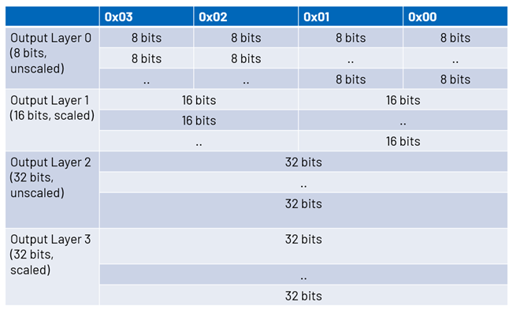

##### `layers` (Mandatory)

`layers` is a list that defines the per-layer description, as shown below:

#### Per-Layer Configuration

Each layer in the `layers` list describes the layer’s processors, convolution type, activation, pooling, weight and output sizes, data input format, data memory offsets, and its processing sequence. Several examples are located in the `networks/` and `tests/` folders.

##### `name` (Optional)

`name` assigns a name to the current layer. By default, layers are referenced by their sequence number. Using `name`, they can be referenced using a string. *Note: “stop” and “input” are reserved names.*

Example:
        `name: parallel_1_2`

##### `sequence` (Optional)

This key allows overriding of the processing sequence. The default is `0` for the first layer, or the previous layer’s sequence + 1 for other layers.

`sequence` numbers may have gaps. The software will sort layers by their numeric value, with the lowest value first.

##### `next_sequence` (Optional)

On MAX78000, layers are executed sequentially. On MAX78002, this key can optionally be used to specify the next layer (by either using an integer number or a name). `stop` terminates execution.

Example:
        `next_sequence: final`

##### `processors` (Mandatory)

`processors` specifies which processors will handle the input data. The processor map must match the number of input channels, and the input data format. For example, in CHW format, processors must be attached to different data memory instances.

`processors` is specified as a 64-bit hexadecimal value. Dots (‘.’) and a leading ‘0x’ are ignored.

*Note: When using multi-pass (i.e., using more than 64 channels), the number of processors is an integer division of the channel count, rounded up to the next multiple of 4. For example, 52 processors are required for 100 channels (since 100 div 2 = 50, and 52 is the next multiple of 4). For best efficiency, use channel counts that are multiples of 4.*

Example for three processors 0, 4, and 8:
        `processors: 0x0000.0000.0000.0111`

Example for four processors 0, 1, 2, and 3:
        `processors: 0x0000.0000.0000.000f`

##### `output_processors` (Optional)

`output_processors` specifies which data memory instances and 32-bit word offsets to use for the layer’s output data. When not specified, this key defaults to the next layer’s `processors`, or, for the last layer, to the global `output_map`. `output_processors` is specified as a 64-bit hexadecimal value. Dots (‘.’) and a leading ‘0x’ are ignored.

##### `out_offset` (Optional)

`out_offset` specifies the relative offset inside the data memory instance where the output data should be written to. When not specified, `out_offset` defaults to `0`. See also [Data Memory Ping-Pong](#data-memory-ping-pong).

Example:
        `out_offset: 0x2000`

##### `in_offset` (Optional)

`in_offset` specifies the offset into the data memory instances where the input data should be loaded from. When not specified, this key defaults to the previous layer’s `out_offset`, or `0` for the first layer.

Example:
        `in_offset: 0x2000`

##### `output_width` (Optional)

When **not** using an `activation` and when `operation` is **not** `None`/`Passthrough`, a layer can output `32` bits of unclipped data in Q17.14 format. Typically, this is used for the **last** layer. The default is `8` bits. *Note that the corresponding model’s layer must be trained with* `wide=True` *when* `output_width` *is 32*.

Example:
        `output_width: 32`

##### `data_format` (Optional)

When specified for the first layer only, `data_format` can be either `chw`/`big` or `hwc`/`little`. The default is `hwc`. Note that the data format interacts with `processors`, see [Channel Data Formats](#channel-data-formats).

##### `operation`

This key (which can also be specified using `op`, `operator`, or `convolution`) selects a layer’s main operation after the optional input pooling.
When this key is not specified, a warning is displayed, and `Conv2d` is selected.

| Operation                 | Description                                                  |
| :------------------------ | :----------------------------------------------------------- |
| `Conv1d`                  | 1D convolution over an input composed of several input planes |
| `Conv2d`                  | 2D convolution over an input composed of several input planes |
| `ConvTranspose2d`         | 2D transposed convolution (upsampling) over an input composed of several input planes |
| `None` or `Passthrough`   | No operation *(note: input and output processors must be the same)* |
| `Linear` or `FC` or `MLP` | Linear transformation to the incoming data (fully connected layer) |
| `Add`                     | Element-wise addition                                        |
| `Sub`                     | Element-wise subtraction                                     |
| `BitwiseXor` or `Xor`     | Element-wise binary XOR                                      |
| `BitwiseOr` or `Or`       | Element-wise binary OR                                       |

Element-wise operations default to two operands. This can be changed using the `operands` key.

##### `eltwise` (Optional)

Element-wise operations can also be added “in-flight” to `Conv2d`. In this case, the element-wise operation is specified using the `eltwise` key.
*Note: On MAX78000, this is only supported for 64 channels, or up to 128 channels when only two operands are used. Use a separate layer for the element-wise operation when more operands or channels are needed instead of combining the element-wise operator with a convolution.*

Example:
        `eltwise: add`

##### `dilation` (Optional)

Specifies the dilation for Conv1d/Conv2d operations (default: `1`). *Note: Conv2d dilation is only supported on MAX78002.*

Example:
        `dilation: 7`

##### `groups` (Optional)

By default, Conv1d and Conv2d are configured with *groups=1,* a “full” convolution. On MAX78002 only, depthwise separable convolutions can be specified using groups=channels (input channels must match the output channels).

Example:
        `op: conv2d`
        `groups: 64`

##### `pool_first` (Optional)

When using both pooling and element-wise operations, pooling is performed first by default. Optionally, the element-wise operation can be performed before the pooling operation by setting `pool_first` to `False`.

Example:
        `pool_first: false`

##### `operands` (Optional)

For any element-wise `operation`, this key configures the number of operands from `2` to `16` inclusive. The default is `2`.

Example:
        `operation: add`
        `operands: 4`

##### `activate` (Optional)

This key describes whether to activate the layer output (the default is to not activate). When specified, this key must be `ReLU`, `Abs` or `None` (the default). *Please note that there is always an implicit non-linearity when outputting 8-bit data since outputs are clamped to $[–1, +127/128]$, see [activation functions](#activation-functions).*

`output_shift` can be used for (limited) “linear” activation.

##### `quantization` (Optional)

This key describes the width of the weight memory in bits and can be `1`, `2`, `4`, `8`, or `binary` (MAX78002 only). Specifying a `quantization` that is smaller than what the weights require results in an error message. The default value is based on the `weight_bits` field in `state_dict` read from the quantized checkpoint for the layer.

*On MAX78002 only, `binary` sets the alternate 1-bit representation of –1/+1.*

Example:
        `quantization: 4`

##### `output_shift` (Optional)

When `output_width` is 8, the 32-bit intermediate result can be shifted left or right before reduction to 8-bit. The value specified here is cumulative with the value generated from and used by `quantization`. Note that `output_shift` is not supported for passthrough layers.

The 32-bit intermediate result is multiplied by $2^{totalshift}$, where the total shift count must be within the range $[-15, +15]$, resulting in a factor of $[2^{–15}, 2^{15}]$ or $[0.0000305176$ to $32768]$.

| weight quantization | shift used by quantization | available range for `output_shift` |
| ------------------- | -------------------------- | ---------------------------------- |
| 8-bit               | 0                          | $[-15, +15]$                       |
| 4-bit               | 4                          | $[-19, +11]$                       |
| 2-bit               | 6                          | $[-21, +9]$                        |
| 1-bit               | 7                          | $[-22, +8]$                        |

Using `output_shift` can help normalize data, particularly when using small weights. By default, `output_shift` is generated by the training software, and it is used for batch normalization as well as quantization-aware training.

*Note:* When using 32-bit wide outputs in the final layer, no hardware shift is performed and `output_shift` is ignored.

Example:
        `output_shift: 2`

##### `kernel_size` (Optional)

* For `Conv2d`, this key must be `3x3` (the default) or `1x1`.
* For `Conv1d`, this key must be `1` through `9`.
* For `ConvTranspose2d`, this key must be `3x3` (the default).

Example:
        `kernel_size: 1x1`

##### `stride` (Optional)

This key must be `1` or `[1, 1]`.

##### `pad` (Optional)

`pad` sets the padding for the convolution.

* For `Conv2d`, this value can be `0`, `1` (the default), or `2`.
* For `Conv1d`, the value can be `0`, `1`, `2`, or `3` (the default).
* For `ConvTranspose2d`, this value can be `0`, `1` (the default), or `2`. *Note that the value follows PyTorch conventions and effectively adds* `(kernel_size – 1) – pad` *amount of zero padding to both sizes of the input, so “0” adds 2 zeros each and “2” adds no padding.*
* For `Passthrough`, this value must be `0` (the default).

##### `max_pool` (Optional)

When specified, performs a `MaxPool` before the convolution. The pooling size can be specified as an integer (when the value is identical for both dimensions, or for 1D convolutions), or as two values in order `[H, W]`.

Example:
        `max_pool: 2`

##### `avg_pool` (Optional)

When specified, performs an `AvgPool` before the convolution. The pooling size can be specified as an integer (when the value is identical for both dimensions, or for 1D convolutions), or as two values in order `[H, W]`.

Example:
        `avg_pool: 2`

##### `pool_dilation` (Optional)

When performing a pooling operation *on MAX78002*, this key describes the pool dilation. The pooling dilation can be specified as an integer (when the value is identical for both dimensions, or for 1D convolutions), or as two values in order `[H, W]`. The default is `1` or `[1, 1]`.

Example:
        `pool_dilation: [2, 1]`

##### `pool_stride` (Optional)

When performing a pooling operation, this key describes the pool stride. The pooling stride can be specified as an integer (when the value is identical for both dimensions, or for 1D convolutions), or as two values in order `[H, W]`, where both values must be identical. The default is `1` or `[1, 1]`.

Example:
        `pool_stride: [2, 2]`

##### `in_channels` (Optional)

`in_channels` specifies the number of channels of the input data. This is usually automatically computed based on the weights file and the layer sequence. This key allows overriding of the number of channels. See also: `in_dim`.

Example:
        `in_channels: 8`

##### `in_dim` (Optional)

`in_dim` specifies the dimensions of the input data. This is usually automatically computed based on the output of the previous layer or the layer(s) referenced by `in_sequences`. This key allows overriding of the automatically calculated dimensions. `in_dim` must be used when changing from 1D to 2D data or vice versa. 1D dimensions can be specified as a tuple `[L, 1]` or as an integer `L`.

See also: `in_channels`, `in_crop`.

Examples:
        `in_dim: [64, 64]`
        `in_dim: 32`

##### `in_crop` (Optional)

`in_crop` specifies a number of rows (2D) or data bytes (1D) to skip (crop) when using the previous layer's output as input. By also adjusting `in_offset`, this provides the means to crop the top/bottom of an image or the beginning/end of 1D data. The dimensions and offsets are validated to match (minus the crop amount).

See also: `in_dim`, `in_offset`.

Example (1D cropping):
        `# Output data had L=512`
        `in_offset: 0x000c  # Skip 3 (x4 processors) at beginning`
        `in_dim: 506  # Target length = 506`
        `in_crop: [3, 3]  # Crop 3 at the beginning, 3 at the end`

##### `in_sequences` (Optional)

By default, a layer’s input is the output of the previous layer. `in_sequences` can be used to point to the output of one or more arbitrary previous layers, for example when processing the same data using two different kernel sizes, or when combining the outputs of several prior layers. `in_sequences` can be specified as a single item (for a single input) or as a list (for multiple inputs). Both layer sequence numbers as well as layer names can be used. As a special case, `-1` or `input` refer to the input data. The `in_offset` and `out_offset` must be set to match the specified sequence.

###### Multiple Arguments (Element-wise Operations)

`in_sequences` is used to specify the inputs for a multi-operand element-wise operator (for example, `add`). The output processors for all arguments of the sequence must match.

###### Layer Concatenation

`in_sequences` can also be used to specify concatenation similar to `torch.cat()`.

The output processors must be adjacent for all sequence arguments, and arguments listed earlier must use lower processor numbers than arguments listed later. The order of arguments of `in_sequences` must match the model. The following code shows an example `forward` function for a model that concatenates two values:

```python
def forward(self, x):
    x = self.conv0(x)  # Layer 0
    y = self.conv1(x)  # Layer 1
    y = torch.cat((y, x), dim=1)
```

In this case, `in_sequences` would be `[1, 0]` since `y` (the output of layer 1) precedes `x` (the output of layer 0) in the `torch.cat()` statement.

Examples:
        `in_sequences: [2, 3]`
        `in_sequences: [expand_1x1, expand_3x3]`

See the [Fire example](#example) for a network that uses `in_sequences`.

##### `out_channels` (Optional)

`out_channels` specifies the number of channels of the output data. This is usually automatically computed based on the weights and layer sequence. This key allows overriding the number of output channels.

Example:
        `out_channels: 8`

##### `streaming` (Optional)

`streaming` specifies that the layer is using [streaming mode](#streaming-mode). This is necessary when the input data dimensions exceed the available data memory. When enabling `streaming`, all prior layers have to enable `streaming` as well. `streaming` can be enabled for up to 8 layers.

Example:
        `streaming: true`

##### `flatten` (Optional)

`flatten` specifies that 2D input data should be transformed to 1D data for use by a `Linear` layer. *Note that flattening cannot be used in the same layer as pooling.*

Example:
        `flatten: true`

##### `write_gap` (Optional)

`write_gap` specifies the number of channels that should be skipped during write operations (this value is multiplied with the output multi-pass, i.e., write every *n*th word where *n = write_gap × output_multipass*). This creates an interleaved output that can be used as the input for subsequent layers that use an element-wise operation, or to concatenate multiple inputs to form data with more than 64 channels. The default is 0.

Set `write_gap` to `1` to produce output for a subsequent two-input element-wise operation.

Example:
        `write_gap: 1`

##### `read_gap` (Optional)

On MAX78002 only, when multi-pass is not used (i.e., typically 64 input channels or less), data can be fetched while skipping bytes. This allows a layer to directly consume data produced by a layer with `write_gap` without the need for intermediate layers. The default is 0.

Example:
        `read_gap: 1`

##### `bias_group` (Optional)

For layers that use a bias, this key can specify one or more bias memories that should be used. By default, the software uses a “Fit First Descending (FFD)” allocation algorithm that considers the largest bias lengths first, and then the layer number, and places each bias in the available quadrant with the most available space, descending to the smallest bias length.

“Available quadrants” is the complete list of quadrants used by the network (in any layer). `bias_group` must reference one or more of these available quadrants.

`bias_group` can be a list of integers or a single integer.

Example:
        `bias_group: 0`

##### `output` (Optional)

By default, the final layer is used as the output layer. Output layers are checked using the known-answer test, and they are copied from hardware memory when `cnn_unload()` is called. The tool also checks that output layer data isn’t overwritten by any later layers.

When specifying `output: true`, any layer (or a combination of layers) can be used as an output layer.
*Note:* When `--no-unload` is used, output layers are not used for generating `cnn_unload()`.

Example:
        `output: true`

##### `weight_source` (Optional)

Certain networks share weights between layers. The tools automatically deduplicate weights and bias values (unless `--no-deduplicate-weights` is specified). When the checkpoint file does *not* contain duplicated weights, `weight_source: layer` is needed in the YAML configuration for the layer(s) that reuse(s) weights. `layer` can be specified as layer number or name.

Example:
        `weight_source: conv1p3`

#### Rolling Buffers

Certain networks (such as TCN) require rolling data buffers. These are implemented in the YAML file (for a complete example, please see `networks/ai85-kinetics-actiontcn.yaml`).

##### `data_buffer` (Global)

The data buffer is allocated and named using the global `data_buffer` configuration key. `processor`,  `dim` (1D or 2D), `channels`, and `offset` must be defined.

Example:

```yaml
data_buffer:
  - processors: 0xffffffff00000000
    dim: 15
    channels: 32
    offset: 0x7fc4
    name: tcn_buffer
```

##### `buffer_shift` (per layer)

The buffer is shifted `n` places using `buffer_shift: n`. `in_offset` and `in_dim` are required.

Example:

```yaml
- processors: 0xffffffff00000000
    output_processors: 0xffffffff00000000
    in_offset: 0x7FC8
    in_channels: 32
    in_dim: 14
    in_sequences: tcn_buffer
    out_offset: 0x7fc4
    operation: passthrough
    buffer_shift: 1
    name: buffer_shift
```

##### `buffer_insert` (per layer)

New data is added using `buffer_insert: n`.

Example:

```yaml
 - processors: 0xffffffffffffffff
    output_processors: 0xffffffff00000000
    in_offset: 0x5000
    out_offset: 0x7FFC
    operation: Conv2d
    in_sequences: res4_out
    buffer_insert: 1
    kernel_size: 3x3
    pad: 0
    activate: ReLU
    name: conv5
```

##### Buffer use

The buffer is used with `in_sequences`, in the example `in_sequences: tcn_buffer`. To use the buffer contents as input, `in_offset` and `in_dim` are required.

#### Dropout and Batch Normalization

* Dropout is only used during training, and corresponding YAML entries are not needed.
* Batch normalization (“batchnorm”) is fused into the preceding layer’s weights and bias values (see [Batch Normalization](#batch-normalization)), and YAML entries are not needed.

#### Example

The following shows an example for a single “Fire” operation, the MAX78000/MAX78002 hardware layer numbers and its YAML description.

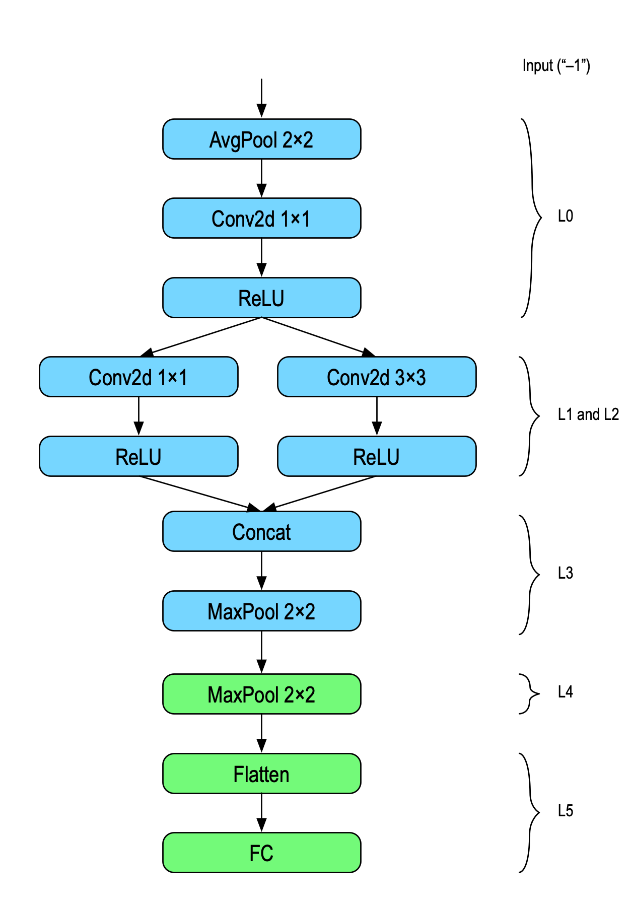

```yaml
---
arch: ai85firetestnet
dataset: CIFAR-10
# Input dimensions are 3x32x32

layers:
  ### Fire
  # Squeeze (0)
  - avg_pool: 2
    pool_stride: 2
    pad: 0
    in_offset: 0x1000
    processors: 0x0000000000000007
    data_format: HWC
    out_offset: 0x0000
    operation: conv2d
    kernel_size: 1x1
    activate: ReLU
  # Expand 1x1 (1)
  - in_offset: 0x0000
    out_offset: 0x1000
    processors: 0x0000000000000030
    output_processors: 0x0000000000000f00
    operation: conv2d
    kernel_size: 1x1
    pad: 0
    activate: ReLU
    name: expand_1x1
  # Expand 3x3 (2)
  - in_offset: 0x0000
    out_offset: 0x1000
    processors: 0x0000000000000030
    output_processors: 0x000000000000f000
    operation: conv2d
    kernel_size: 3x3
    activate: ReLU
    in_sequences: 0
    name: expand_3x3
  # Concatenate (3)
  - max_pool: 2
    pool_stride: 2
    in_offset: 0x1000
    out_offset: 0x0000
    processors: 0x000000000000ff00
    operation: none
    in_sequences: [expand_1x1, expand_3x3]
  ### Additional layers (4, 5)
  - max_pool: 2
    pool_stride: 2
    out_offset: 0x1000
    processors: 0x000000000000ff00
    operation: none
  - flatten: true
    out_offset: 0x0000
    op: mlp  # The fully connected (FC) layer L5
    processors: 0x000000000000ff00
    output_width: 32
```

#### Residual Connections

Many networks use residual connections. In the following example, the convolution on the right works on the output data of the first convolution. However, that same output data also “bypasses” the second convolution and is added to the output.

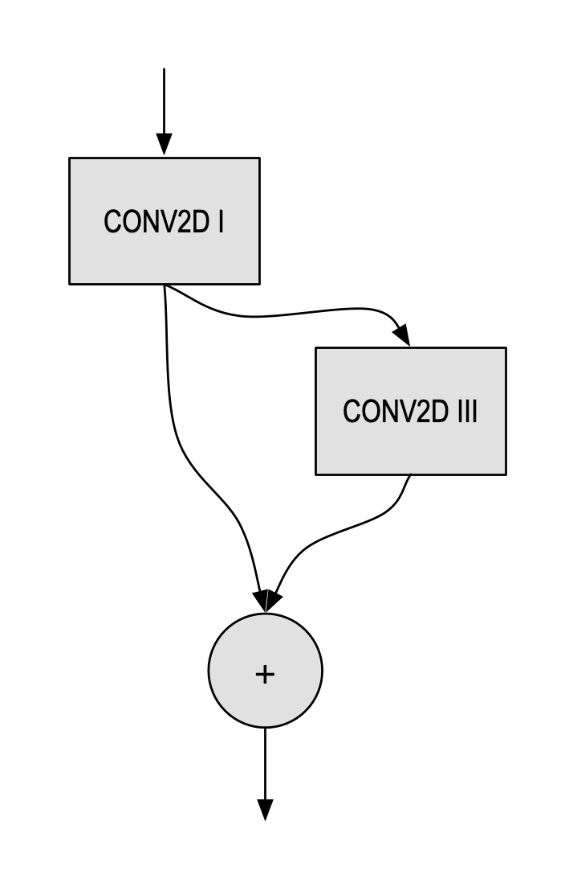

On MAX78000/MAX78002, the element-wise addition works on “interleaved data,” i.e., each machine fetch gathers one operand.

In order to achieve this, a layer must be inserted that does nothing else but reformat the data into interleaved format using the `write_gap` keyword (this operation happens in parallel and is fast).

```yaml
---
...
layers:
  ...
  # Layer I
  - out_offset: 0x0000
    processors: 0x0ffff00000000000
    operation: conv2d
    kernel_size: 3x3
    pad: 1
    activate: ReLU
  
  # Layer II - re-format data with gap
  - out_offset: 0x2000
    processors: 0x00000000000fffff
    output_processors: 0x00000000000fffff
    operation: passthrough
    write_gap: 1
    name: layerII
  
  # Layer III
  - in_offset: 0x0000
    out_offset: 0x2004
    processors: 0x00000000000fffff
    operation: conv2d
    kernel_size: 3x3
    pad: 1
    activate: ReLU
    write_gap: 1
    name: layerIII
  
  # Layer IV - Residual
  - in_sequences: [layerII, layerIII]
    in_offset: 0x2000
    out_offset: 0x0000
    processors: 0x00000000000fffff
    eltwise: add
    ...
```

The same network can also be viewed graphically:

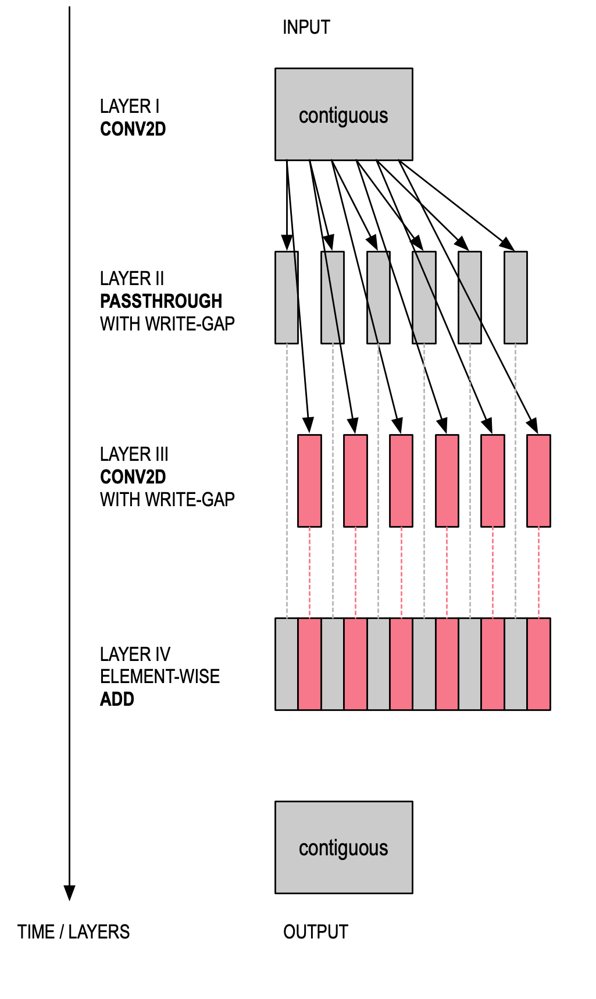

#### Automatically Generating YAML Network Descriptions (Preview)

The ai8x-training repository includes a *preview version* of the “yamlwriter” tool integrated into `train.py` which can create a skeleton YAML file for many networks (excluding data memory allocation). To use this tool:

1. Switch to the training repository.
2. Use the training script and append “--yaml-template myfile.yaml” (see example below).
3. **IMPORTANT!** Edit the resulting output and manually assign processors and data memory offsets.

Please note that the tool is not compatible with some of the features of more complex networks. It can nevertheless help getting started with writing a new YAML network description file.

Simple example for MNIST:

```shell
(ai8x-training) $ scripts/train_mnist.sh --yaml-template mnist.yaml
(ai8x-training) $ vim mnist.yaml
```

Next, edit the resulting yaml file and adjust the `in_offset`, `out_offset` and `processors`, `output_processors` as needed.


### Adding New Models and New Datasets to the Network Loader

Adding new datasets to the Network Loader is implemented as follows:

1. Provide the [network model](#model), its YAML description and weights. Place the YAML file (e.g., `new.yaml`) in the `networks` directory, and weights in the `trained` directory.
   The non-quantized weights are obtained from a training checkpoint, for example:
   `(ai8x-synthesis) $ cp ../ai8x-training/logs/2020.06.02-154133/best.pth.tar trained/new-unquantized.pth.tar`

2. When using post-training quantization, the quantized weights are the result of the quantization step. Copy and customize an existing quantization shell script, for example:
   `(ai8x-synthesis) $ cp scripts/quantize_mnist.sh scripts/quantize_new.sh`

   Then, *edit this script to point to the new [model](#model) and [dataset](#data-loader)* (`vi scripts/quantize_new.sh`), and call the script to generate the quantized weights. Example:

   ```shell
   (ai8x-synthesis) $ scripts/quantize_new.sh 
   Configuring device: MAX78000.
   Reading networks/new.yaml to configure network...
   Converting checkpoint file trained/new-unquantized.pth.tar to trained/new.pth.tar
   +----------------------+-------------+----------+
   | Key                  | Type        | Value    |
   |----------------------+-------------+----------|
   | arch                 | str         | ai85net5 |
   | compression_sched    | dict        |          |
   | epoch                | int         | 165      |
   | extras               | dict        |          |
   | optimizer_state_dict | dict        |          |
   | optimizer_type       | type        | SGD      |
   | state_dict           | OrderedDict |          |
   +----------------------+-------------+----------+
   Model keys (state_dict):
   conv1.conv2d.weight, conv2.conv2d.weight, conv3.conv2d.weight, conv4.conv2d.weight, fc.linear.weight, fc.linear.bias
   conv1.conv2d.weight avg_max: tensor(0.3100) max: tensor(0.7568) mean: tensor(0.0104) factor: 54.4 bits: 8
   conv2.conv2d.weight avg_max: tensor(0.1843) max: tensor(0.2897) mean: tensor(-0.0063) factor: 108.8 bits: 8
   conv3.conv2d.weight avg_max: tensor(0.1972) max: tensor(0.3065) mean: tensor(-0.0053) factor: 108.8 bits: 8
   conv4.conv2d.weight avg_max: tensor(0.3880) max: tensor(0.5299) mean: tensor(0.0036) factor: 108.8 bits: 8
   fc.linear.weight avg_max: tensor(0.6916) max: tensor(0.9419) mean: tensor(-0.0554) factor: 108.8 bits: 8
   fc.linear.bias   
   ```

3. Provide a sample input. The sample input is used to generate a known-answer test (self test) against the predicted label. The purpose of the sample input is to ensure that the generated code matches the model — it does <u>*not*</u> ensure that the model is of good quality. However, it can help finding issues in the YAML description of the model.

   The sample input is provided as a NumPy “pickle” — add `sample_dset.npy` for the dataset named `dset` to the `tests` directory. This file can be generated by saving a sample in CHW format (no batch dimension) using `numpy.save()`, see below.

   For example, the MNIST 1×28×28 image sample would be stored in `tests/sample_mnist.npy` in an `np.array` with shape `[1, 28, 28]` and datatype `>i8` (`np.int64`). The file can contain random integers, or it can be obtained from the `train.py` software.

   *Note: To convert an existing sample input file to `np.int64`, use the `tests/convert_sample.py` script.*

#### Generating a Random Sample Input

To generate a random sample input, use a short NumPy script. In the grayscale MNIST example:

```python
import os
import numpy as np

a = np.random.randint(-128, 127, size=(1, 28, 28), dtype=np.int64)
np.save(os.path.join('tests', 'sample_mnist'), a, allow_pickle=False, fix_imports=False)
```

For RGB image inputs, there are three channels. For example, a 3×80×60 (C×H×W) input is created using `size=(3, 80, 60)`.
**Note:** The array must be of data type `np.int64`.

#### Saving a Sample Input from Training Data

1. In the `ai8x-training` project, add the argument `--save-sample 10` to the `scripts/evaluate_mnist.sh` script. *Note: The index 10 is arbitrary, but it must be smaller than the batch size. If manual visual verification is desired, it is a good idea to pick a sample where the quantized model computes the correct answer.*

2. Run the modified `scripts/evaluate_mnist.sh`. It will produce a file named `sample_mnist.npy`.

3. Save the `sample_mnist.npy` file and copy it to the `ai8x-synthesis` project.

#### Evaluate the Quantized Weights with the New Dataset and Model

1. Switch to training project directory and activate the environment:

   ```shell
   (ai8x-synthesis) $ deactivate
   $ cd ../ai8x-training
   $ source .venv/bin/activate
   ```

2. Create an evaluation script and run it:

   ```shell
   (ai8x-training) $ cp scripts/evaluate_mnist.sh scripts/evaluate_new.sh
   (ai8x-training) $ vim scripts/evaluate_new.sh
   (ai8x-training) $ scripts/evaluate_new.sh
   ```

   Example output:

   ```shell
   (ai8x-training) $ scripts/evaluate_new.sh 
   Configuring device: MAX78000, simulate=True.
   Log file for this run: logs/2020.06.03-125328/2020.06.03-125328.log
   --------------------------------------------------------
   Logging to TensorBoard - remember to execute the server:
   > tensorboard --logdir='./logs'
   
   => loading checkpoint ../ai8x-synthesis/trained/new.pth.tar
   => Checkpoint contents:
   +----------------------+-------------+----------+
   | Key                  | Type        | Value    |
   |----------------------+-------------+----------|
   | arch                 | str         | ai85net5 |
   | compression_sched    | dict        |          |
   | epoch                | int         | 165      |
   | extras               | dict        |          |
   | optimizer_state_dict | dict        |          |
   | optimizer_type       | type        | SGD      |
   | state_dict           | OrderedDict |          |
   +----------------------+-------------+----------+
   
   => Checkpoint['extras'] contents:
   +-----------------+--------+-------------------+
   | Key             | Type   | Value             |
   |-----------------+--------+-------------------|
   | best_epoch      | int    | 165               |
   | best_top1       | float  | 99.46666666666667 |
   | clipping_method | str    | SCALE             |
   | clipping_scale  | float  | 0.85              |
   | current_top1    | float  | 99.46666666666667 |
   +-----------------+--------+-------------------+
   
   Loaded compression schedule from checkpoint (epoch 165)
   => loaded 'state_dict' from checkpoint '../ai8x-synthesis/trained/new.pth.tar'
   Optimizer Type: <class 'torch.optim.sgd.SGD'>
   Optimizer Args: {'lr': 0.1, 'momentum': 0.9, 'dampening': 0, 'weight_decay': 0.0001, 'nesterov': False}
   Dataset sizes:
     training=54000
     validation=6000
     test=10000
   --- test ---------------------
   10000 samples (256 per mini-batch)
   Test: [   10/   40]    Loss 44.193750    Top1 99.609375    Top5 99.960938    
   Test: [   20/   40]    Loss 66.567578    Top1 99.433594    Top5 99.980469    
   Test: [   30/   40]    Loss 51.816276    Top1 99.518229    Top5 99.986979    
   Test: [   40/   40]    Loss 53.596094    Top1 99.500000    Top5 99.990000    
   ==> Top1: 99.500    Top5: 99.990    Loss: 53.596
   
   ==> Confusion:
   [[ 979    0    0    0    0    0    0    0    1    0]
    [   0 1132    1    0    0    0    0    2    0    0]
    [   2    0 1026    1    0    0    0    3    0    0]
    [   0    0    0 1009    0    0    0    0    1    0]
    [   0    0    0    0  978    0    0    0    0    4]
    [   1    0    0    3    0  886    1    0    0    1]
    [   5    4    1    0    1    0  946    0    1    0]
    [   0    1    3    0    0    0    0 1023    0    1]
    [   0    0    0    1    1    1    0    0  970    1]
    [   0    0    0    0    4    1    0    3    0 1001]]
   
   Log file for this run: logs/2020.06.03-125328/2020.06.03-125328.log
   ```

### Generating C Code

Run `ai8xize.py` with the new network and the new sample data to generate embedded C code that can be compiled with the Arm and RISC-V compilers. See `gen-demos-max78000.sh` for examples.

#### Starting an Inference, Waiting for Completion, Multiple Inferences in Sequence

An inference is started by configuring registers and weights, loading the input, and enabling processing. This code is automatically generated — see the `cnn_init()`, `cnn_load_weights()`, `cnn_load_bias()`, `cnn_configure()`, and `load_input()` functions. The sample data can be used as a self-checking feature on device power-up since the output for the sample data is known.
To start the accelerator, use `cnn_start()`. The `load_input()` function is called either before `cnn_start()`, or after `cnn_start()`, depending on whether FIFOs are used. To run a second inference with new data, call `cnn_start()` again (after or before loading the new data input using load_input()`).

The MAX78000/MAX78002 accelerator can generate an interrupt on completion, and it will set a status bit (see `cnn.c`). The resulting data can now be unloaded from the accelerator (code for this is also auto-generated in `cnn_unload()`).

To run another inference, ensure all quadrants are disabled (stopping the state machine, as shown in `cnn_init()`). Next, load the new input data and start processing.


#### Overview of the Functions in main.c

The generated code is split between API code (in `cnn.c`) and data-dependent code in `main.c` or `main_riscv.c`. The data-dependent code is based on a known-answer test. The `main()` function shows the proper sequence of steps to load and configure the CNN accelerator, run it, unload it, and verify the result.

`void load_input(void);`
Load the example input. This function can serve as a template for loading data into the CNN accelerator. Note that the clocks and power to the accelerator must be enabled first. If this is skipped, the device may appear to hang and the [recovery procedure](https://github.com/analogdevicesinc/MaximAI_Documentation/tree/main/MAX78000_Feather#how-to-unlock-a-max78000-that-can-no-longer-be-programmed) may have to be used.

`int check_output(void);`
This function verifies that the known-answer test works correctly in hardware (using the example input). This function is typically not needed in the final application.

`int main(void);`
This is the main function and can serve as a template for the user application. It shows the correct sequence of operations to initialize, load, run, and unload the CNN accelerator.


#### Overview of the Generated API Functions

The API code (in `cnn.c` by default) is auto-generated. It is data-independent, but differs depending on the network. This simplifies replacing the network while keeping the remainder of the code intact.

The functions that do not return `void` return either `CNN_FAIL` or `CNN_OK` as specified in the auto-generated `cnn.h` header file. The header file also contains a definition for the number of outputs of the network (`CNN_NUM_OUTPUTS`). In limited circumstances, this can make the wrapper code somewhat network-independent.

`int cnn_enable(uint32_t clock_source, uint32_t clock_divider);`
Enable clocks (from `clock_source` with `clock_divider`) and power to the accelerator; also enable the accelerator interrupt. By default, on MAX78000, the accelerator runs at 50 MHz (APB clock or PCLK divided by 1). On MAX78002, by default the MDLL is enabled and the accelerator runs at 200 MHz.

`int cnn_disable(void);`
Disable clocks and power to the accelerator.

`int cnn_init(void);`
Perform minimum accelerator initialization so it can be configured or restarted.

`int cnn_configure(void);`
Configure the accelerator for the given network.

`int cnn_load_weights(void);`
Load the accelerator weights. `cnn_init()` must be called before loading weights after reset or wake from sleep. *Note that the physical weight memories are 72-bit wide. When `--mexpress` mode is enabled (default), the weight data is written in a sequence of 32-bit writes, containing the “packed” weight values. When using `--no-mexpress`, each weight memory is written in four 32-bit memory writes, with zero-padded data.*

`int cnn_verify_weights(void);`
Verify the accelerator weights (used for debug only).

`int cnn_load_bias(void);`
Load the accelerator bias values (if needed). Unlike accelerator weights, bias values cannot be retained after calling `cnn_disable()`. Therefore, this function must be called again after the accelerator is re-enabled. *Note: The bias values are stored in 8-bit software arrays, but the physical memories require 32-bit access. The helper function `memcpy_8to32()` performs the expansion from 8 to 32-bit.*

`int cnn_start(void);`
Start accelerator processing.

`int cnn_stop(void);`
Force-stop the accelerator regardless of whether it has finished or not.

`int cnn_continue(void);`
Continue accelerator processing after force-stopping it.

`int cnn_unload(uint32_t *out_buf);`
Unload the results from the accelerator. The output buffer must be 32-bit aligned (round up to the next 32-bit size when using 8-bit outputs).

`int cnn_boost_enable(mxc_gpio_regs_t *port, uint32_t pin);`
Turn on the boost circuit on `port`.`pin`. This is only needed for very energy intense networks. Use the `--boost` command line option to insert calls to this function in the wrapper code.

`int cnn_boost_disable(mxc_gpio_regs_t *port, uint32_t pin);`
Turn off the boost circuit connected to `port`.`pin`.


#### Softmax, and Data Unload in C

`ai8xize.py` can generate a call to a software Softmax function using the command line switch `--softmax`. That function is provided in the `assets/device-all` folder. To use the provided software Softmax on MAX78000/MAX78002, the last layer output should be 32-bit wide (`output_width: 32`).

The software Softmax function is optimized for processing time, and it quantizes the input. When the last layer uses weights that are not 8-bits, the software function used will shift the input values first.

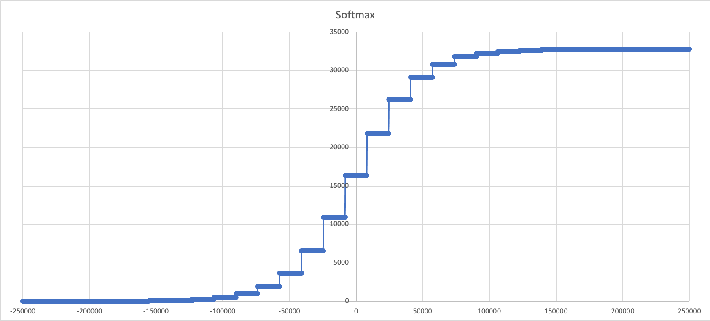


#### Generated Files and Upgrading the CNN Model

The generated C code comprises the following files. Some of the files are customized based on the project name, and some are custom for a combination of project name and weight/sample data inputs:

| File name      | Source                                   | Project specific? | Model/weights change? |
| -------------- | ---------------------------------------- | ----------------- | --------------------- |
| Makefile*      | template(s) in assets/embedded-*         | Yes               | No                    |
| cnn.c          | generated                                | Yes               | **Yes**               |
| cnn.h          | template in assets/device-all            | Yes               | **Yes**               |
| weights.h      | generated                                | Yes               | **Yes**               |
| log.txt        | generated                                | Yes               | **Yes**               |
| main.c         | generated                                | Yes               | No                    |
| sampledata.h   | generated                                | Yes               | No                    |
| sampleoutput.h | generated                                | Yes               | **Yes**               |
| softmax.c      | assets/device-all                        | No                | No                    |
| model.launch   | template in assets/eclipse               | Yes               | No                    |
| .cproject      | template in assets/eclipse               | Yes               | No                    |
| .project       | template in assets/eclipse               | Yes               | No                    |
| .settings/*    | templates in assets/eclipse/.settings    | Yes               | No                    |
| .vscode/*      | generated and templates in assets/vscode | Yes               | No                    |

In order to upgrade an embedded project after retraining the model, point the network generator to a new empty directory and regenerate. Then, copy the four files that will have changed to your original project — `cnn.c`, `cnn.h`, `weights.h`, and `log.txt`. This allows for persistent customization of the I/O code and project (for example, in `main.c` and additional files) while allowing easy model upgrades.

The generator also adds all files from the `assets/eclipse`, `assets/device-all`, and `assets/embedded-*` folders. These files (when starting with `template` in their name) will be automatically customized to include project-specific information as shown in the following table:

| Key                       | Replaced by                                                                      |
| ------------------------- | -------------------------------------------------------------------------------- |
| `##__PROJ_NAME__##`       | Project name (works on file names as well as the file contents), from `--prefix` |
| `##__ELF_FILE__##`        | Output elf (binary) file name (`PROJECT.elf` or `PROJECT-combined.elf`)          |
| `##__BOARD__##`           | Board name (e.g., `EvKit_V1`), from `--board-name`                               |
| `##__FILE_INSERT__##`     | Network statistics and timer                                                     |
| `##__OPENOCD_PARAMS__##`  | OpenOCD arguments (e.g., `-f interface/cmsis-dap.cfg -f target/max7800x.cfg`), from `--eclipse-openocd-args` |
| `##__TARGET_UC__##`       | Upper case device name (e.g., `MAX78000`), from `--device`                       |
| `##__TARGET_LC__##`       | Lower case device name (e.g., `max78000`), from `--device`                       |
| `##__ADDITIONAL_INCLUDES__##` | Additional include files, from `--eclipse-includes`  (default: empty)        |
| `##__GCC_PREFIX__##`      | `arm-non-eabi-` or `riscv-none-elf-`                                             |
| `##__DEFINES__##`<br />*or* `##__GCC_SUFFIX__##` | Additional #defines (e.g., `-D SUPERSPEED`), from `--define` (default: empty) |
| `##__DEFINES_ARM__##`<br />*or* `##__ARM_DEFINES__##` | Replace default ARM #defines, from `--define-default-arm` (default: `"MXC_ASSERT_ENABLE ARM_MATH_CM4"`) |
| `##__DEFINES_RISCV__##`<br />*or* `##__RISC_DEFINES__##` | Replace default RISC-V #defines, from `--define-default-riscv` (default: `"MXC_ASSERT_ENABLE RV32"`) |
| `##__PROCESSOR_DEFINES__##` | Selects the #defines for the active processor (Arm or RISC-V)                  |
| `##__ADDITIONAL_VARS__##` | Additional variables, from `--eclipse-variables` (default: empty)                |
| `##__PMON_GPIO_PINS__##`  | Power Monitor GPIO pins                                                          |
| `##__CNN_START__##`       | Port pin action when CNN starts                                                  |
| `##__CNN_COMPLETE__##`    | Port pin action when CNN finishes                                                |
| `##__SYS_START__##`       | Port pin action when system starts                                               |
| `##__SYS_COMPLETE__##`    | Port pin action when system finishes                                             |

*Note: The vscode templates are treated differently and not designed to be modified by the user.*

##### Contents of the device-all Folder

* For MAX78000/MAX78002, the software Softmax is implemented in `softmax.c`.
* A template for the `cnn.h` header file in `templatecnn.h`. The template is customized during code generation using model statistics and timer, but uses common function signatures for all projects.

#### Determining the Compiled Flash Image Size

The generated `.elf` file (either `build/PROJECT.elf` or `build/PROJECT-combined.elf` when building for RISC-V) contains debug and other meta information. To determine the true Flash image size, either examine the `.map` file, or convert the `.elf` to a binary image and examine the resulting image.

```shell
% arm-none-eabi-objcopy -I elf32-littlearm build/mnist.elf -O binary temp.bin                     
% ls -la temp.bin
-rwxr-xr-x  1 user  staff  321968 Jan  1 11:11 temp.bin
```

#### Troubleshooting

##### Handling Linker Flash Section Overflows

When linking the generated C code, the code space might overflow:

```shell
$ make
  CC    main.c
  CC    cnn.c
  ...
  LD    build/mnist.elf 
arm-none-eabi/bin/ld: build/mnist.elf section `.text' will not fit in region `FLASH'
arm-none-eabi/bin/ld: region `FLASH' overflowed by 600176 bytes
collect2: error: ld returned 1 exit status
```

The most likely reason is that the input is too large (from `sampledata.h`), or that the expected output (in `sampleoutput.h`) is too large. It is important to note that this only affects the generated code with the built-in known-answer test (KAT) that will not be part of the user application since normal input and output data are not predefined in Flash memory.

To deal with this issue, there are several options:

* The sample input data can be stored in external memory. This requires modifications to the generated code. Please see the MSDK examples to learn how to access external memory.
* The sample input data can be programmatically generated. Typically, this requires manual modification of the generated code, and a corresponding modification of the sample input file.
  The generator also contains a built-in generator (supported *only* when using `--fifo`, and only for HWC inputs); the command line option `--synthesize-input` uses only the first few words of the sample input data, and then adds the specified value N (for example, 0x112233 if three input channels are used) to each subsequent set of M 32-bit words. M can be specified using `--synthesize-words` and defaults to 8. Note that M must be a divisor of the number of pixels per channel.
* The output check can be truncated. The command line option `--max-verify-length` checks only the first N words of output data (for example, 1024). To completely disable the output check, use `--no-kat`.
* For 8-bit output values, `--mlator` typically generates more compact code.
* Change the compiler optimization level in `Makefile`. To change the default optimization levels, modify `MXC_OPTIMIZE_CFLAGS` in `assets/embedded-ai85/templateMakefile` for Arm code and `assets/embedded-riscv-ai85/templateMakefile.RISCV` for RISC-V code. Both `-O1` and `-Os` may result in smaller code compared to `-O2`.
* If the last layer has large-dimension, large-channel output, the `cnn_unload()` code in `cnn.c` may cause memory segment overflows not only in Flash, but also in the target buffer in SRAM (`ml_data32[]` or `ml_data[]` in `main.c`). In this case, manual code edits are required to perform multiple partial unloads in sequence.

##### Known-Answer-Test (KAT): Console Does Not Print PASS/FAIL

In some cases, the serial console does not print PASS or FAIL for the known-answer test, for example:

```text
Waiting...

*** CNN Inference Test ***

[nothing]
```

A connected debugger will disconnect, similar to:

```text
Program stopped.
0x0000fff4 in ?? ()
```

This can be caused by very small, fast networks, where the inference finishes before the main code has entered sleep mode:

```c
 while (cnn_time == 0)
    // CNN has already finished or is about to finish
    MXC_LP_EnterSleepMode(); // Wait for CNN
    // Device will not wake up since the CNN complete interrupt has already happened
```

Solution: Please use the command line switch `--no-wfi` to disable sleep mode.

##### Known-Answer-Test (KAT) Failures – Debugging Techniques

There can be many reasons why the known-answer test (KAT) fails for a given network with an error message, or where the KAT does not complete. The following techniques may help in narrowing down where in the network or the YAML description of the network the error occurs:

* For very short and small networks, disable the use of WFI (wait for interrupt) instructions while waiting for completion of the CNN computations by using the command line option `--no-wfi`. *Explanation: In these cases, the network terminates more quickly than the time it takes between testing for completion and executing the WFI instruction, so the WFI instruction is never interrupted and the code may appear to hang.*
* The `--no-wfi` option can also be useful when trying to debug code, since the debugger loses connection when the device enters sleep mode using `__WFI()`.
* By default, there is a two-second delay at the beginning of the code. This time allows the debugger to take control before the device enters any kind of sleep mode. `--no-wfi` disables sleep mode (see also the related information [above](#known-answer-test-kat-console-does-not-print-passfail)). The time delay can be modified using the `--debugwait` option.
  If the delay is too short or skipped altogether, and the device does not wake at the end of execution, the device may appear to hang and the [recovery procedure](https://github.com/analogdevicesinc/MaximAI_Documentation/tree/main/MAX78000_Feather#how-to-unlock-a-max78000-that-can-no-longer-be-programmed) may have to be used in order to load new code or to debug code.
* For very large and deep networks, enable the boost power supply using the `--boost` command line option. On the EVkit, the boost supply is connected to port pin P2.5, so the command line option is `--boost 2.5`.
* The default compiler optimization level is `-O2`, and incorrect code may be generated under rare circumstances. Lower the optimization level in the generated `Makefile` to `-O1`, clean (`make distclean && make clean`), and rebuild the project (`make`). If this solves the problem, one of the possible reasons is that code is missing the `volatile` keyword for certain variables.
  To permanently adjust the default compiler optimization level, modify `MXC_OPTIMIZE_CFLAGS` in `assets/embedded-ai85/templateMakefile` for Arm code and `assets/embedded-riscv-ai85/templateMakefile.RISCV` for RISC-V code.
* When allocating large amounts of data on the stack, ensure the stack is sized appropriately. The stack size is configured in the linker file (by default, part of the MSDK).
* `--stop-after N` where `N` is a layer number may help to find the problematic layer by terminating the network early without having to retrain and without having to change the weight input file. Note that this may also require `--max-verify-length` as [described above](#handling-linker-flash-section-overflows) since intermediate outputs tend to be large, and additionally `--no-unload` to suppress generation of the `cnn_unload()` function.
* `--no-bias LIST` where `LIST` is a comma-separated list of layers (e.g., `0,1,2,3`) can rule out problems due to the bias. This option zeros out the bias for the given layers without having to remove bias values from the weight input file.
* `--ignore-streaming` ignores all `streaming` statements in the YAML file. Note that this typically only works when the sample input is replaced with a different, lower-dimension sample input (for example, use 3×32×32 instead of 3×128×128), and does not support fully connected layers without retraining (use `--stop-after` to remove final layers). Ensure that the network (or partial network when using `--stop-after`) does not produce all-zero intermediate data or final outputs when using reduced-dimension inputs. The log file (`log.txt` by default) will contain the necessary information.
* Certain C library functions (such as `memcpy` or `printf`) use byte-wide or 16-bit wide accesses and may not work correctly when accessing CNN memory *directly* (i.e., pointing inside the accelerator memory). They *will* function as expected when operating on data memory that is *not* located inside the CNN accelerator, for example data returned by `cnn_unload()`.


##### Synthesis Failures

The synthesis step (“izer”) will fail if the yaml description does not match the checkpoint file created by PyTorch.

Unlike PyTorch networks that can be constructed to be completely input dimension independent, MAX78000/MAX78002 networks always require knowledge of the input dimensions, which are set by the sample input. The sample input defaults to `tests/sample_dataset.npy` (where `dataset` is replaced with the dataset used, e.g., `mnist`). The command line option `--sample-input` can point the tool to a different input source.

The dimensions are also important when [flattening](#fully-connected-linear-layers), since every pixel results in a channel, impacting the processor setup. The following is an example error message of a network that attempts to flatten a layer. The network was trained with 128×128, but the actual sample input provided was 64×64:

```shell
ERROR: Layer 6: 64 input channels (before flattening) using 1 pass, and 1 operand (64 processors per pass), but the enabled processor map 0x000000000000ffff has 16 bits instead of the expected number of 64.
```

*In this example, each dimension was half the expected size, so the expected processor count was off by a factor of 4. To resolve the error, a properly dimensioned sample input had to be provided.*

##### “new-lines” Configuration File Parsing Error

```shell
ERROR: invalid config: option "type" of "new-lines" should be in ('unix', 'dos')
```

This message indicates that an outdated version of `yamllint` is installed in the search path. Either update `yamllint` to version 1.27.0 or later, or uninstall `yamllint`, or edit `.yamllint` to remove `new-lines: type: platform`, or use `--yamllint none`.

#### Energy Measurement

The MAX78000 Evaluation Kit (EVKit) revision C and later, and the MAX78002 Evaluation Kit both include a MAX32625 microcontroller connected to a MAX34417 power accumulator. Since the sample rate of the MAX34417 is slow compared to typical inference times, `ai8xize.py` supports the command line parameter `--energy` that will run 100 iterations of the inference, separating out the input data load time. This allows enough sample time to get meaningful results (recommended minimum: 1 second).

When running C code generated with `--energy`, the power display on the EVKit will display the inference energy.

*Note: MAX78000 uses LED1 and LED2 to trigger power measurement via MAX32625 and MAX34417.*

See the [benchmarking guide](https://github.com/analogdevicesinc/MaximAI_Documentation/blob/main/Guides/MAX7800x%20Power%20Monitor%20and%20Energy%20Benchmarking%20Guide.pdf) for more information about benchmarking.


#### Moving from MAX78000 to MAX78002 (or vice versa)

Assuming the network is compatible with the new deployment target, changing the `--device` parameter will create new code that differs as follows:

| File           | Changes                                                      | Recommended Action            |
| -------------- | ------------------------------------------------------------ | ----------------------------- |
| cnn.c          | Modified register and memory addresses, modified clock configuration | Replace file          |
| main.c         | Modified input memory addresses, modified clock configuration | Replace file or edit         |
| Makefile       | Modified TARGET variables                                    | Replace file or edit          |
| .launch        | Modified values for `.cfg` and `.svd`                        | Replace file or edit          |
| sampleoutput.h | Modified memory addresses                                    | Replace file                  |
| weights.h      | Modified memory addresses                                    | Replace file                  |
| .settings/     | Modified TARGET value                                        | Replace folder or edit .prefs |
| .vscode/       | Modified target variable                                     | Replace folder or edit .json  |


## Further Information

Additional information about the evaluation kits, and the software development kit (MSDK) is available on the web at <https://github.com/analogdevicesinc/MaximAI_Documentation>.

[AHB Addresses for MAX78000 and MAX78002](https://github.com/analogdevicesinc/ai8x-synthesis/blob/develop/docs/AHBAddresses.md)

[Facial Recognition System](https://github.com/analogdevicesinc/ai8x-training/blob/develop/docs/FacialRecognitionSystem.md)


---

## Contributing Code

### Linting

Both projects are set up for `flake8`, `pylint` and `isort` to lint Python code. The line width is related to 100 (instead of the default of 80), and the number of lines per module was increased; configuration files are included in the projects. Shell code is linted by `shellcheck`, and YAML files by `yamllint`.
Code should not generate any warnings in any of the tools (some of the components in the `ai8x-training` project will create warnings as they are based on third-party code).

`flake8` and `pylint` need to be installed into both virtual environments:

```shell
(ai8x-synthesis) $ pip3 install flake8 pylint mypy isort
```

The GitHub projects use the [GitHub Super-Linter](https://github.com/github/super-linter) to automatically verify push operations and pull requests. The Super-Linter can be installed locally using [podman](https://podman.io) (or Docker), see [installation instructions](https://github.com/github/super-linter/blob/main/docs/run-linter-locally.md).
To run locally, create a clean copy of the repository and run the following command from the project directory (i.e., `ai8x-training` or `ai8x-synthesis`):

```shell
$ podman run --rm -e RUN_LOCAL=true -e VALIDATE_MARKDOWN=false -e VALIDATE_PYTHON_BLACK=false -e VALIDATE_ANSIBLE=false -e VALIDATE_EDITORCONFIG=false -e VALIDATE_JSCPD=false -e VALIDATE_CPP=false -e VALIDATE_ANSIBLE=false -e VALIDATE_NATURAL_LANGUAGE=false -e VALIDATE_CLANG_FORMAT=false -e VALIDATE_GITHUB_ACTIONS=false -e FILTER_REGEX_EXCLUDE="attic/.*|inspect_ckpt.py" -v `pwd`:/tmp/lint ghcr.io/github/super-linter:v4
```

### Submitting Changes

Do not try to push any changes into the main branch. Instead, create a fork and submit a pull request against the `develop` branch. The easiest way to do this is using a [graphical client](#additional-software) such as Fork or GitHub Desktop.

*Note: After creating the fork, you must re-enable actions in the “Actions” tab of the repository on GitHub.*

The following document has more information:
<https://github.com/analogdevicesinc/MaximAI_Documentation/blob/main/CONTRIBUTING.md>

---
