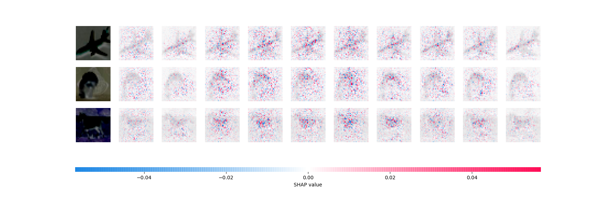

# MAX78000 Model Training and Quantization

# MAX78000 Network Loader and RTL Simulation Generator

_September 3, 2020_

_Open the `.md` version of this file in a markdown enabled viewer, for example Typora (http://typora.io).
See https://github.com/adam-p/markdown-here/wiki/Markdown-Cheatsheet for a description of Markdown. A [PDF copy of this file](README.pdf) is available in this repository. The GitHub rendering of this document does not show the formulas or the clickable table of contents._

This software consists of two related projects:
1. MAX78000 Model Training and Quantization
2. MAX78000 Network Loader and RTL Simulation Generator

---

[TOC]

## Part Numbers

This document covers several of Maxim’s ultra-low power machine learning accelerator systems. They are sometimes referred to by their die types. The following shows the die types and their corresponding part numbers:

| Die Type | Part Number(s)            |
| -------- | ------------------------- |
| *AI84*   | *Unreleased test chip*    |
| **AI85** | **MAX78000**              |
| AI87     | MAX78002 (in development) |

## Overview

The following graphic shows an overview of the development flow:


## Installation

### File System Layout

Including the SDK, the expected/resulting file system layout will be:

    ..../ai8x-training/
    ..../ai8x-synthesis/
    ..../ai8x-synthesis/sdk/
    ..../manifold/

where “....” is the project root, for example `~/Documents/Source/AI`.

### Prerequisites

This software currently supports Ubuntu 18.04 LTS (Ubuntu 20.04 LTS is not yet supported by CUDA). The server version is sufficient, see https://ubuntu.com/download/server. *Note: The Windows Subsystem for Linux (WSL) currently does <u>not</u> support CUDA.*

When going beyond simple tests, model training requires CUDA hardware acceleration (the network loader does not require CUDA).

Install CUDA 10.1 or CUDA 10.2:
https://developer.nvidia.com/cuda-toolkit-archive

*Note: When using multiple GPUs, the software will automatically use all available GPUs and distribute the workload. To prevent this, either use the `--gpus` command line argument, or set the `CUDA_VISIBLE_DEVICES` environment variable.*

#### Shared (Multi-User) and Remote Systems

On a shared (multi-user) system that has previously been set up, only local installation is needed. CUDA and any `apt-get` or `brew` tasks are not necessary.

The `screen` command can be used inside a remote terminal to disconnect a session from the controlling terminal, so that a long running training session doesn’t abort due to network issues, or local power saving. In addition, screen can log all console output to a text file.

Example:

```shell
$ ssh targethost
targethost$ screen -L # or screen -r to resume, screen -list to list
targethost$
Ctrl+A,D to disconnect
```

`man screen` has more information.

#### Recommended Software

The following software is optional, and can be replaced with other similar software of the user’s choosing.

1. Visual Studio Code (Editor, Free), https://code.visualstudio.com, with the “Remote - SSH” plugin
2. Typora (Markdown Editor, Free during beta), http://typora.io
3. CoolTerm (Serial Terminal, Free), http://freeware.the-meiers.org
   or Serial ($30), https://apps.apple.com/us/app/serial/id877615577?mt=12
4. Git Fork (Graphical Git Client, $50), https://git-fork.com
   or GitHub Desktop (Graphical Git Client, Free), https://desktop.github.com
5. Beyond Compare (Diff and Merge Tool, $60), https://scootersoftware.com

### Project Installation

*The software in this project requires Python 3.6.9 or a later 3.6.x version. Versions 3.7/3.8/3.9 are not yet supported.*

It is not necessary to install Python 3.6.9 system-wide, or to rely on the system-provided Python. To manage Python versions, use `pyenv` (https://github.com/pyenv/pyenv).

On macOS (no CUDA support available):

```shell
$ brew install pyenv pyenv-virtualenv libomp libsndfile
```

On Ubuntu 18.04 LTS:

```shell
$ sudo apt-get install -y make build-essential libssl-dev zlib1g-dev \
  libbz2-dev libreadline-dev libsqlite3-dev wget curl llvm \
  libncurses5-dev libncursesw5-dev xz-utils tk-dev libffi-dev liblzma-dev \
  libsndfile-dev portaudio19-dev
$ curl -L https://github.com/pyenv/pyenv-installer/raw/master/bin/pyenv-installer | bash
```

Then, add to either `~/.bash_profile`, `~/.bashrc` or `~/.profile` (as shown by the terminal output of the previous step):

```shell
eval "$(pyenv init -)"
eval "$(pyenv virtualenv-init -)"
```

Next, close the Terminal and install Python 3.6.9:

```shell
$ pyenv install 3.6.9
```

#### git Environment

If the local git environment has not been previously configured, add the following commands to configure e-mail and name. The e-mail must match GitHub (including upper/lower case):

```shell
$ git config --global user.email "first.last@maximintegrated.com"
$ git config --global user.name "First Last"
```

#### Project Root

For convenience, define a shell variable named `AI_PROJECT_ROOT`:

```shell
$ export AI_PROJECT_ROOT="$HOME/Documents/Source/AI"
```

Add this line to `~/.profile`.

#### Nervana Distiller

Nirvana Distiller is package for neural network compression and quantization. Network compression can reduce the memory footprint of a neural network, increase its inference speed and save energy. Distiller is automatically installed with the other packages.

On macOS, add the following to `~/.matplotlib/matplotrc`:

    backend: TkAgg

#### Uber Manifold

Manifold is a model-agnostic visual debugging tool for machine learning. Manifold can compare models, detects which subset of data a model is inaccurately predicting, and explains the potential cause of poor model performance by surfacing the feature distribution difference between better and worse-performing subsets of data.

There is a hosted version of Manifold at http://manifold.mlvis.io/. To install it locally (for IP reasons and higher speed):

On macOS,

```shell
brew install yarn npm
```

On Ubuntu 18.04 LTS,

```shell
$ cd $AI_PROJECT_ROOT
$ curl -sS https://dl.yarnpkg.com/debian/pubkey.gpg | sudo apt-key add -
$ echo "deb https://dl.yarnpkg.com/debian/ stable main" | sudo tee /etc/apt/sources.list.d/yarn.list
$ curl -sL https://deb.nodesource.com/setup_13.x | sudo -E bash -
$ sudo apt-get update
$ sudo apt-get install -y nodejs yarn
```

On both Mac and Linux:

```shell
$ git clone https://github.com/uber/manifold.git
$ cd manifold
$ yarn
# ignore warnings
$ cd examples/manifold
$ yarn
# ignore warnings
```

#### Windows Systems

Windows/MS-DOS is not supported for training networks at this time. *This includes the Windows Subsystem for Linux (WSL) since it currently lacks CUDA support.*

### Upstream Code

Change to the project root and run the following commands. Use your GitHub credentials when prompted.

```shell
$ cd $AI_PROJECT_ROOT
$ git clone https://github.com/MaximIntegratedAI/ai8x-training.git
$ git clone https://github.com/MaximIntegratedAI/ai8x-synthesis.git
```

#### Creating the Virtual Environment

To create the virtual environment and install basic wheels:

```shell
$ cd ai8x-training
$ git submodule update --init
$ pyenv local 3.6.9
$ python3 -m venv .
$ source bin/activate
(ai8x-training) $ pip3 install -U pip setuptools
```

The next step differs depending on whether the system uses Linux with CUDA 10.1, or any other setup.

For CUDA 10.1 on Linux:

```shell
(ai8x-training) $ pip3 install -r requirements-cu101.txt
```

For all other systems, including CUDA 10.2 on Linux:

```shell
(ai8x-training) $ pip3 install -r requirements.txt
```

##### Repository Branches

By default, the `master` branch is checked out. This branch has been tested more rigorously than the `develop` branch. `develop`, on the other hand, contains the latest improvements to the project. To switch to `develop`, use the following command:

```shell
(ai8x-training) $ git checkout develop
```

##### Updating the Project

Major upgrades (such as updating from PyTorch 1.3.1 to PyTorch 1.5) are best done by removing all installed wheels. This can be achieved most easily by creating a new folder and starting from scratch at [Upstream Code](#Upstream Code). 

For minor updates, pull the latest code and install the updated wheels:

```shell
(ai8x-training) $ git pull
(ai8x-training) $ git submodule update --init
(ai8x-training) $ pip3 install -U pip setuptools
(ai8x-training) $ pip3 install -U -r requirements.txt # or requirements-cu101.txt with CUDA 10.1
```

#### Synthesis Project

The `ai8x-synthesis` project does not require CUDA.

Start by deactivating the `ai8x-training` environment if it is active.

```shell
(ai8x-training) $ deactivate
```

Then, create a second virtual environment:

```shell
$ cd $AI_PROJECT_ROOT
$ cd ai8x-synthesis
$ git submodule update --init
$ pyenv local 3.6.9
$ python3 -m venv .
$ source bin/activate
(ai8x-synthesis) $ pip3 install -U pip setuptools
(ai8x-synthesis) $ pip3 install -r requirements.txt
```

##### Repository Branches

By default, the `master` branch is checked out. This branch has been tested more rigorously than the `develop` branch. `develop`, on the other hand, contains the latest improvements to the project. To switch to `develop`, use the following command:

```shell
(ai8x-synthesis) $ git checkout develop
```

##### Updating the Project

Major upgrades (such as updating from PyTorch 1.3.1 to PyTorch 1.5) are best done by removing all installed wheels. This can be achieved most easily by creating a new folder and starting from scratch at [Upstream Code](#Upstream Code). 

To pull the latest code and install the updated wheels, use:

```shell
(ai8x-synthesis) $ git pull
(ai8x-synthesis) $ git submodule update --init
(ai8x-synthesis) $ pip3 install -U pip setuptools
(ai8x-synthesis) $ pip3 install -U -r requirements.txt
```

### Embedded Software Development Kit (SDK)

The MAX78000 SDK is a git submodule of ai8x-synthesis. It is checked out automatically to a version compatible with the project into the folder `sdk`.

***If the embedded C compiler is run on Windows instead of Linux, ignore this section*** *and install the Maxim SDK executable, see https://github.com/MaximIntegratedAI/MaximAI_Documentation.*

The Arm embedded compiler can be downloaded from [https://developer.arm.com/tools-and-software/open-source-software/developer-tools/gnu-toolchain/gnu-rm/downloads](https://developer.arm.com/tools-and-software/open-source-software/developer-tools/gnu-toolchain/gnu-rm/downloads).

The RISC-V embedded compiler can be downloaded from [https://github.com/xpack-dev-tools/riscv-none-embed-gcc-xpack/releases/](https://github.com/xpack-dev-tools/riscv-none-embed-gcc-xpack/releases/).

Add the following to your `~/.profile`, adjusting for the actual `PATH` to the compilers:

```shell
echo $PATH | grep -q -s "/usr/local/gcc-arm-none-eabi-9-2019-q4-major/bin"
if [ $? -eq 1 ] ; then
    PATH=$PATH:/usr/local/gcc-arm-none-eabi-9-2019-q4-major/bin
    export PATH
    ARMGCC_DIR=/usr/local/gcc-arm-none-eabi-9-2019-q4-major
    export ARMGCC_DIR
fi

echo $PATH | grep -q -s "/usr/local/riscv-none-embed-gcc/8.3.0-1.1/bin"
if [ $? -eq 1 ] ; then
    PATH=$PATH:/usr/local/riscv-none-embed-gcc/8.3.0-1.1/bin
    export PATH
    RISCVGCC_DIR=/usr/local/riscv-none-embed-gcc/8.3.0-1.1
    export RISCVGCC_DIR
fi
```

The debugger requires OpenOCD. On Windows, an OpenOCD executable is installed with the SDK. On macOS and Linux, the OpenOCD fork from [https://github.com/MaximIntegratedMicros/openocd.git](https://github.com/MaximIntegratedMicros/openocd.git) must be used. An Ubuntu 18.04 LTS binary is available at https://github.com/MaximIntegratedAI/MAX78000_SDK/blob/master/Tools/OpenOCD/openocd. *Note: A copy of the configuration files and a `run-openocd-maxdap` script are contained in the `hardware` folder of the `ai8x-synthesis` project.*

`gen-demos-max78000.sh` will create code that is compatible with the SDK and copy it into the SDK’s Example directories.

---

## MAX78000 Hardware and Resources

MAX78000/MAX78002 are embedded accelerators. Unlike GPUs, MAX78000/MAX78002 do not have gigabytes of memory, and cannot support arbitrary data (image) sizes.

### Overview

A typical CNN operation consists of pooling followed by a convolution. While these are traditionally expressed as separate layers, pooling can be done “in-flight” on MAX78000/MAX78002 for greater efficiency.

To minimize data movement, the accelerator is optimized for convolutions with in-flight pooling on a sequence of layers. MAX78000 and MAX78002 also support in-flight element-wise operations, pass-through layers and 1D convolutions (without element-wise operations):


The MAX78000/MAX78002 accelerators contain 64 parallel processors. There are four groups that contain 16 processors each.

Each processor includes a pooling unit and a convolutional engine with dedicated weight memory:


Data is read from data memory associated with the processor, and written out to any data memory located within the accelerator. To run a deep convolutional neural network, multiple layers are chained together, where each layer’s operation is individually configurable. The output data from one layer is used as the input data for the next layer, for up to 32 layers (where *in-flight* pooling and *in-flight* element-wise operations do not count as layers).

The following picture shows an example view of a 2D convolution with pooling:


### Data, Weights, and Processors

Data memory, weight memory, and processors are interdependent.

In the MAX78000/MAX78002 accelerator, processors are organized as follows:

* Each processor is connected to its own dedicated weight memory instance.
* Four processors share one data memory instance.
* A group of sixteen processors shares certain common controls and can be operated as a slave to another group, or independently/separately.

Any given processor has visibility of:

* Its dedicated weight memory, and
* The data memory instance it shares with three other processors.

#### Weight Memory

For each of the four 16-processor groups, weight memory and processors can be visualized as follows. Assuming one input channel processed by processor 0, and 8 output channels, the 8 shaded kernels will be used:


#### Data Memory

Data memory connections can be visualized as follows:


All input data must be located in the data memory instance the processor can access. Conversely, output data can be written to any data memory instance inside the accelerator (but not to general purpose SRAM on the Arm microcontroller bus).

The data memory instances inside the accelerator are single-port memories. This means that only one access operation can happen per clock cycle. When using the HWC data format (see [Channel Data Formats](#Channel-Data-Formats)), this means that each of the four processors sharing the data memory instance will receive one byte of data per clock cycle (since each 32-bit data word consists of four packed channels).

### Streaming Mode

The machine also implements a streaming mode. Streaming allows input data dimensions that exceed the available per-channel data memory in the accelerator.

The following illustration shows the basic principle: In order to produce the first output pixel of the second layer, not all data needs to be present at the input. In the example, a 5×5 input needs to be available.


In the accelerator implementation, data is shifted into the Tornado memory in a sequential fashion, so prior  rows will be available as well. In order to produce the _blue_ output pixel, input data up to the blue input pixel must be available.


When the _yellow_ output pixel is produced, the first (_black_) pixel of the input data is no longer needed and its data can be discarded:


The number of discarded pixels is network specific and dependent on pooling strides and the types of convolution. In general, streaming mode is only useful for networks where the output data dimensions decrease from layer to layer (for example, by using a pooling stride).

*Note: Streaming mode requires the use of FIFOs.*

#### FIFOs

Since the data memory instances are single-port memories, software would have to temporarily disable the accelerator in order to feed it new data. Using  FIFOs, software can input available data while the accelerator is running. The accelerator will autonomously fetch data from the FIFOs when needed, and stall (pause) when no enough data is available.

The MAX78000/MAX78002 accelerator has two types of FIFO:

##### Standard FIFOs

There are four dedicated FIFOs connected to processors 0-3, 16-19, 32-35, and 48-51, supporting up to 16 input channels (in HWC format) or four channels (CHW format). These FIFOs work when used from the ARM Cortex-M4 core and from the RISC-V core.

The standard FIFOs are selected using the `--fifo` argument for `ai8xize.py`.

##### Fast FIFO

The fast FIFO is only available from the RISC-V core, and runs synchronously with the RISC-V for increased throughput. It supports up to four input channels (HWC format) or a single channel (CHW format). The fast FIFO is connected to processors 0, 1, 2, 3 or 0, 16, 32, 48.

The fast FIFO is selected using the `--fast-fifo` argument for `ai8xize.py`.

### Accelerator Limits

* MAX78000:
  * The maximum number of layers is 32 (pooling and element-wise layers do not count when preceding a convolution).
  * The maximum number of input channels in any layer is 1024 each.
  * The maximum number of output channels in any layer is 1024 each.
  * The weight memory supports up to 768 * 64 3×3 Q7 kernels (see [Number Format](#Number-Format)).
    When using 1-, 2- or 4 bit weights, the capacity increases accordingly.
    When using more than 64 input or output channels, weight memory is shared and effective capacity decreases.
    Weights must be arranged according to specific rules detailed below.
  * There are 16 instances of 32 KiB data memory. When not using streaming mode, any data channel (input, intermediate, or output) must completely fit into one memory instance. This limits the first-layer input to 181×181 pixels per channel in the CHW format. However, when using more than one input channel, the HWC format may be preferred, and all layer output are in HWC format as well. In those cases, it is required that four channels fit into a single memory instance -- or 91×90 pixels per channel.
    Note that the first layer commonly creates a wide expansion (i.e., large number of output channels) that needs to fit into data memory, so the input size limit is mostly theoretical.
  * When using streaming, the data sizes are limited to 1023×1023, subject to available TRAM. Streaming is limited to 8 layers or less, and to four FIFOs (up to 4 input channels in CHW and up to 16 channels in HWC format). When using streaming, the product of a layer’s input data width, input data height, and input data channels divided by 64 rounded up must not exceed 2^21: $rows * columns * ⌈\frac{channels}{64}⌉ < 2^{21}$.

### Number Format

All weights, bias values and data are stored and computed in Q7 format (signed two’s complement 8-bit integers, [-128...+127]). See https://en.wikipedia.org/wiki/Q_%28number_format%29.

The 8-bit value $w$ is defined as:

$$ w = (-a_7 2^7+a_6 2^6+a_5 2^5+a_4 2^4+a_3 2^3+a_2 2^2+a_1 2^1+a_0)/128 $$


Examples:
| Binary	| Value        |
|:---------:|-------------:|
| 0000 0000 | 0            |
| 0000 0001 | 1/128        |
| 0000 0010 | 2/128        |
| 0111 1110 | 126/128      |
| 0111 1111 | 127/128      |
| 1000 0000 | −128/128 (–1)|
| 1000 0001 | −127/128     |
| 1000 0010 | −126/128     |
| 1111 1110 | −2/128       |
| 1111 1111 | −1/128       |

On MAX78000/MAX78002, _weights_ can be 1, 2, 4, or 8 bits wide (configurable per layer using the `quantization` key). Bias values are always 8 bits wide. Data is 8 bits wide, except for the last layer that can optionally output 32 bits of unclipped data in Q17.14 format when not using activation.

|wt bits| min  | max  |
|:-----:|-----:|-----:|
|    8  | –128 | +127 |
|    4  |   –8 |    7 |
|    2  |   –2 |    1 |
|    1  |   –1 |    0 |

Note that 1-bit weights (and, to a lesser degree, 2-bit weights) require the use of bias to produce useful results. Without bias, all sums of products of activated data from a prior layer would be negative, and activation of that data would always be zero.

#### Rounding

MAX78000/MAX78002 rounding (for the CNN sum of products) uses “round half towards positive infinity”, i.e. $y=⌊0.5+x⌋$. This rounding method is not the default method in either Excel or Python/NumPy. The rounding method can be achieved in NumPy using `y = np.floor(0.5 + x)` and in Excel as `=FLOOR.PRECISE(0.5 + X)`.

By way of example:

| Input                    | Rounded |
|:-------------------------|:-------:|
| +3.5                     | +4      |
| +3.25, +3.0, +2.75, +2.5 | +3      |
| +2.25, +2.0, +1.75, +1.5 | +2      |
| +1.25, +1.0, +0.75, +0.5 | +1      |
| +0.25, 0, –0.25, –0.5    | 0       |
| –0.75, –1.0, –1.25, –1.5 | –1      |
| –1.75, –2.0, –2.25, –2.5 | –2      |
| –2.75, –3.0, –3.25, –3.5 | –3      |

#### Addition

Addition works similarly to regular two’s-complement arithmetic.

Example:
$$ w_0 = 1/64 → 00000010 $$
$$ w_1 = 1/2 → 01000000 $$
$$ w_0 + w_1 = 33/64 → 01000010 $$

#### Saturation and Clipping

Values smaller than $–128⁄128$ are saturated to $–128⁄128$ (1000 0000). Values larger than $+127⁄128$ are saturated to $+127⁄128$ (0111 1111).

The MAX78000/MAX78002 CNN sum of products uses full resolution for both products and sums, so the saturation happens only at the very end of the computation.

Example 1:

$$ w_0 = 127/128 → 01111111 $$
$$ w_1 = 127/128 → 01111111 $$
$$ w_0 + w_1 = 254/128 → saturate → 01111111 (= 127/128) $$

Example 2:

$$ w_0 = -128/128 → 10000000 $$
$$ w_1 = -128/128 → 10000000 $$
$$ w_0 + w_1 = -256/128 → saturate → 10000000 (= -128/128) $$

#### Multiplication

Since operand values are implicitly divided by 128, the product of two values has to be shifted in order to maintain magnitude when using a standard multiplier (e.g., 8×8):

$$ w_0 * w_1 = \frac{w'_0}{128} * \frac{w'_1}{128} = \frac{w'_0 * w'_1}{128} ≫ 7 $$

In software,
* Determine the sign bit: $s = sign(w_0) * sign(w_1)$
* Convert operands to absolute values: $w'_0 = abs(w_0); w'_1 = abs(w_1)$
* Multiply using standard multiplier: $w'_0 * w'_1 = w''_0/128 * w''_1/128; r' = w''_0 * w''_1$
* Shift: $r'' = r' ≫ 7$
* Round up/down depending on $r'[6]$
* Apply sign: $r = s * r''$

Example 1:

$$ w_0 = 1/64 → 00000010 $$
$$ w_1 = 1/2 → 01000000 $$
$$ w_0 * w_1 = 1/128 → shift, truncate → 00000001 (= 1/128) $$

A “standard” two’s-complement multiplication would return 00000000 10000000. The MAX78000/MAX78002 data format discards the rightmost bits.

Example 2:

$$ w_0 = 1/64 → 00000010 $$
$$ w_1 = 1/4 → 00100000 $$
$$ w_0 * w_1 = 1/256 → shift, truncate → 00000000 (= 0) $$

“Standard” two’s-complement multiplication would return 00000000 01000000, the MAX78000/MAX78002 result is truncated to 0 after the shift operation.

#### Sign Bit

Operations preserve the sign bit.

Example 1:

$$ w_0 = -1/64 → 11111110 $$
$$ w_1 = 1/4 → 00100000 $$
$$ w_0 * w_1 = -1/256 → shift, truncate → 00000000 (= 0) $$

* Determine the sign bit: $s = sign(-1/64) * sign(1/4) = -1 * 1 = -1$
* Convert operands to absolute values: $w'_0 = abs(-1/64); w'_1 = abs(1/4)$
* Multiply using standard multiplier: $r' = 1/64 ≪ 7 * 1/4 ≪ 7 = 2 * 32 = 64$
* Shift: $r'' = r' ≫ 7 = 64 ≫ 7 = 0$
* Apply sign: $r = s * r'' = -1 * 0 = 0$

Example 2:

$$ w_0 = -1/64 → 11111110 $$
$$ w_1 = 1/2 → 01000000 $$
$$ w_0 * w_1 = -1/128 → shift, truncate → 11111111 (= -1/128) $$

* Determine the sign bit: $s = sign(-1/64) * sign(1/2) = -1 * 1 = -1$
* Convert operands to absolute values: $w'_0 = abs(-1/64); w'_1 = abs(1/2)$
* Multiply using standard multiplier: $r' = 1/64 ≪ 7 * 1/2 ≪ 7 = 2 * 64 = 128$
* Shift: $r'' = r' ≫ 7 = 128 ≫ 7 = 1$
* Apply sign: $r = s * r'' = -1 * 1 ≫ 7 = -1/128$

Example 3:

$$ w_0 = 127/128 → 01111111 $$
$$ w_1 = 1/128 → 00000001 $$
$$ w_0 * w_1 = 128/128 → saturation → 01111111 (= 127/128) $$

### Channel Data Formats

#### HWC

All internal data are stored in HWC format, 4 channels per 32-bit word. Assuming 3-color (or 3-channel) input, one byte will be unused. Example:


#### CHW

The input layer can also use the CHW format (sequence of channels), for example:


### CHW Data Format and Consequences for Weight Memory Layout

When using the CHW data format, only one of the four processors sharing the data memory instance can be used. The next channel needs to use a processor connected to a different data memory instance, so that the machine can deliver one byte per clock cycle to each enabled processor.

Because of the fact that a processor has its own dedicated weight memory, this will introduce “gaps” in the weight memory map, as shown in the following illustration:


### Active Processors and Layers

For each layer, a set of active processors must be specified. The number of active processors must be the same as the number of input channels for the layer, and the input data for that layer must be located in data memory instances accessible to the selected processors.

It is possible to specify a relative offset into the data memory instance that applies to all processors. _Example:_ Assuming HWC data format, specifying the offset as 8192 bytes will cause processors 0-3 to read their input from the second half of data memory 0, processors 4-7 will read from the second half of data memory instance 1, etc.

For most simple networks with limited data sizes, it is easiest to ping-pong between the first and second halves of the data memories - specify the data offset as 0 for the first layer, 0x2000 for the second layer, 0 for the third layer, etc. This strategy avoids overlapping inputs and outputs when a given processor is used in two consecutive layers.

Even though it is supported by the accelerator, the Network Generator will not be able to check for inadvertent overwriting of unprocessed input data by newly generated output data when overlapping data or streaming data. Use the `--overlap-data` command line switch to disable these checks, and to allow overlapped data.

### Layers and Weight Memory

For each layer, the weight memory start column is automatically configured by the Network Loader. The start column must be a multiple of 4, and the value applies to all processors.

The following example shows the weight memory layout for two layers. The first layer (L0) has 7 inputs and 9 outputs, and the second layer (L1) has 9 inputs and 2 outputs.


### Weight Storage Example

The file `ai84net.xlsx` contains an example for a single-channel CHW input using the `AI84Net5` network (this example also supports up to four channels in HWC).

*Note*: As described above, multiple CHW channels must be loaded into separate memory instances. When using a large number of channels, this can cause “holes” in the processor map, which in turn can cause subsequent layers’ kernels to require padding.

The Network Loader prints a kernel map that shows the kernel arrangement based on the provided network description. It will also flag cases where kernel or bias memories are exceeded.

### Example: `Conv2D`

The following picture shows an example of a `Conv2d` with 1×1 kernels, 5 input channels, 2 output channels and data size of 2×2. The inputs are shown on the left, and the outputs on the right, and the kernels are shown lined up with the associated inputs --- the number of kernel rows matches the number of input channels, and the number kernel columns matches the number of output channels. The lower half of the picture shows how the data is arranged in memory when HWC data is used for both input and output.


### Limitations of MAX78000 Networks

The MAX78000 hardware does not support arbitrary network parameters. Specifically,
* Dilation, groups, depth-wise convolutions, and hardware batch normalization are not supported. *Note: Batch normalization should be folded into the weights, see [Batch Normalization](#Batch-Normalization).*

* `Conv2d`:
  
  * Kernel sizes must be 1×1 or 3×3.
  * Padding can be 0, 1, or 2.
  * Stride is fixed to 1. Pooling, including 1×1, can be used to achieve a stride other than 1.
  
* `Conv1d`:
  
  * Kernel sizes must be 1 through 9.
  * Padding can be 0, 1, or 2.
  * Stride is fixed to 1. Pooling, including 1, can be used to achieve a stride other than 1.
  
* `ConvTranspose2d`:

  * Kernel sizes must be 3×3.
  * Padding can be 0, 1, or 2.
  * Stride is fixed to 2.

* A programmable layer-specific shift operator is available at the output of a convolution.

* The supported activation functions are `ReLU` and `Abs`, and a limited subset of `Linear`.

* Pooling:
  * Both max pooling and average pooling are available, with or without convolution.
  
  * Pooling does not support padding.
  
  * Pooling strides can be 1 through 16. For 2D pooling, the stride is the same for both dimensions.
  
  * For 2D pooling, supported pooling kernel sizes are 1×1 through 16×16, including non-square kernels. 1D pooling supports kernels from 1 through 16. *Note: 1×1 kernels can be used when a convolution stride other than 1 is desired.*
  
  * Average pooling is implemented both using `floor()`and using rounding (half towards positive infinity). Use the `--avg-pool-rounding` switch to turn on rounding in the training software and the Network Generator.
  
    Example:
  
    * _floor:_ Since there is a quantization step at the output of the average pooling, a 2×2 `AvgPool2d` of `[[0, 0], [0, 3]]` will return $\lfloor \frac{3}{4} \rfloor = 0$.
    * _rounding:_ 2×2 `AvgPool2d` of `[[0, 0], [0, 3]]` will return $\lfloor \frac{3}{4} \rceil = 1$.
  
* The number of input channels must not exceed 1024.

* The number of output channels must not exceed 1024.

* The number of layers must not exceed 32 (where pooling and element-wise operations do not add to the count when preceding a convolution).

* The maximum dimension (number of rows or columns) for input or output data is 1023.
  
  * When using data greater than 90×91, `streaming` mode must be used.
  * When using `streaming` mode, the product of any layer’s input width, input height, and input channels divided by 64 rounded up must not exceed 2^21: $width * height * ⌈\frac{channels}{64}⌉ < 2^{21}$.
  
* Overall weight storage is limited to 64*768 3×3 8-bit kernels (and proportionally more when using smaller weights, or smaller kernels). However, weights must be arranged in a certain order, see above.

* The hardware supports 1D and 2D convolution layers, 2D transposed convolution layers (upsampling), element-wise addition, subtraction, binary OR, binary XOR as well as fully connected layers (`Linear`) (implemented using 1×1 convolutions on 1×1 data):
  * The maximum number of input neurons is 1024, and the maximum number of output neurons is 1024 (16 each per processor used).
  *  `Flatten` functionality is available to convert 2D input data for use by fully connected layers.
  *  Element-wise operators support from 2 up to 16 inputs.
  *  Element-wise operators can be chained in-flight with pooling and 2D convolution (where the order of pooling and element-wise operations can be swapped).
  * For convenience, a `Softmax` operator is supported in software.
  
* Since the internal network format is HWC in groups of four channels, output concatenation only works properly when all components of the concatenation other than the last have multiples of four channels.

### Fully Connected (Linear) Layers

m×n fully connected layers can be realized in hardware by “flattening” 2D input data into m channels of 1×1 input data. The hardware will produce n channels of 1×1 output data. When chaining multiple fully connected layers, the flattening step is omitted. The following picture shows 2D data, the equivalent flattened 1D data, and the output.

For MAX78000/MAX78002, both m and n must not be larger than 16.


### Upsampling (Fractionally-Strided 2D Convolutions)

The hardware supports 2D upsampling (“fractionally-strided convolutions”, sometimes called “deconvolution” even though this is not strictly mathematically correct). The PyTorch equivalent is `ConvTranspose2D` with a stride of 2.

The example shows a fractionally-strided convolution with a stride of 2, pad of 1, and a 3×3 kernel. This “upsamples” the input dimensions from 3×3 to output dimensions of 6×6.


---

## Model Training and Quantization

The main training software is `train.py`. It drives the training aspects including model creation, checkpointing, model save, and status display (see `--help` for the many supported options, and the `train_*.sh` scripts for example usage).

The `ai84net.py` and `ai85net.py` files contain models that fit into AI84’s weight memory. These models rely on the MAX78000/MAX78002 hardware operators that are defined in `ai8x.py`.

To train the FP32 model for MNIST on MAX78000, run `train_mnist.sh` in the `ai8x-training` project. This script will place checkpoint files into the log directory. Training makes use of the Distiller framework, but the `train.py` software has been modified slightly to improve it and add some MAX78000/MAX78002 specifics.

### Command Line Arguments

The following table describes the most important command line arguments for `train.py`. Use `--help` for a complete list.

| Argument                   | Description                                                  | Example                         |
| -------------------------- | ------------------------------------------------------------ | ------------------------------- |
| `--help`                   | Complete list of arguments                                   |                                 |
| *Device selection*         |                                                              |                                 |
| `--device`                 | Set device (default: AI84)                                   | `--device MAX78000`             |
| *Model and dataset*        |                                                              |                                 |
| `-a`, `--arch`             | Set model (collected from models folder)                     | `--model ai85net5`              |
| `--dataset`                | Set dataset (collected from datasets folder)                 | `--dataset MNIST`               |
| `--data`                   | Path to dataset (default: data)                              | `--data /data/ml`               |
| *Training*                 |                                                              |                                 |
| `--epochs`                 | Number of epochs to train (default: 90)                      | `--epochs 100`                  |
| `-b`, `--batch-size`       | Mini-batch size (default: 256)                               | `--batch-size 512`              |
| `--compress`               | Set compression and learning rate schedule                   | `--compress schedule.yaml`      |
| `--lr`, `--learning-rate`  | Set initial learning rate                                    | `--lr 0.001`                    |
| `--deterministic`          | Seed random number generators with fixed values              |                                 |
| `--resume-from`            | Resume from previous checkpoint                              | `--resume-from chk.pth.tar`     |
| `--disable-qat`            | Disable Quantization Aware Training (“QAT”)                  |                                 |
| `--qat-start-epoch`        | Begin learning QAT parameters at this epoch (default: 10)    | `--qat-start-epoch 2`           |
| *Display and statistics*   |                                                              |                                 |
| `--confusion`              | Display the confusion matrix                                 |                                 |
| `--param-hist`             | Collect parameter statistics                                 |                                 |
| `--pr-curves`              | Generate precision-recall curves                             |                                 |
| `--embedding`              | Display embedding (using projector)                          |                                 |
| *Hardware*                 |                                                              |                                 |
| `--use-bias`               | The `bias=True` parameter is passed to the model. The effect of this parameter is model dependent (the parameter is either ignored, effective for some operations, or all operations). |                                 |
| `--avg-pool-rounding`      | Use rounding for AvgPool                                     |                                 |
| *Evaluation*               |                                                              |                                 |
| `-e`, `--evaluate`         | Evaluate previously trained model                            |                                 |
| `--8-bit-mode`, `-8`       | Simluate quantized operation for hardware device (8-bit data) |                                 |
| `--exp-load-weights-from`  | Load weights from file                                       |                                 |
| *Export*                   |                                                              |                                 |
| `--summary onnx`           | Export trained model to ONNX (default name: to model.onnx)   |                                 |
| `—summary onnx_simplified` | Export trained model to simplified ONNX file (default name: model.onnx) |                                 |
| `--summary-filename`       | Change the file name for the exported model                  | `--summary-filename mnist.onnx` |
| `--save-sample`            | Save data[index] from the test set to a NumPy pickle for use as sample data | `--save-sample 10`              |

### Observing GPU Resources

`nvidia-smi` can be used in a different terminal during training to examine the GPU resource usage of the training process. In the following example, the GPU is using 100% of its compute capabilities, but not all of the available memory. In this particular case, the batch size could be increased to use more memory.

```
$ nvidia-smi
+-----------------------------------------------------------------------------+
| NVIDIA-SMI 430.50       Driver Version: 430.50       CUDA Version: 10.1     |
|-------------------------------+----------------------+----------------------+
| GPU  Name        Persistence-M| Bus-Id        Disp.A | Volatile Uncorr. ECC |
| Fan  Temp  Perf  Pwr:Usage/Cap|         Memory-Usage | GPU-Util  Compute M. |
|===============================+======================+======================|
|   0  GeForce RTX 208...  Off  | 00000000:01:00.0  On |                  N/A |
| 39%   65C    P2   152W / 250W |   3555MiB / 11016MiB |    100%      Default |
+-------------------------------+----------------------+----------------------+
...
```

### Custom nn.Modules

The `ai8x.py` file contains customized PyTorch classes (subclasses of `torch.nn.Module`). Any model that is designed to run on MAX78000/MAX78002 should use these classes. There are three main changes over the default classes in `torch.nn.Module`:

1. Additional “Fused” operators that model in-flight pooling and activation.
2. Rounding and clipping that matches the hardware.
3. Support for quantized operation (when using the `-8` command line argument).

#### List of Predefined Modules

The following modules are predefined:

| Name                   | Description / PyTorch equivalent        |
| ---------------------- | --------------------------------------- |
| Conv2d                 | Conv2d                                  |
| FusedConv2dReLU        | Conv2d, followed by ReLU                |
| FusedConv2dAbs         | Conv2d, followed by Abs                 |
| MaxPool2d              | MaxPool2d                               |
| FusedMaxPoolConv2d     | MaxPool2d, followed by Conv2d           |
| FusedMaxPoolConv2dReLU | MaxPool2d, followed by Conv2d, and ReLU |
| FusedMaxPoolConv2dAbs  | MaxPool2d, followed by Conv2d, and Abs  |
| AvgPool2d              | AvgPool2d                               |
| FusedAvgPoolConv2d     | AvgPool2d, followed by Conv2d           |
| FusedAvgPoolConv2dReLU | AvgPool2d, followed by Conv2d, and ReLU |
| FusedAvgPoolConv2dAbs  | AvgPool2d, followed by Conv2d, and Abs  |
| ConvTranspose2d	| ConvTranspose2d |
| FusedConvTranspose2dReLU	| ConvTranspose2d, followed by ReLU |
| FusedConvTranspose2dAbs	| ConvTranspose2d, followed by Abs |
| FusedMaxPoolConvTranspose2d	| MaxPool2d, followed by ConvTranspose2d |
| FusedMaxPoolConvTranspose2dReLU	| MaxPool2d, followed by ConvTranspose2d, and ReLU |
| FusedMaxPoolConvTranspose2dAbs	| MaxPool2d, followed by ConvTranspose2d, and Abs |
| FusedAvgPoolConvTranspose2d	| AvgPool2d, followed by ConvTranspose2d |
| FusedAvgPoolConvTranspose2dReLU	| AvgPool2d, followed by ConvTranspose2d, and ReLU |
| FusedAvgPoolConvTranspose2dAbs	| AvgPool2d, followed by ConvTranspose2d, and Abs |
| Linear                 | Linear                                  |
| FusedLinearReLU        | Linear, followed by ReLU                |
| FusedLinearAbs         | Linear, followed by Abs                 |
| Conv1d                 | Conv1d                                  |
| FusedConv1dReLU        | Conv1d, followed by ReLU                |
| FusedConv1dAbs         | Conv1d, followed by Abs                 |
| MaxPool1d | MaxPool1d |
| FusedMaxPoolConv1d | MaxPool1d, followed by Conv1d |
| FusedMaxPoolConv1dReLU | MaxPool2d, followed by Conv1d, and ReLU |
| FusedMaxPoolConv1dAbs | MaxPool2d, followed by Conv1d, and Abs |
| AvgPool1d | AvgPool1d |
| FusedAvgPoolConv1d | AvgPool1d, followed by Conv1d |
| FusedAvgPoolConv1dReLU | AvgPool1d, followed by Conv1d, and ReLU |
| FusedAvgPoolConv1dAbs | AvgPool1d, followed by Conv1d, and Abs |
| Add | Element-wise Add |
| Sub | Element-wise Sub |
| Or | Element-wise bitwise Or |
| Xor | Element-wise bitwise Xor |


#### Dropout

Dropout modules such as `torch.nn.Dropout()` and `torch.nn.Dropout2d()`are automatically disabled during inference, and can therefore be used for training without affecting inference.

#### view and reshape

There are two supported cases for  `view()` or `reshape()`.

1. Conversion between 1D data and 2D data: Both the batch dimension (first dimension) and the channel dimension (second dimension) must stay the same. The height/width of the 2D data must match the length of the 1D data (i.e., H×W = L).
   Examples:
       `x = x.view(x.size(0), x.size(1), -1)  # 2D to 1D`
       `x = x.view(x.shape[0], x.shape[1], 16, -1)  # 1D to 2D`
   *Note: `x.size()` and `x.shape[]` are equivalent.*
When reshaping data, `in_dim:` must be specified in the model description file.
2. Conversion from 1D and 2D to Fully Connected (“flattening”): The batch dimension (first dimension) must stay the same, and the other dimensions are combined (i.e., M = C×H×W or M = C×L).
   Example: 
       `x = x.view(x.size(0), -1)  # Flatten`

#### Support for Quantization

##### Data

When using the `-8` command line switch, all module outputs are quantized to 8-bit in the range  [-128...+127] to simulate hardware behavior. The last layer can optionally use 32-bit output for increased precision. This is simulated by adding the parameter `wide=True` to the module function call.

##### Weights: Quantization Aware Training

After `--qat-start-epoch` epochs (10 by default), training will learn an additional parameter that corresponds to a shift of the final sum of products.

By default, weights are quantized to 8-bits. The custom modules in `ai8x.py` have an optional `weight_bits=` parameter that can be used to reduce the number of bits available for weights on a per-layer basis.

*Note: This feature can be disabled using the `--disable-qat` command line argument.* 

#### Batch Normalization

Batch normalization after `Conv1d` and  `Conv2d` layers is supported using “fusing”. The fusing operation merges the effect of batch normalization layers into the parameters of the preceding convolutional layer. For detailed information about batch normalization fusing/folding, see Section 3.2 of the following paper: https://arxiv.org/pdf/1712.05877.pdf.

After fusing/folding, the network will not contain any batchnorm layers. The effects of batch normalization will instead be expressed by modified weights and biases of the preceding convolutional layer. If the trained network contains batchnorm layers, the `batchnormfuser.py` script (see [BatchNorm Fusing](#BatchNorm-Fusing)) should be called before `quantize.py` to fuse the batchnorm layers. To be able perform folding/fusing by running `batchnormfuser.py`, a second model architecture should be defined without batchnorm layers. This architecture should be exactly the same as the input model architecture, except for the removal of all batchnorm layers.

### Model Comparison and Feature Attribution

Both TensorBoard and Manifold can be used for model comparison and feature attribution.

#### TensorBoard

TensorBoard is built into `train.py`. It provides a local web server that can be started before, during, or after training and it picks up all data that is written to the `logs/` directory. 

For classification models, TensorBoard supports the optional `--param-hist` and `--embedding` command line arguments. `--embedding` randomly selects up to 100 data points from the last batch of each verification epoch. These can be viewed in the “projector” tab in TensorBoard.

To start the TensorBoard server, use a second terminal window:

```shell
(ai8x-training) $ tensorboard --logdir='./logs'
TensorBoard 2.2.2 at http://127.0.0.1:6006/ (Press CTRL+C to quit)
```

On a shared system, add the `--port 0` command line option.

The training progress can be observed by starting TensorBoard and pointing a web browser to the port indicated.

##### Remote Access to TensorBoard

When using a remote system, use `ssh` in another terminal window to forward the remote port to the local machine:

```shell
$ ssh -L 6006:127.0.0.1:6006 targethost
```

When using PuTTY, port forwarding is achieved as follows:


#### Manifold

The quickest way to integrate manifold is by creating CSV files from the training software. *Note that performance will suffer when there are more than about 20,000 records in the CSV file. Subsampling the data is one way to avoid this problem.*

The `train.py` program can create CSV files using the `--save-csv` command line argument in combination with `--evaluate`:

```shell
./train.py --model ai85net5 --dataset MNIST --confusion --evaluate --save-csv mnist --device MAX78000 --exp-load-weights-from ../ai8x-synthesis/trained/ai85-mnist.pth.tar -8
```

To run the manifold example application:

```shell
$ cd manifold/examples/manifold
$ npm run start
```

The code will run in JavaScript inside the browser (this may cause warnings that the web page is consuming lots of resources). To run a browser remotely on a development machine, forward X11 using the following command:

```shell
$ ssh -Yn targethost firefox http://localhost:8080/
```

To forward only the remote web port, use `ssh`:

```shell
$ ssh -L 8080:127.0.0.1:8080 targethost
```

#### SHAP — SHapely Additive exPlanations

The training software integrates code to generate SHAP plots (see https://github.com/slundberg/shap). This  can help with feature attribution for input images.

The train.py program can create plots using the `--shap` command line argument in combination with `--evaluate`:

```shell
./train.py --model ai85net5 --dataset CIFAR10 --confusion --evaluate --device MAX78000 --exp-load-weights-from logs/CIFAR-new/best.pth.tar --shap 3
```

This will create a plot with a random selection of 3 test images. The plot shows ten outputs (the ten classes) for the three different input images on the left. Red pixels increase the model’s output while blue pixels decrease the output. The sum of the SHAP values equals the difference between the expected model output (averaged over the background dataset) and the current model output.



### BatchNorm Fusing

If batchnorm fusing is needed (see [Batch Normalization](#Batch-Normalization)), the `batchnormfuser.py` tool must be run.

#### Command Line Arguments

The following table describes the command line arguments for `batchnormfuser.py`:

| Argument            | Description                                                  | Example                                  |
| ------------------- | ------------------------------------------------------------ | ---------------------------------------- |
| `-i`, `--inp_path`  | Set input checkpoint path                                    | `-i logs/2020.06.05-235316/best.pth.tar` |
| `-o`, `--out_path`  | Set output checkpoint path for saving fused model            | `-o best_without_bn.pth.tar`             |
| `-oa`, `--out_arch` | Set output architecture name (architecture without batchnorm layers) | `-oa ai85simplenet`                      |


### Quantization

There are two main approaches to quantization — quantization-aware training and post-training quantization. The MAX78000/MAX78002 support both approaches.

The `quantize.py` software quantizes an existing PyTorch checkpoint file and writes out a new PyTorch checkpoint file that can then be used to evaluate the quality of the quantized network, using the same PyTorch framework used for training. The same new checkpoint file will also be used to feed the [Network Loader](#Network-Loader).

#### Quantization-Aware Training (QAT)

Quantization-aware training is the better performing approach. It is enabled by default. QAT learns additional parameters during training that help with quantization. No additional arguments are needed for `quantize.py`.

#### Post-Training Quantization

This approach is also called *”naive quantization”*. It should be used when  `--disable-qat` is specified for training. 

While several approaches for clipping are implemented in `quantize.py`, clipping with a simple fixed scale factor performs best, based on experimental results. The approach requires the clamping operators implemented in `ai8x.py`.

Note that the “optimum” scale factor for simple clipping is highly dependent on the model and weight data. For the MNIST example, a `--scale 0.85` works well. For the CIFAR-100 example on the other hand, Top-1 performance is 30 points better with `--scale 1.0`.

#### Command Line Arguments

The `quantize.py` software has the following important command line arguments:

| Argument              | Description                                                  | Example         |
| --------------------- | ------------------------------------------------------------ | --------------- |
| `--help`              | Complete list of options                                     |                 |
| *Device selection*    |                                                              |                 |
| `--device`            | Set device (default: AI84)                                     | `--device MAX78000`   |
| *Debug*               |                                                              |                 |
| `-v`                  | Verbose output                                               |                 |
| *Weight quantization* |                                                              |                 |
| `-c`, `--config-file` | YAML file with weight quantization information<br />(default: from checkpoint file, or 8-bit for all layers) | `-c mnist.yaml` |
| `--clip-method`       | Non-QAT clipping method — either STDDEV, AVG, AVGMAX or SCALE | `--clip-method SCALE` |
| `--scale` | Sets scale for the SCALE clipping method | `--scale 0.85` |

*Note: The syntax for the optional YAML file is described below. The same file can be used for both `quantize.py` and `ai8xize.py`.*

#### Example and Evaluation

Copy the working and tested weight files into the `trained/` folder of the `ai8x-synthesis` project.

Example for MNIST:

```shell
(ai8x-synthesis) $ ./quantize_mnist.sh
```

To evaluate the quantized network for MAX78000 (run from the training project):

```shell
(ai8x-training) $ ./evaluate_mnist.sh
```

#### Alternative Quantization Approaches

If Quantization-aware training is not desired, post-training quantization can be improved using more sophisticated methods. For example, see
https://github.com/pytorch/glow/blob/master/docs/Quantization.md,
https://github.com/ARM-software/ML-examples/tree/master/cmsisnn-cifar10,
https://github.com/ARM-software/ML-KWS-for-MCU/blob/master/Deployment/Quant_guide.md,
or Distiller’s approach (installed with this software).

Further, a quantized network can be refined using post-quantization training (see Distiller).

In all cases, ensure that the quantizer writes out a checkpoint file that the Network Loader can read.

### Adding New Network Models and New Datasets to the Training Process

The following step is needed to add new network models:

* Implement a new network model based on the constraints described earlier, see [Custom nn.Modules](#custom-nnmodules) (and `models/ai85net.py` for an example). The file must include the `models` data structure that describes the model (name, minimum number of inputs, and whether it can handle 1D or 2D inputs). `models` can list multiple models in the same file.

The following steps are needed for new data formats and datasets:

#### Data Loader

Develop a data loader in PyTorch, see https://pytorch.org/tutorials/beginner/data_loading_tutorial.html. See `datasets/mnist.py` for an example.

The data loader must include a loader function, for example `mnist_get_datasets(data, load_train=True, load_test=True)`. `data` is a tuple of the specified data directory and the program arguments, and the two bools specify whether training and/or test data should be loaded.

The data loader is expected to download and preprocess the datasets as needed and install everything in the specified location.

The loader returns a tuple of two PyTorch Datasets for training and test data.

#### `datasets` Data Structure

Add the new data loader to a new file in the `datasets`  directory (for example `datasets/mnist.py`). The file must include the `datasets` data structure that describes the dataset and points to the new loader. `datasets` can list multiple datasets in the same file.

The `input` key describes the dimensionality of the data, and the first dimension is passed as `num_channels` to the model, whereas the remaining dimensions are passed as `dimension`. For example, `'input': (1, 28, 28)` will be passed to the model as `num_channels=1` and `dimensions=(28,28)`.

The optional `regression` key in the structure can be set to `True` to automatically select the `--regression` command line argument. `regression` defaults to `False`.

The optional `visualize` key can point to a custom visualization function used when creating `--embedding`. The input to the function (format NCHW for 2D data, or NCL for 1D data) is a batch of data (with N ≤ 100). The default handles square RGB or monochrome images. For any other data, a custom function must be supplied.

#### Training and Verification Data

The training/verification data is located (by default) in `data/DataSetName`, for example `data/CIFAR10`. The location can be overridden with the `--data target_directory` command line argument. 

#### Training Process

Train the new network/new dataset. See `train_mnist.sh` for a command line example.

#### Netron - Network Visualization

The Netron tool (https://github.com/lutzroeder/Netron) can visualize networks, similar to what is available within Tensorboard. To use Netron, use `train.py` to export the trained network to ONNX, and upload the ONNX file.

```shell
(ai8x-training) $ ./train.py --model ai85net5 --dataset MNIST --evaluate --exp-load-weights-from checkpoint.pth.tar --device MAX78000 --summary onnx
```


---

## Network Loader (AI8Xize)

_The `ai8xize` network loader currently depends on PyTorch and Nervana’s Distiller. This requirement will be removed in the future._

The network loader creates C code that programs the MAX78000/MAX78002 (for embedded execution, or RTL simulation). Additionally, the generated code contains sample input data and the expected output for the sample, as well as code that verifies the expected output.

The `ai8xize.py` program needs two inputs:
1. A quantized checkpoint file, generated by the MAX78000/MAX78002 model quantization program `quantize.py`.
2. A YAML description of the network.

### Command Line Arguments

The following table describes the most important command line arguments for `ai8xize.py`. Use `--help` for a complete list.

| Argument                 | Description                                                  | Example                         |
| ------------------------ | ------------------------------------------------------------ | ------------------------------- |
| `--help`                 | Complete list of arguments                                   |                                 |
| *Device selection*       |                                                              |                                 |
| `--device`               | Set device (default: AI84)                                     | `--device MAX78000`                   |
| *Hardware features*      |                                                              |                                 |
| `--avg-pool-rounding`    | Round average pooling results                                |                                 |
| `--simple1b`             | Use simple XOR instead of 1-bit multiplication               |                                 |
| *Embedded code*          |                                                              |                                 |
| `-e`, `--embedded-code`  | Generate embedded code for device                            |                                 |
| `--config-file`          | YAML configuration file containing layer configuration       | `--config-file cfg.yaml`        |
| `--checkpoint-file`      | Checkpoint file containing quantized weights                 | `--checkpoint-file chk.pth.tar` |
| `--display-checkpoint`   | Show parsed checkpoint data                                  |                                 |
| `--prefix`               | Set test name prefix                                         | `--prefix mnist`                |
| *Code generation*        |                                                              |                                 |
| `--compact-data`         | Use *memcpy* to load input data in order to save code space  |                                 |
| `--compact-weights`      | Use *memcpy* to load weights in order to save code space     |                                 |
| `--mexpress`             | Use faster kernel loading                                    |                                 |
| `--mlator`               | Use hardware to swap output bytes (useful for large multi-channel outputs) |                                 |
| `--unload`               | Add cnn_unload() function to generated code                  |                                 |
| `--softmax`              | Add cnn_unload() and Softmax functions to generated code     |                                 |
| `--boost`                | Turn on a port pin to boost the CNN supply                   | `--boost 2.5`                   |
| *File names*             |                                                              |                                 |
| `--c-filename`           | C file name base (default: main.c)                           | `--c-filename cnn.c`            |
| `--weight-filename`      | Weight header file name (default: weights.h)                 | `--weight-filename wt.h`        |
| `--sample-filename`      | Sample data header file name (default: sampledata.h)         | `--sample-filename kat.h`       |
| `--sample-input`         | Sample data source file name (default: tests/sample_dataset.npy) | `--sample-input kat.npy`        |
| *Streaming and FIFOs*    |                                                              |                                 |
| `--fifo`                 | Use FIFOs to load streaming data                             |                                 |
| `--fast-fifo`            | Use fast FIFO to load streaming data                         |                                 |
| `--fast-fifo-quad`       | Use fast FIFO in quad fanout mode (implies --fast-fifo)      |                                 |
| *RISC-V*                 |                                                              |                                 |
| `--riscv`                | Use RISC-V processor                                         |                                 |
| `--riscv-debug`          | Use RISC-V processor and enable the RISC-V JTAG              |                                 |
| `--riscv-flash`          | Move kernel/input to Flash (implies --riscv)                 |                                 |
| `--riscv-cache`          | Enable RISC-V cache (implies --riscv and --riscv-flash)      |                                 |
| `--riscv-exclusive`      | Use exclusive SRAM access for RISC-V (implies --riscv)       |                                 |
| *Debug and logging*      |                                                              |                                 |
| `-v`, `--verbose`        | Verbose output                                               |                                 |
| `-L`, `--log`            | Redirect stdout to log file                                  |                                 |
| `--log-intermediate`     | Log data between layers                                      |                                 |
| `--log-pooling`          | Log unpooled and pooled data between layers in CSV format    |                                 |
| `--log-filename`         | Log file name (default: log.txt)                             | `--log-filename run.log`        |
| `-D`, `--debug`          | Debug mode                                                   |                                 |
| `--debug-computation`    | Debug computation (SLOW)                                     |                                 |
| `--stop-after`           | Stop after layer                                             | `--stop-after 2`                |
| `--one-shot`             | Use layer-by-layer one-shot mechanism                        |                                 |
| *Streaming tweaks*       |                                                              |                                 |
| `--overlap-data`         | Allow output to overwrite input                              |                                 |
| `--override-start`       | Override auto-computed streaming start value (x8 hex)        |                                 |
| `--increase-start`       | Add integer to streaming start value (default: 2)            |                                 |
| `--override-rollover`    | Override auto-computed streaming rollover value (x8 hex)     |                                 |
| `--override-delta1`      | Override auto-computed streaming delta1 value (x8 hex)       |                                 |
| `--increase-delta1`      | Add integer to streaming delta1 value (default: 0)           |                                 |
| `--override-delta2`      | Override auto-computed streaming delta2 value (x8 hex)       |                                 |
| `--increase-delta2`      | Add integer to streaming delta2 value (default: 0)           |                                 |
| `--ignore-streaming`     | Ignore all 'streaming' layer directives                      |                                 |
| *Power saving*           |                                                              |                                 |
| `--powerdown`            | Power down unused MRAM instances                             |                                 |
| `--deepsleep`            | Put ARM core into deep sleep                                 |                                 |
| *Hardware settings*      |                                                              |                                 |
| `--input-offset`         | First layer input offset (x8 hex, defaults to 0x0000)        | `--input-offset 2000`           |
| `--mlator-noverify`      | Do not check both mlator and non-mlator output               |                                 |
| `--write-zero-registers` | Write registers even if the value is zero                    |                                 |
| `--init-tram`            | Initialize TRAM to 0                                         |                                 |
| `--zero-sram`            | Zero memories                                                |                                 |
| `--zero-unused`          | Zero unused registers                                        |                                 |
| `--ready-sel`            | Specify memory waitstates                                    |                                 |
| `--ready-sel-fifo`       | Specify FIFO waitstates                                      |                                 |
| `--ready-sel-aon`        | Specify AON waitstates                                       |                                 |

### YAML Network Description

An example network description for the ai85net5 architecture and MNIST is shown below:

```yaml
# CHW (big data) configuration for MNIST
  
arch: ai85net5
dataset: MNIST

# Define layer parameters in order of the layer sequence
layers:
- pad: 1
  activate: ReLU
  out_offset: 0x2000
  processors: 0x0000000000000001
  data_format: CHW
  op: conv2d
- max_pool: 2
  pool_stride: 2
  pad: 2
  activate: ReLU
  out_offset: 0
  processors: 0xfffffffffffffff0
  op: conv2d
- max_pool: 2
  pool_stride: 2
  pad: 1
  activate: ReLU
  out_offset: 0x2000
  processors: 0xfffffffffffffff0
  op: conv2d
- avg_pool: 2
  pool_stride: 2
  pad: 1
  activate: ReLU
  out_offset: 0
  processors: 0x0ffffffffffffff0
  op: conv2d
- op: mlp
  flatten: true
  out_offset: 0x1000
  output_width: 32
  processors: 0x0000000000000fff
```

To generate an embedded MAX78000 demo in the `demos/ai85-mnist/` folder, use the following command line:

```shell
(ai8x-synthesize) $ ./ai8xize.py --verbose -L --top-level cnn --test-dir demos --prefix ai85-mnist --checkpoint-file trained/ai85-mnist.pth.tar --config-file networks/mnist-chw-ai85.yaml --device MAX78000 --compact-data --mexpress --softmax --embedded-code
```

Running this command will combine the network described above with a fully connected software classification layer. The generated code will include all loading, unloading, and configuration steps.

To generate an RTL simulation for the same network and sample data in the directory `tests/ai85-mnist-....` (where .... is an autogenerated string based on the network topology), use:

```shell
(ai8x-synthesize) $ ./ai8xize.py --verbose --autogen rtlsim --top-level cnn -L --test-dir rtlsim --prefix ai85-mnist --checkpoint-file trained/ai85-mnist.pth.tar --config-file networks/mnist-chw-ai85.yaml --device MAX78000
```

### Network Loader Configuration Language

Network descriptions are written in YAML (see https://en.wikipedia.org/wiki/YAML). There are two sections in each file --- global statements and a sequence of layer descriptions.

#### Global Configuration

##### `arch` (Mandatory)

`arch` specifies the network architecture, for example `ai84net5`. This key is matched against the architecture embedded in the checkpoint file.

##### `bias` (Optional, Test Only)

The `bias` configuration is only used for test data. *To use bias with trained networks, use the `bias` parameter in PyTorch’s `nn.Module.Conv2d()` function. The converter tool will then automatically add bias parameters as needed.*

##### `dataset` (Mandatory)

`dataset` configures the data set for the network. This determines the input data size and dimensions as well as the number of input channels.

Data sets are for example `mnist`, `fashionmnist`, and `cifar-10`.

##### `output_map` (Optional)

The global `output_map`, if specified, overrides the memory instances where the last layer outputs its results. If not specified, this will be either the `output_processors` specified for the last layer, or, if that key does not exist, default to the number of processors needed for the output channels, starting at 0.

Example:
	`output_map: 0x0000000000000ff0`

##### `layers` (Mandatory)

`layers` is a list that defines the per-layer description.

#### Per-Layer Configuration

Each layer in the `layers` list describes the layer’s processors, convolution type, activation, pooling, weight and output sizes, data input format, data memory offsets, and its processing sequence. Several examples are located in the `networks/` and `tests/` folders.

##### `sequence` (Optional)

This key allows overriding of the processing sequence. The default is `0` for the first layer, or the previous layer’s sequence + 1 for other layers.

`sequence` numbers may have gaps. The software will sort layers by their numeric value, with the lowest value first.

##### `processors` (Mandatory)

`processors` specifies which processors will handle the input data. The processor map must match the number of input channels, and the input data format. For example, in CHW format, processors must be attached to different data memory instances.

*Note: When using multi-pass (i.e., using more than 64 channels), the number processors is an integer division of the channel count, rounded up. For example, 60 processors are specified for 120 channels.*

Example:
	 `processors: 0x0000000000000111`

##### `output_processors` (Optional)

`output_processors` specifies which data memory instances and 32-bit word offsets to use for the layer’s output data. When not specified, this key defaults to the next layer’s `processors`, or, for the last layer, to the global `output_map`.

##### `out_offset` (Optional)

`out_offset` specifies the relative offset inside the data memory instance where the output data should be written to. When not specified, `out_offset` defaults to `0`.

Example:
	 `out_offset: 0x2000`

##### `in_offset` (Optional)

`in_offset` specifies the offset into the data memory instances where the input data should be loaded from. When not specified, this key defaults to the previous layer’s `out_offset`, or `0` for the first layer.

Example:
	 `in_offset: 0x2000`

##### `output_width` (Optional)

When __not__ using an `activation`, the last layer can output `32` bits of unclipped data in Q17.14 format. The default is `8` bits.

Example:
	`output_width: 32`

##### `data_format` (Optional)

When specified for the first layer only, `data_format` can be either `chw`/`big` or `hwc`/`little`. The default is `hwc`. Note that the data format interacts with `processors`. 

##### `operation`

This key (which can also be specified using `op`, `operator`, or `convolution`) selects a layer’s main operation after the optional input pooling.
When this key is not specified, a warning is displayed and `Conv2d` is selected.

| Operation                 | Description                                                  |
| :------------------------ | :----------------------------------------------------------- |
| `Conv1d`                  | 1D convolution over an input composed of several input planes |
| `Conv2d`                  | 2D convolution over an input composed of several input planes |
| `ConvTranspose2d`         | 2D transposed convolution (upsampling) over an input composed of several input planes |
| `None` or `Passthrough`   | No operation *(note: input and output processors must be the same)* |
| `Linear` or `FC` or `MLP` | Linear transformation to the incoming data                   |
| `Add`                     | Element-wise addition                                        |
| `Sub`                     | Element-wise subtraction                                     |
| `Xor`                     | Element-wise binary XOR                                      |
| `Or`                      | Element-wise binary OR                                       |

Element-wise operations default to two operands. This can be changed using the `operands` key.

##### `eltwise` (Optional)

Element-wise operations can also be added “in-flight” to `Conv2d`. In this case, the element-wise operation is specified using the `eltwise` key.

Example:
  `eltwise: add`

##### `pool_first` (Optional)

When using both pooling and element-wise operations, pooling is performed first by default. Optionally, the element-wise operation can be performed before the pooling operation by setting `pool_first` to `False`.

Example:
	`pool_first: false`

##### `operands` (Optional)

For any element-wise `operation`, this key configures the number of operands from `2` to `16` inclusive. The default is `2`.

Example:
	`operation: add`

​	`operands: 4`

##### `activate` (Optional)

This key describes whether to activate the layer output (the default is to not activate). When specified, this key must be `ReLU`, `Abs` or `None` (the default).

Note that the output values are clipped (saturated) to $[0, +127]$. Because of this, `ReLU` behaves more similar to PyTorch’s `nn.Hardtanh(min_value=0, max_value=127)` than to PyTorch’s `nn.ReLU()`.

Note that `output_shift` can be used for (limited) “linear” activation.


##### `quantization` (Optional)

This key describes the width of the weight memory in bits and can be `1`, `2`, `4`, or `8` (the default is based on the range of the layer’s weights). Specifying a `quantization` that is smaller than what the weights require results in an error message.

Example:
	`quantization: 4`

##### `output_shift` (Optional)

When `output_width` is 8, the 32-bit intermediate result can be shifted left or right before reduction to 8-bit. The value specified here is cumulative with the value generated from `quantization`.

The 32-bit intermediate result is multiplied by $2^{totalshift}$, where the total shift count must be within the range $[-15, +15]$, resulting in a factor of $[2^{–15}, 2^{15}]$ or $[0.0000305176$ to $32768]$.

| quantization | implicit shift | range for `output_shift` |
| ------------ | -------------- | ------------------------ |
| 8-bit        | 0              | $[-15, +15]$             |
| 4-bit        | 4              | $[-19, +11]$             |
| 2-bit        | 6              | $[-21, +9]$              |
| 1-bit        | 7              | $[-22, +8]$              |

Using `output_shift` can help normalize data, particularly when using small weights. By default, `output_shift` is generated by the training software.

Example:
	`output_shift: 2`

##### `kernel_size` (Optional)

2D convolutions:

​	This key must be `3x3` (the default) or `1x1`.

1D convolutions:

​	This key must be `1` through `9`.

Example:
	`kernel_size: 1x1`

##### `stride` (Optional)

2D convolutions:

​	This key must be `1`.

1D convolutions:

​	This key must be `1`.

##### `pad` (Optional)

`pad` sets the padding for the convolution.

* For `Conv2d`, this value can be `0`, `1` (the default), or `2`.
* For `Conv1d`, the value can be `0`, `1`, `2`, or `3` (the default).
* For `Passthrough`, this value must be `0` (the default).

##### `max_pool` (Optional)

When specified, performs a `MaxPool` before the convolution. The pooling size can specified as an integer (when the value is identical for both dimensions, or for 1D convolutions), or as two values in order `[H, W]`.

Example:
	 `max_pool: 2`

##### `avg_pool` (Optional)

When specified, performs an `AvgPool` before the convolution. The pooling size can specified as an integer (when the value is identical for both dimensions, or for 1D convolutions), or as two values in order `[H, W]`.

Example:
	 `avg_pool: 2`

##### `pool_stride` (Optional)

When performing a pooling operation, this key describes the pool stride. The pooling stride can be specified as an integer (when the value is identical for both dimensions, or for 1D convolutions), or as two values in order `[H, W]`. The default is `1` or `[1, 1]`.

Example:
	 `pool_stride: 2`

##### `in_channels` (Optional)

`in_channels` specifies the number of channels of the input data. This is usually automatically computed based on the weights file and the layer sequence. This key allows overriding of the number of channels. See also: `in_dim`.

Example:
  `in_channels: 8` 

##### `in_dim` (Optional)

`in_dim` specifies the dimensions of the input data. This is usually automatically computed based on the output of the previous layer or the layer(s) referenced by `in_sequences`. This key allows overriding of the automatically calculated dimensions. `in_dim` must be used when changing from 1D to 2D data or vice versa.

See also: `in_channels`.

Example:
  `in_dim: [64, 64]` 

##### `in_sequences` (Optional)

By default, a layer’s input is the output of the previous layer. `in_sequences` can be used to point to the output of one or more arbitrary previous layers, for example when processing the same data using two different kernel sizes, or when combining the outputs of several prior layers. `in_sequences` can be specified as an integer (for a single input) or as a list (for multiple inputs). As a special case, `-1` is the input data. The `in_offset` and `out_offset` must be set to match the specified sequence.

Example:
  `in_sequences: [2, 3]` 

See the [Fire example](#example) for a network that uses `in_sequences`.

##### `out_channels` (Optional)

`out_channels` specifies the number of channels of the output data. This is usually automatically computed based on the weights and layer sequence. This key allows overriding the number of output channels.

Example:
  `out_channels: 8` 

##### `streaming` (Optional)

`streaming` specifies that the layer is using streaming mode. this is necessary when the input data dimensions exceed the available data memory. When enabling `streaming`, all prior layers have to enable `streaming` as well. `streaming` can be enabled for up to 8 layers.

Example:
	`streaming: true`

##### `flatten` (Optional)

`flatten` specifies that 2D input data should be transformed to 1D data for use by a `Linear` layer.

Example:
	`flatten: true`

##### `write_gap` (Optional)

`write_gap` specifies the number of words that should be skipped during write operations (i.e., write every *n*th word). This creates an interleaved output that can be used as the input for subsequent layers that use element-wise operations.

Example:
	`write_gap: 1`

#### Example

The following shows an example for a single “Fire” operation, the MAX78000/MAX78002 hardware layer numbers and its YAML description.


```yaml
arch: ai85firetestnet
dataset: CIFAR-10
# Input dimensions are 3x32x32

layers:
### Fire
# Squeeze
- avg_pool: 2
  pool_stride: 2
  pad: 0
  in_offset: 0x1000
  processors: 0x0000000000000007
  data_format: HWC
  out_offset: 0x0000
  operation: conv2d
  kernel_size: 1x1
  activate: ReLU
# Expand 1x1
- in_offset: 0x0000
  out_offset: 0x1000
  processors: 0x0000000000000030
  output_processors: 0x0000000000000f00
  operation: conv2d
  kernel_size: 1x1
  pad: 0
  activate: ReLU
# Expand 3x3
- in_offset: 0x0000
  out_offset: 0x1000
  processors: 0x0000000000000030
  output_processors: 0x000000000000f000
  operation: conv2d
  kernel_size: 3x3
  activate: ReLU
  in_sequences: 0
# Concatenate
- max_pool: 2
  pool_stride: 2
  in_offset: 0x1000
  out_offset: 0x0000
  processors: 0x000000000000ff00
  operation: none
  in_sequences: [1, 2]
### Additional layers
- max_pool: 2
  pool_stride: 2
  out_offset: 0x1000
  processors: 0x000000000000ff00
  operation: none
- flatten: true
  out_offset: 0x0000
  op: mlp
  processors: 0x000000000000ff00
  output_width: 32
```

#### Residual Connections

Many networks use residual connections. In the following example, the convolution on the right works on the output data of the first convolution. However, that same output data also “bypasses” the second convolution and is added to the output.


On MAX78000/MAX78002, the element-wise addition works on “interleaved data”, i.e., each machine fetch gathers one operand.

In order to achieve this, a layer must be inserted that does nothing else but reformat the data into interleaved format using the `write_gap` keyword (this operation happens in parallel and is fast).

```yaml
# Layer 1
- out_offset: 0x0000
  processors: 0x0ffff00000000000
  operation: conv2d
  kernel_size: 3x3
  pad: 1
  activate: ReLU

# Layer 2 - re-format data with gap
- out_offset: 0x2000
  processors: 0x00000000000fffff
  output_processors: 0x00000000000fffff
  operation: passthrough
  write_gap: 1

# Layer 3
- in_offset: 0x0000
  out_offset: 0x2004
  processors: 0x00000000000fffff
  operation: conv2d
  kernel_size: 3x3
  pad: 1
  activate: ReLU
  write_gap: 1

# Layer 4 - Residual
- in_sequences: [2, 3]
  in_offset: 0x2000
  out_offset: 0x0000
  processors: 0x00000000000fffff
  eltwise: add
  ...
```

The same network can also be viewed graphically:


### Adding New Models and New Datasets to the Network Loader

Adding new datasets to the Network Loader is implemented as follows:
1. Provide the network model, its YAML description and weights. Place the YAML file (e.g., `new.yaml`) in the `networks` directory, and weights in the `trained` directory.
   The non-quantized weights are obtained from a training checkpoint, for example:
   `(ai8x-synthesis) $ cp ../ai8x-training/logs/2020.06.02-154133/best.pth.tar trained/new-unquantized.pth.tar`

2. When using post-training quantization, the quantized weights are the result of the quantization step. Copy and customize an existing quantization shell script, for example:
   `(ai8x-synthesis) $ cp quantize_mnist.sh quantize_new.sh`

   Then, *edit this script to point to the new model and dataset* (`vim quantize_new.sh`), and call the script to generate the quantized weights. Example:
   ```shell
   (ai8x-synthesis) $ ./quantize_new.sh 
   Configuring device: AI85.
   Reading networks/new.yaml to configure network...
   Converting checkpoint file trained/new-unquantized.pth.tar to trained/new.pth.tar
   +----------------------+-------------+----------+
   | Key                  | Type        | Value    |
   |----------------------+-------------+----------|
   | arch                 | str         | ai85net5 |
   | compression_sched    | dict        |          |
   | epoch                | int         | 165      |
   | extras               | dict        |          |
   | optimizer_state_dict | dict        |          |
   | optimizer_type       | type        | SGD      |
   | state_dict           | OrderedDict |          |
   +----------------------+-------------+----------+
   Model keys (state_dict):
   conv1.conv2d.weight, conv2.conv2d.weight, conv3.conv2d.weight, conv4.conv2d.weight, fc.linear.weight, fc.linear.bias
   conv1.conv2d.weight avg_max: tensor(0.3100) max: tensor(0.7568) mean: tensor(0.0104) factor: 54.4 bits: 8
   conv2.conv2d.weight avg_max: tensor(0.1843) max: tensor(0.2897) mean: tensor(-0.0063) factor: 108.8 bits: 8
   conv3.conv2d.weight avg_max: tensor(0.1972) max: tensor(0.3065) mean: tensor(-0.0053) factor: 108.8 bits: 8
   conv4.conv2d.weight avg_max: tensor(0.3880) max: tensor(0.5299) mean: tensor(0.0036) factor: 108.8 bits: 8
   fc.linear.weight avg_max: tensor(0.6916) max: tensor(0.9419) mean: tensor(-0.0554) factor: 108.8 bits: 8
   fc.linear.bias   
   ```

3. Provide a sample input. The sample input is used to generate a known-answer test (self test). The sample input is provided as a NumPy “pickle” — add `sample_dset.npy` for the dataset named `dset` to the `tests` directory. This file can be generated by saving a sample in CHW format (no batch dimension) using `numpy.save()`, see below.

   For example, the MNIST 1×28×28 image sample would be stored in `tests/sample_mnist.npy` in an `np.array` with shape `[1, 28, 28]` and datatype `<i8`. The file can be random, or can be obtained from the `train.py` software.

#### Generating a Random Sample Input

To generate a random sample input, use a short NumPy script. In the MNIST example:

```python
import os
import numpy as np

a = np.random.randint(-128, 127, size=(1, 28, 28), dtype=np.int64)
np.save(os.path.join('tests', 'sample_mnist'), a, allow_pickle=False, fix_imports=False)
```

#### Saving a Sample Input from Training Data

1. In the `ai8x-training` project, add the argument `--save-sample 10` to the `evaluate_mnist.sh` script. *Note: The index 10 is arbitrary, but it must be smaller than the batch size. If manual visual verification is desired, it is a good idea to pick a sample where the quantized model computes the correct answer.*

2. Run the modified `evaluate_mnist.sh`. It will produce a file named `sample_mnist.npy`.

3. Save the `sample_mnist.npy` file and copy it to the `ai8x-synthesis` project.

#### Evaluate the Quantized Weights with the New Dataset and Model

1. Switch to training project directory and activate the environment:
   ```shell
   (ai8x-synthesis) $ deactivate`
   $ cd ../ai8x-training
   $ source bin/activate
   ```
2. Create an evaluation script and run it:
   ```shell
   (ai8x-training) $ cp evaluate_mnist.sh evaluate_new.sh
   (ai8x-training) $ vim evaluate_new.sh
   (ai8x-training) $ ./evaluate_new.sh
   ```
   Example output:
   ```shell
   (ai8x-training) $ ./evaluate_new.sh 
   Configuring device: AI85, simulate=True.
   Log file for this run: logs/2020.06.03-125328/2020.06.03-125328.log
   --------------------------------------------------------
   Logging to TensorBoard - remember to execute the server:
   > tensorboard --logdir='./logs'

   => loading checkpoint ../ai8x-synthesis/trained/new.pth.tar
   => Checkpoint contents:
   +----------------------+-------------+----------+
   | Key                  | Type        | Value    |
   |----------------------+-------------+----------|
   | arch                 | str         | ai85net5 |
   | compression_sched    | dict        |          |
   | epoch                | int         | 165      |
   | extras               | dict        |          |
   | optimizer_state_dict | dict        |          |
   | optimizer_type       | type        | SGD      |
   | state_dict           | OrderedDict |          |
   +----------------------+-------------+----------+

   => Checkpoint['extras'] contents:
   +-----------------+--------+-------------------+
   | Key             | Type   | Value             |
   |-----------------+--------+-------------------|
   | best_epoch      | int    | 165               |
   | best_top1       | float  | 99.46666666666667 |
   | clipping_method | str    | SCALE             |
   | clipping_scale  | float  | 0.85              |
   | current_top1    | float  | 99.46666666666667 |
   +-----------------+--------+-------------------+

   Loaded compression schedule from checkpoint (epoch 165)
   => loaded 'state_dict' from checkpoint '../ai8x-synthesis/trained/new.pth.tar'
   Optimizer Type: <class 'torch.optim.sgd.SGD'>
   Optimizer Args: {'lr': 0.1, 'momentum': 0.9, 'dampening': 0, 'weight_decay': 0.0001, 'nesterov': False}
   Dataset sizes:
     training=54000
     validation=6000
     test=10000
   --- test ---------------------
   10000 samples (256 per mini-batch)
   Test: [   10/   40]    Loss 44.193750    Top1 99.609375    Top5 99.960938    
   Test: [   20/   40]    Loss 66.567578    Top1 99.433594    Top5 99.980469    
   Test: [   30/   40]    Loss 51.816276    Top1 99.518229    Top5 99.986979    
   Test: [   40/   40]    Loss 53.596094    Top1 99.500000    Top5 99.990000    
   ==> Top1: 99.500    Top5: 99.990    Loss: 53.596

   ==> Confusion:
   [[ 979    0    0    0    0    0    0    0    1    0]
    [   0 1132    1    0    0    0    0    2    0    0]
    [   2    0 1026    1    0    0    0    3    0    0]
    [   0    0    0 1009    0    0    0    0    1    0]
    [   0    0    0    0  978    0    0    0    0    4]
    [   1    0    0    3    0  886    1    0    0    1]
    [   5    4    1    0    1    0  946    0    1    0]
    [   0    1    3    0    0    0    0 1023    0    1]
    [   0    0    0    1    1    1    0    0  970    1]
    [   0    0    0    0    4    1    0    3    0 1001]]
   
   Log file for this run: logs/2020.06.03-125328/2020.06.03-125328.log
   ```

### Generating C Code

Run `ai8xize.py` with the new network and the new sample data to generate embedded C code that can be compiled with the Arm and RISC-V compilers. See `gen-demos-max78000.sh` for examples.

#### Starting an Inference, Waiting for Completion, Multiple Inferences in Sequence

An inference is started by loading registers and kernels, loading the input, and enabling processing.  This code is automatically generated—see the `cnn_load()`, `load_kernels()`, and `load_input()` functions. The sample data can be used as a self-checking feature on device power-up since the output for the sample data is known.

The MAX78000/MAX78002 accelerator can generate an interrupt on completion, and it will set a status bit (see `cnn_wait()`). The resulting data can now be unloaded from the accelerator (code for this is also auto-generated in `cnn_unload()`).

To run another inference, ensure all groups are disabled (stopping the state machine, as shown in `cnn_load()`). Next, load the new input data and start processing.

#### Softmax, and Data unload in C

`ai8xize.py` can generate a custom `cnn_unload()` function using the command line switch `--unload`. The `--softmax` switch additionally inserts a call to a software Softmax function that is provided in the `device-ai8x` folder. To use the provided software Softmax on MAX78000/MAX78002, the last layer output should be 32-bit wide (`output_width: 32`).

The software Softmax function is optimized for processing time and it quantizes the input.


#### Contents of the device-* Folder

* For MAX78000/MAX78002, the software Softmax is implemented in `softmax.c`.

---

## AHB Memory Addresses

The following tables show the AHB memory addresses for the MAX78000 accelerator:

### Data memory

Total: 512 KiB (16 instances of 8192 × 32)

| **Group** | **Instance** | **Address Range**       |
| --------- | ------------ | ----------------------- |
| 0         | 0            | 0x50400000 - 0x50407FFF |
| 0         | 1            | 0x50408000 - 0x5040FFFF |
| 0         | 2            | 0x50410000 - 0x50417FFF |
| 0         | 3            | 0x50418000 - 0x5041FFFF |
| 0         | 0            | 0x50800000 - 0x50807FFF |
| 1         | 1            | 0x50808000 - 0x5080FFFF |
| 1         | 2            | 0x50810000 - 0x50817FFF |
| 1         | 3            | 0x50818000 - 0x5081FFFF |
| 2         | 0            | 0x50C00000 - 0x50C07FFF |
| 2         | 1            | 0x50C08000 - 0x50C0FFFF |
| 2         | 2            | 0x50C10000 - 0x50C17FFF |
| 2         | 3            | 0x50C18000 - 0x50C1FFFF |
| 3         | 0            | 0x51000000 - 0x51007FFF |
| 3         | 1            | 0x51008000 - 0x5100FFFF |
| 3         | 2            | 0x51010000 - 0x51017FFF |
| 3         | 3            | 0x51018000 - 0x5101FFFF |

### TRAM

Total: 384 KiB (64 instances of 3072 × 16)

| **Group** | **Instance** | **Address Range\***     |
| --------- | ------------ | ----------------------- |
| 0         | 0            | 0x50110000 - 0x50112FFF |
| 0         | 1            | 0x50114000 - 0x50116FFF |
| 0         | 2            | 0x50118000 - 0x5011AFFF |
| 0         | 3            | 0x5011C000 - 0x5011EFFF |
| 0         | 4            | 0x50120000 - 0x50122FFF |
| 0         | 5            | 0x50124000 - 0x50126FFF |
| 0         | 6            | 0x50128000 - 0x5012AFFF |
| 0         | 7            | 0x5012C000 - 0x5012EFFF |
| 0         | 8            | 0x50130000 - 0x50132FFF |
| 0         | 9            | 0x50134000 - 0x50136FFF |
| 0         | 10           | 0x50138000 - 0x5013AFFF |
| 0         | 11           | 0x5013C000 - 0x5013EFFF |
| 0         | 12           | 0x50140000 - 0x50142FFF |
| 0         | 13           | 0x50144000 - 0x50146FFF |
| 0         | 14           | 0x50148000 - 0x5014AFFF |
| 0         | 15           | 0x5014C000 - 0x5014EFFF |
| 1         | 0            | 0x50510000 - 0x50512FFF |
| 1         | 1            | 0x50514000 - 0x50516FFF |
| 1         | 2            | 0x50518000 - 0x5051AFFF |
| 1         | 3            | 0x5051C000 - 0x5051EFFF |
| 1         | 4            | 0x50520000 - 0x50522FFF |
| 1         | 5            | 0x50524000 - 0x50526FFF |
| 1         | 6            | 0x50528000 - 0x5052AFFF |
| 1         | 7            | 0x5052C000 - 0x5052EFFF |
| 1         | 8            | 0x50530000 - 0x50532FFF |
| 1         | 9            | 0x50534000 - 0x50536FFF |
| 1         | 10           | 0x50538000 - 0x5053AFFF |
| 1         | 11           | 0x5053C000 - 0x5053EFFF |
| 1         | 12           | 0x50540000 - 0x50542FFF |
| 1         | 13           | 0x50544000 - 0x50546FFF |
| 1         | 14           | 0x50548000 - 0x5054AFFF |
| 1         | 15           | 0x5054C000 - 0x5054EFFF |
| 2         | 0            | 0x50910000 - 0x50912FFF |
| 2         | 1            | 0x50914000 - 0x50916FFF |
| 2         | 2            | 0x50918000 - 0x5091AFFF |
| 2         | 3            | 0x5091C000 - 0x5091EFFF |
| 2         | 4            | 0x50920000 - 0x50922FFF |
| 2         | 5            | 0x50924000 - 0x50926FFF |
| 2         | 6            | 0x50928000 - 0x5092AFFF |
| 2         | 7            | 0x5092C000 - 0x5092EFFF |
| 2         | 8            | 0x50930000 - 0x50932FFF |
| 2         | 9            | 0x50934000 - 0x50936FFF |
| 2         | 10           | 0x50938000 - 0x5093AFFF |
| 2         | 11           | 0x5093C000 - 0x5093EFFF |
| 2         | 12           | 0x50940000 - 0x50942FFF |
| 2         | 13           | 0x50944000 - 0x50946FFF |
| 2         | 14           | 0x50948000 - 0x5094AFFF |
| 2         | 15           | 0x5094C000 - 0x5094EFFF |
| 3         | 0            | 0x50D10000 - 0x50D12FFF |
| 3         | 1            | 0x50D14000 - 0x50D16FFF |
| 3         | 2            | 0x50D18000 - 0x50D1AFFF |
| 3         | 3            | 0x50D1C000 - 0x50D1EFFF |
| 3         | 4            | 0x50D20000 - 0x50D22FFF |
| 3         | 5            | 0x50D24000 - 0x50D26FFF |
| 3         | 6            | 0x50D28000 - 0x50D2AFFF |
| 3         | 7            | 0x50D2C000 - 0x50D2EFFF |
| 3         | 8            | 0x50D30000 - 0x50D32FFF |
| 3         | 9            | 0x50D34000 - 0x50D36FFF |
| 3         | 10           | 0x50D38000 - 0x50D3AFFF |
| 3         | 11           | 0x50D3C000 - 0x50D3EFFF |
| 3         | 12           | 0x50D40000 - 0x50D42FFF |
| 3         | 13           | 0x50D44000 - 0x50D46FFF |
| 3         | 14           | 0x50D48000 - 0x50D4AFFF |
| 3         | 15           | 0x50D4C000 - 0x50D4EFFF |

**using 32 bits of address space for each 16-bit memory*

### Kernel memory (“MRAM”)

Total: 432 KiB (64 instances of 768 × 72)

| **Group** | **Instance** | **Address Range\***     |
| --------- | ------------ | ----------------------- |
| 0         | 0            | 0x50180000 - 0x50182FFF |
| 0         | 1            | 0x50184000 - 0x50186FFF |
| 0         | 2            | 0x50188000 - 0x5018AFFF |
| 0         | 3            | 0x5018c000 - 0x5018DFFF |
| 0         | 4            | 0x50190000 - 0x50191FFF |
| 0         | 5            | 0x50194000 - 0x50196FFF |
| 0         | 6            | 0x50198000 - 0x5019AFFF |
| 0         | 7            | 0x5019C000 - 0x5019DFFF |
| 0         | 8            | 0x501A0000 - 0x501A2FFF |
| 0         | 9            | 0x501A4000 - 0x501A6FFF |
| 0         | 10           | 0x501A8000 - 0x501AAFFF |
| 0         | 11           | 0x501AC000 - 0x501ADFFF |
| 0         | 12           | 0x501B0000 - 0x501B2FFF |
| 0         | 13           | 0x501B4000 - 0x501B6FFF |
| 0         | 14           | 0x501B8000 - 0x501BAFFF |
| 0         | 15           | 0x501BC000 - 0x501BDFFF |
| 1         | 0            | 0x50580000 - 0x50582FFF |
| 1         | 1            | 0x50584000 - 0x50586FFF |
| 1         | 2            | 0x50588000 - 0x5058AFFF |
| 1         | 3            | 0x5058C000 - 0x5058DFFF |
| 1         | 4            | 0x50590000 - 0x50591FFF |
| 1         | 5            | 0x50594000 - 0x50596FFF |
| 1         | 6            | 0x50598000 - 0x5059AFFF |
| 1         | 7            | 0x5059C000 - 0x5059DFFF |
| 1         | 8            | 0x505A0000 - 0x505A2FFF |
| 1         | 9            | 0x505A4000 - 0x505A6FFF |
| 1         | 10           | 0x505A8000 - 0x505AAFFF |
| 1         | 11           | 0x505AC000 - 0x505ADFFF |
| 1         | 12           | 0x505B0000 - 0x505B2FFF |
| 1         | 13           | 0x505B4000 - 0x505B6FFF |
| 1         | 14           | 0x505B8000 - 0x505BAFFF |
| 1         | 15           | 0x505BC000 - 0x505BDFFF |
| 2         | 0            | 0x50980000 - 0x50982FFF |
| 2         | 1            | 0x50984000 - 0x50986FFF |
| 2         | 2            | 0x50988000 - 0x5098AFFF |
| 2         | 3            | 0x5098C000 - 0x5098DFFF |
| 2         | 4            | 0x50990000 - 0x50991FFF |
| 2         | 5            | 0x50994000 - 0x50996FFF |
| 2         | 6            | 0x50998000 - 0x5099AFFF |
| 2         | 7            | 0x5099C000 - 0x5099DFFF |
| 2         | 8            | 0x509A0000 - 0x509A2FFF |
| 2         | 9            | 0x509A4000 - 0x509A6FFF |
| 2         | 10           | 0x509A8000 - 0x509AAFFF |
| 2         | 11           | 0x509AC000 - 0x509ADFFF |
| 2         | 12           | 0x509B0000 - 0x509B2FFF |
| 2         | 13           | 0x509B4000 - 0x509B6FFF |
| 2         | 14           | 0x509B8000 - 0x509BAFFF |
| 2         | 15           | 0x509BC000 - 0x509BDFFF |
| 3         | 0            | 0x50D80000 - 0x50D82FFF |
| 3         | 1            | 0x50D84000 - 0x50D86FFF |
| 3         | 2            | 0x50D88000 - 0x50D8AFFF |
| 3         | 3            | 0x50D8C000 - 0x50D8DFFF |
| 3         | 4            | 0x50D90000 - 0x50D91FFF |
| 3         | 5            | 0x50D94000 - 0x50D96FFF |
| 3         | 6            | 0x50D98000 - 0x50D9AFFF |
| 3         | 7            | 0x50D9C000 - 0x50D9DFFF |
| 3         | 8            | 0x50DA0000 - 0x50DA2FFF |
| 3         | 9            | 0x50DA4000 - 0x50DA6FFF |
| 3         | 10           | 0x50DA8000 - 0x50DAAFFF |
| 3         | 11           | 0x50DAC000 - 0x50DADFFF |
| 3         | 12           | 0x50DB0000 - 0x50DB2FFF |
| 3         | 13           | 0x50DB4000 - 0x50DB6FFF |
| 3         | 14           | 0x50DB8000 - 0x50DBAFFF |
| 3         | 15           | 0x50DBC000 - 0x50DBDFFF |

**using 128 bits of address space for each 72-bit memory*

### Bias memory

Total: 2 KiB (4 instances of 128 × 32) 

| **Group** | **Address Range**       |
| --------- | ----------------------- |
| 0         | 0x50108000 - 0x50109FFF |
| 1         | 0x50508000 - 0x50509FFF |
| 2         | 0x50908000 - 0x50909FFF |
| 3         | 0x50D08000 - 0x50D09FFF |

---

## Contributing Code

### Linting

Both projects are set up for `flake8`, `pylint`, and `mypy`. The line width is related to 100 (instead of the default of 80), and the number of lines per module was increased; configuration files are included in the projects.
Code should not generate any warnings in any of the tools (some of the components in the `ai8x-training` project will create warnings as they are based on third-party code).

`flake8`, `pylint` and `mypy` need to be installed into both virtual environments:

```shell
(ai8x-synthesis) $ pip3 install flake8 pylint mypy
```

### Submitting Changes

Do not try to push any changes into the master branch. Instead, create a fork and submit a pull request against the `develop` branch. The easiest way to do this is using a [graphical client](#Recommended-Software) such as Fork or GitHub Desktop.

The following document has more information:
https://github.com/MaximIntegratedAI/MaximAI_Documentation/blob/master/CONTRIBUTING.md

---
