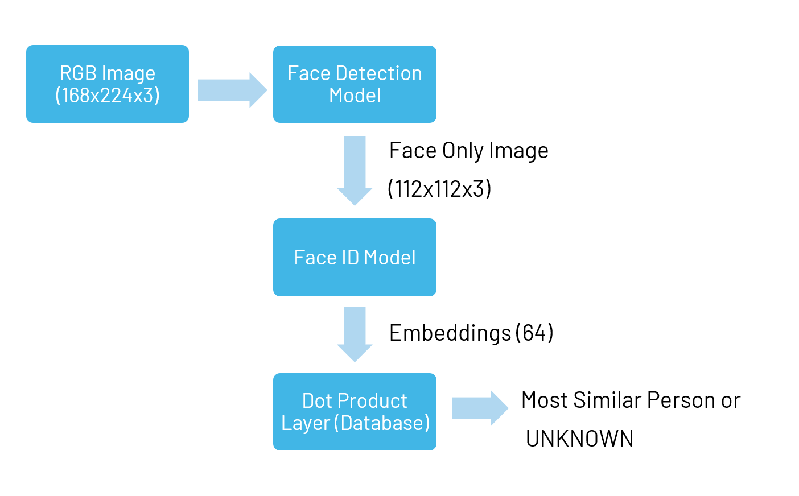
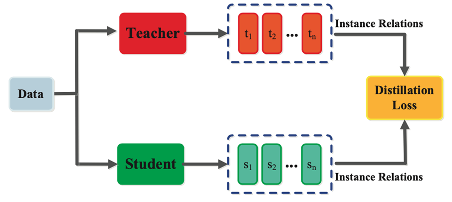

# Facial Recognition System

This document aims to explain facial recognition applications for MAX7800x series microcontrollers. The facial recognition task consists of three main parts: face detection, face identification and dot product:

- The face detection model detects faces in the captured image and extracts a rectangular sub-image containing only one face.
- The face Identification model identifies a person from their facial images by generating the embedding for a given face image.
- The dot product layer outputs the dot product representing the similarity between the embedding from the given image and embeddings in the database.

Figure 1 depicts the facial recognition system sequential diagram.

Figure 1. MAX7800x facial recognition system

## Dataset

The first step will be the dataset preparation. The dataset is VGGFace-2 [1].
Please review the term and conditions at [VGGFace2](https://www.robots.ox.ac.uk/~vgg/data/vgg_face2/). Then, download the dataset and extract raw images to the train and test subfolders.

Expected folder structure:

                            - root_dir
                                - VGGFace-2
                                    - train
                                    - test

FaceID and Face Detection tasks share the same ground truth pickle, and it will be automatically generated when one of these tasks started.

## Face Detection

To be able to localize faces in a facial recognition system, a face detection algorithm is generally used in facial recognition systems. Face detection is an object detection problem that has various solutions in the literature. In this work, a face detection algorithm that will run on MAX7800x series microcontrollers with real-time performance was targeted.

For the digit detection problem, previously, a TinySSD[2] based MAX7800x object detection algorithm was developed, named TinierSSD. The face detection model is a modified version of the digit detection model. The modification reduces the number of parameters and enables larger input sizes.

To train the face detection model, `scripts/train_facedet_tinierssd.sh` can be used.

## FaceID

To train a FaceID model for MAX7800x microcontrollers, there are multiple steps. As the MAX7800x FaceID models will be trained in a knowledge distillation fashion, the first step will be downloading a backbone checkpoint for the teacher model.

The suggested teacher model is IR-152, but the other teacher models defined in `model_irse_drl.py` may be used as well. Please review the terms and conditions at face.evoLVe[3] repository, and download the checkpoint according to your teacher model selection.

By default, both `scripts/train_faceid_112.sh` and `scripts/train_mobilefacenet_112.sh` use `Backbone_IR_152_Epoch_112_Batch_2547328_Time_2019-07-13-02-59_checkpoint.pth` which needs to be placed in the folder `pretrained` in the root directory of the repository. This checkpoint can be found via the [Model Zoo](https://github.com/ZhaoJ9014/face.evoLVe?tab=readme-ov-file#Model-Zoo) section of the face.evoLVe repository under “IR-152”.

There are two FaceID models, one for the MAX78000 and one for the MAX78002. The MAX78000 one is named `faceid_112`, and it is a relatively lightweight model. To enable more performance on MAX78002, a more complex model was developed, which is named `mobilefacenet_112`. To train the FaceID models, `scripts/train_faceid_112.sh` and `scripts/train_mobilefacenet_112.sh` scripts can be used, respectively. By using the `--backbone-checkpoint` argument, the path to the checkpoint can be changed.

The training scripts will run the Dimensionality Reduction and Relation Based-Knowledge Knowledge Distillation steps automatically. A summary of Dimensionality Reduction and Relation-Based Knowledge Distillation can be found in the following sub-sections.

### Dimensionality Reduction on the Teacher Model

Reducing embedding dimensionality can greatly reduce the post-processing operations and memory usage for the facial recognition system. To achieve this, the teacher backbone will be frozen and two additional Conv1d layers will be added to the teacher models. These additions are called dimension reduction layers. For the example in the repository, the length of the embeddings produced by the teacher model is 512 and the optimum length for the student model is found to be 64. Still, other choices like 32, 128 or 256 can be examined for different application areas. A summary of the dimensionality reduction is shown in Figure 2, and dimension reduction layer details are shown in Table 1.

Figure 2. Dimensionality Reduction

Table 1. Dimension Reduction Layers

| Layer1                               | Layer2                              |
|--------------------------------------| ------------------------------------|
| Conv1d(In=512ch, Out=512Ch, Kernel=1)| Conv1d(In=512ch, Out=64Ch, Kernel=1)|
| BatchNorm1d(512)                     | BatchNorm1d(64)                     |
| PReLU(512)                           |                                     |

To train dimensionality reduction layers, the Sub-Center ArcFace loss is used. The SubCenterArcFace Loss was presented in the [4], and a summary of the training framework can be seen in Figure 3. This loss function uses cosine similarity as the distance metric, and in the framework embedding network is trained as a part of the classification problem. The Normalized Sub-Centers (also known as the prototypes) must be learned from zero as no model is available to extract embeddings at the beginning.

Figure 3. Sub-Center ArcFace Loss[4]

### Relation-Based Knowledge Distillation

The knowledge distillation choice for the FaceID models is relation-based. The distillation loss is calculated as the MSE between teacher model and student model.

To train the student FaceID models, no student loss is used, so the student weight is set to 0.

Figure 4 visually represents the relation-based knowledge distillation.

Figure 4. Relation-Based Knowledge Distillation[5]

## Dot Product Layer

The dot product layer weights will be populated with the embeddings that are generated by MAX7800x FaceID models. The outputs of the FaceID models are normalized at both inference and recording. Therefore, the result of the dot product layer equals cosine similarity. Using the cosine similarity as a distance metric, the image is identified as either one of the known subjects or “Unknown”, depending on the embedding distances. To record new people in the database, there are two options. The first one is using the Python scripts that are available with the SDK demos. The second option is to use a “record on hardware” mode which does not require any external connection. The second option is not available for all platforms, therefore please check the SDK demo README files.

## References

[1] [Cao, Qiong, et al. "Vggface2: A dataset for recognising faces across pose and age." 2018 13th IEEE international conference on automatic face & gesture recognition (FG 2018). IEEE, 2018.](https://arxiv.org/abs/1710.08092)

[2] [A. Womg, M. J. Shafiee, F. Li and B. Chwyl, "Tiny SSD: A Tiny Single-Shot Detection Deep Convolutional Neural Network for Real-Time Embedded Object Detection," 2018 15th Conference on Computer and Robot Vision (CRV), Toronto, ON, Canada, 2018, pp. 95-101, doi: 10.1109/CRV.2018.00023.](https://ieeexplore.ieee.org/document/8575741)

[3] [face.evoLVe, High-Performance Face Recognition Library on PaddlePaddle & PyTorch](https://github.com/ZhaoJ9014/face.evoLVe)

[4] [Deng, Jiankang, et al. "Arcface: Additive angular margin loss for deep face recognition." Proceedings of the IEEE/CVF conference on computer vision and pattern recognition. 2019.](https://arxiv.org/abs/1801.07698)

[5] [Gou, Jianping, et al. "Knowledge distillation: A survey." International Journal of Computer Vision 129 (2021): 1789-1819.](https://arxiv.org/abs/2006.05525)
